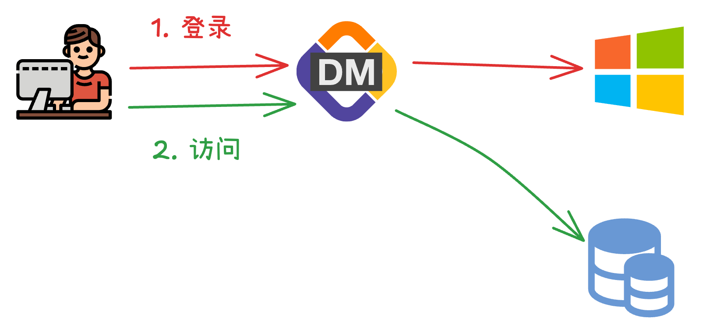

CloudDM 允许您的组织使用企业自身 **Active Directory 域** 以实现统一身份认证。

## 什么是 Active Directory？

AD 是一种目录服务或身份提供程序（IdP），于 1999 年首次推出和 Windows 2000 Server 版本一同发布。
AD 主要是为了帮助管理员将用户连接到基于 Windows 的 IT 资源，同时管理和保护基于 Windows 的业务系统和应用。
AD 负责存储有关网络对象（如用户、组、系统、网络、应用、数字资产等）及其相互关系的信息。

如今 AD 产品已升级为 [AD DS](https://learn.microsoft.com/zh-cn/windows-server/identity/ad-ds/get-started/virtual-dc/active-directory-domain-services-overview)。

## 约束限制

CloudDM 在使用统一身份认证功能时具有如下约束限制：
- **统一身份认证** 的配置需要由主账号进行。
- 多个主账号之间 **统一身份认证配置** 彼此独立。
- 当启用后产品将 **只允许** Active Directory 域用户作为子账号登录。
- 当启用后 **配置** > **子账号管理** 页面中的 **添加账号** 功能将不可用。
- 当启用后 CloudDM 的账号有效性验证将会由 **Active Directory域服务** 验证。
- 用户首次登录时会根据其 **域账号归属的用户组** 确定其 CloudDM 角色归属。具体参考高级选项参数 ldapRoleMap。
- 使用 Active Directory域认证后用户账号有效性及密码强度过期策略等将会全部交由 **Active Directory域服务** 管理。

## 工作原理

- 在登录页面选择 **子账号登录**，输入 Active Directory 域用户的用户名和密码。
- 在点击登录按钮后，CloudDM 会和 Active Directory 域服务通信以验证用户身份。

## 如何配置

```text title='例如：存在如下 Active Directory 域服务'
企业的域：clougence.com
域服务IP：192.168.0.100
域服务账号：administrator
域服务密码：admin
```

CloudDM 开启 **Active Directory域** 认证步骤如下：
1. 使用主账号登录 CloudDM 产品。
2. 进入页面 **配置** > **系统偏好** > **通用参数** 选项卡。
3. 参考如下表格修改配置项。最后点击右上角 **保存** 按钮后 **确认** 保存。

```text title='(必选) 需要修改的配置'
配置项              │ 修改后                       │ 说明
───────────────────┼─────────────────────────────┼──────────────────────────────────────
subAccountAuthType │ AD                          │ 统一身份认证使用 Windows 域服务
ldapHost           │ 192.168.0.100               │ Active Directory 域服务 IP
ldapPort           │ 3268                        │ Active Directory 域服务端口，默认 3268
ldapBase           │ DC=clougence,DC=com         │ Base DC
ldapUser           │ administrator@clougence.com │ 连接 Active Directory 域服务的账号
ldapPassword       │ admin                       │ 连接 Active Directory 域服务的密码
ldapNetBIOSRoute   │ clougence=192.168.0.100     │ NetBIOS/IP 名称映射(Pre-Windows 2000 方式登录)
```

```text title='(可选) 高级参数选项说明'
配置项              │ 修改后         │ 说明
───────────────────┼───────────────┼──────────────────────────────────────
ldapSoTimeout      │ 3000          │ 与域服务通信的超时时间，默认 30 秒
ldapRoleMap        │ Developers    │ 首次登录时绑定的角色，默认是 Developers（开发角色）
```

- **ldapRoleMap** 参数
  - **Manager** 表示系统内置 **[管理员](../roles/role/role_info_admin)** 角色。
  - **DBA** 表示系统内置 **[DBA](../roles/role/role_info_dba)** 角色。
  - **Developers** 表示系统内置 **[开发者](../roles/role/role_info_developer)** 角色。

:::info
- 首次登录时，用户需确认或补全 **手机号、邮箱**。
- 首次进入控制台时会根据其 ldapRoleMap 参数配置分配 CloudDM 用户角色。
:::

## 使用 AD 登入

1. 访问 CloudDM 系统地址，可以向您所在组织的 **运维人员** 或 **系统管理人员** 索要。
  - 通常部署后地址为：_**http://&lt;部署服务器IP&gt;:8222**_
2. 在登录页面切换登录选项卡到 **子账号登录**。
3. 在 **Windows域账号** 输入框中输入分配给您的 **域账号**。
4. 在 **密码** 输入框中输入您域账号的 **密码**。
5. 点击 **登录** 进入系统。

### 首次登录

在首次登录时 CloudDM 会尝试从 Active Directory 域服务器上获取 **用户名**、**手机号** 和 **邮箱** 信息。

:::info
在首次登录时会提示用户是否使用 Active Directory 域服务器中的上述三个信息来填充首次登录用户初始化表单。<br/>
表单内容可以立即修改或者登录 CloudDM 后在系统中修改（FAQ [修改密码/邮箱/手机号](../../faq/info_modify)）
:::

### 域登录名

根据 Windows 域服务的规范，使用 Active Directory 域账号认证有两种登录名格式，分别为：

- **UPN格式**：域账号@域名
- **Pre-Windows 2000 格式**：Domain\LogonName

在使用 Pre-Windows 2000 格式登录时若出现 **NetBIOS 登录名时需要 NetBIOS/IP 名称映射** 报错。
- 请联系 **系统管理员** 检查 **ldapNetBIOSRoute** 配置项。
- 具体配置方法参考手册 **[使用 Active Directory 域服务](../../integrations/sso/sso_ad)**。

## 恢复设置

在开启了 **Active Directory 域** 认证服务后，若想恢复 **内置账号** 方式登录需要按照如下操作进行。

1. 使用主账号登录 CloudDM 产品。
2. 进入页面 **配置** > **系统偏好** > **通用参数** 选项卡。
3. 参考如下表格修改配置项。最后点击右上角 **保存** 按钮后 **确认** 保存。

```text title='(必选) 需要修改的配置'
配置项               │ 修改后                │ 说明
────────────────────┼──────────────────────┼───────────────────────────────────
subAccountAuthType  │ PASSWORD             │ 使用系统内置账号方式登录系统
```
