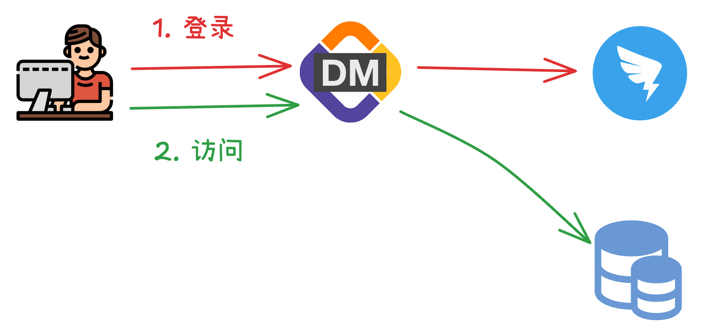
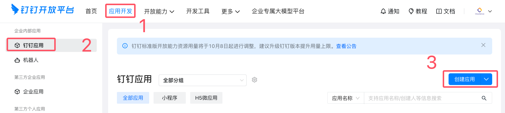
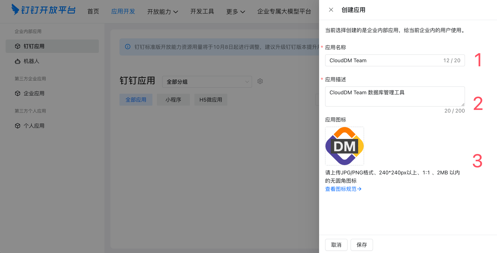
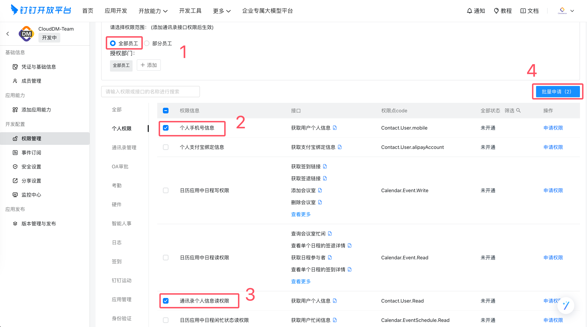
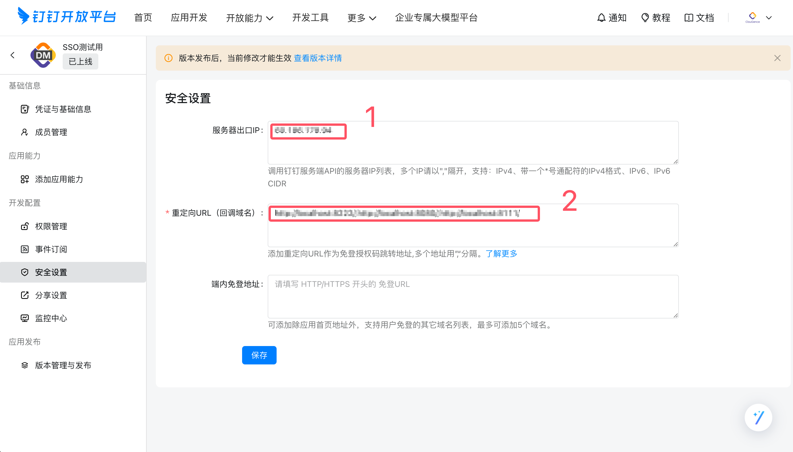

CloudDM 允许您的组织在使用 [钉钉](https://www.dingtalk.com/) 时，通过团队为您分配的钉钉账号进行登录，从而实现统一身份认证。

## 约束限制

CloudDM 版在使用统一身份认证功能时具有如下约束限制：
- **统一身份认证** 的配置需要由主账号进行。
- 多个主账号之间 **统一身份认证配置** 彼此独立。
- 当启用后产品将 **只允许** 钉钉企业组织中的用户作为子账号登录。
- 当启用后 **配置** > **子账号管理** 页面中的 **添加账号** 功能将不可用。
- 当启用后 CloudDM 的账号有效性验证将会由 **钉钉** 验证。
- 用户首次登录时会根据选项参数 dingLoginRoleMap 预先定义的角色进行分配。
- 使用钉钉认证后用户账号有效性及密码强度过期策略等将会全部交由 **钉钉** 管理。

## 工作原理

- CloudDM 采用 OAuth 2.0 流程进行接入。
- 在登录页面的 **子账号登录** 选项卡中点击 **钉钉登录**，跳转到钉钉登录页面。
- 登录完成后钉钉会将浏览器跳转回 CloudDM 并携带 Authorization code 代码。
- CloudDM 根据 Authorization code 代码向钉钉获取用户信息以完成登录动作。

## 如何配置

CloudDM 开启钉钉认证步骤如下：
1. [创建并配置钉钉应用](#config_app)。
2. 使用主账号登录 CloudDM 产品。
3. 进入页面 **配置** > **系统偏好** > **通用参数** 选项卡。
4. 参考如下表格修改配置项。最后点击右上角 **保存** 按钮后 **确认** 保存。

```text title='(必选) 需要修改的配置'
配置项               │ 修改后         │ 说明
────────────────────┼───────────────┼──────────────────────────────────────
subAccountAuthType  │ DingTalk      │ 统一身份认证使用钉钉服务
dingLoginConfigAk   │ xxxxx         │ 钉钉应用 Client ID
dingLoginConfigSk   │ xxxxx         │ 钉钉应用 Client Secret
```

```text title='(可选) 高级参数选项说明'
配置项               │ 修改后         │ 说明
────────────────────┼───────────────┼──────────────────────────────────────
oidcLoginRoleMap    │ Developers    │ 首次登录时绑定的角色，默认是 Developers（开发角色）
```

- **oidcLoginRoleMap** 参数
  - **Manager** 表示系统内置 **[管理员](../roles/role/role_info_admin)** 角色。
  - **DBA** 表示系统内置 **[DBA](../roles/role/role_info_dba)** 角色。
  - **Developers** 表示系统内置 **[开发者](../roles/role/role_info_developer)** 角色。

:::info
- 首次登录时，用户需确认或补全 **手机号、邮箱**。
- 首次进入控制台时会根据其 dingLoginRoleMap 参数配置分配 CloudDM 用户角色。
:::

## 恢复设置

在开启了 **钉钉** 认证服务后，若想恢复 **内置账号** 方式登录需要按照如下操作进行。

1. 使用主账号登录 CloudDM 产品。
2. 进入页面 **配置** > **系统偏好** > **通用参数** 选项卡。
3. 参考如下表格修改配置项。最后点击右上角 **保存** 按钮后 **确认** 保存。

```text title='(必选) 需要修改的配置'
配置项               │ 修改后           │ 说明
────────────────────┼─────────────────┼──────────────────────────────────────
subAccountAuthType  │ PASSWORD        │ 使用系统内置账号方式登录系统
```

## 钉钉应用参考 {#config_app}

:::info
您可以将 [钉钉审批](../approval/dingtalk_approval.md) 和登录整合进同一个应用，CloudDM 支持独立或分开配置它们。
:::

**准备工作**
1. 登录 [钉钉开放平台](https://open.dingtalk.com/)，如您存在多个组织请选择对应的组织进入。
2. 获取 [开发者权限](https://open.dingtalk.com/document/isvapp/obtain-developer-permissions)，如已有权限则略过。

**配置应用**
1. 点击 **应用开发** > **钉钉应用** > **创建应用**。
  
2. 填写应用的基础信息，并点击 **保存**。涉及图标资源可以到 **[资源下载](../../resource/resource_download)** 获取。
  
3. 点击 **凭证与基础信息信息**，获取 **Client ID** 和 **Client Secret**。
   
4. 点击 **权限管理**，给应用分配权限。
   
5. 点击 **安全设置**，设置您部署 CloudDM 环境中公网出口 IP，以及您 CloudDM 访问地址。<br/>（您公网/内网访问 CloudDM 的地址，支持配置多个，若应用并非运行在 80 端口，则地址中需要包含完整端口号）
   
6. 点击 **版本管理与发布**，发布应用。应用可用范围选择 **全部员工**。
   
