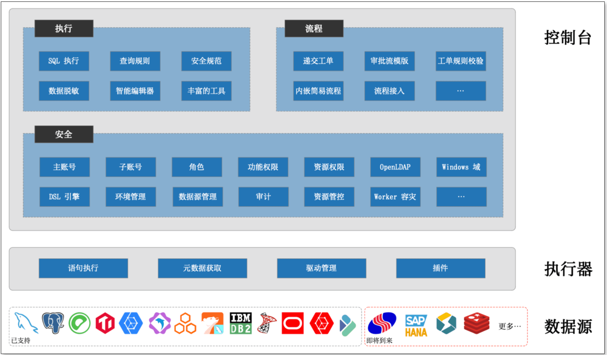

CloudDM Team 是为团队中不同角色人员开发使用数据库而设计的团队协作工具，专注企业数据安全，注重 **安全性**、**稳定性**、**用户体验**。
产品通过 **简单且高效** 的交互来保证开发使用上的便利性，在团队协作过程中利用工作流推进数据库变更在不同环境中的变化，是一款 **便利用**、**安心管**、**不担心** 的数据安全管理平台。

## 核心能力

### 数据源支持
自建数据库：
- MySQL、Oracle、MariaDB、PostgreSQL、DB2（IBM i 及 z/OS）、SQL Server 
- Greenplum、TiDB、OceanBase(MySQL 及 Oracle)
- PolarDB-X

云上数据库：
- 阿里云
  - ADB for MySQL
  - RDS for MySQL、RDS for PostgreSQL、PolarDb for MySQL
  - PolarDB-X
- 亚马逊 AWS
  - MySQL、MariaDB
  - PostgreSQL
- 微软 Azure
  - MySQL、MariaDB
  - PostgreSQL

### 访问

通过统一平台授权数据库的访问，避免随意直链数据库，并对每一条执行的 SQL 进行审查，从源头避免危险的发生。

- 通过 **SQL 审核** 保障 **安全** 的数据访问
  - 包括 **安全规则**、**安全规范** 使数据访问变得 **规范化**，从而避免危险查询造成 **数据破坏** 及数据库的 **稳定性** 影响。
- 利用 **RBAC** 权限控制，让数据的访问更加安全
  - 通过 **角色** 来定义 **岗位**，让不同岗位的人员拥有不同的 **产品功能**，让不该看到的功能不被看到。
  - 通过 **资源权限** 来保证资源被合理范围内的人所使用，进一步的保证数据的 **安全**、**可控**。
- 良好的用户体验 **简单** 且 **强大** 的查询控制台
  - 包括 **语法高亮**、**智能提示**、**执行**、**表结构获取**、**DDL 转换** 等便利能力，从而提升工作效率。

### 协同

通过 **工单**、**流程** 协调团队中对数据库发布变更需求，让 DBA/管理员在产品发布时更加从容面对。

- 对关键数据资产的变更 **有审**、**有备**
  - 通过 **工单递交人** 和 **工单审批人** 身份，对数据资产的变更有 **严格的审核** 以保证 **合规性**，让风险暴露在 **事前**。
  - 通过 **历史工单** 追查问题变更的 **时间**、**地点**、**人物**，从而更加准确的评估 **起因** 和 **影响**，让风险在 **事后** 变成宝贵的经验。
- 工单内容的 **安全规则** 检测
  - 通过 对每一个工单在递交时内容的 **安全规则** 检测可以有效的 **减轻** 在数据库变更的 **审核** 工作。
  - 通过 **规则 DSL** 在产品内置规则之外可以实现更加复杂的 **自定义规则**，从而满足更符合企业自身的 **规范** 要求。
- 更 **简单** 或更 **贴合企业自身** OA 流程系统
  - 可以 使用 CloudDM Team **内置简易流程引擎**，来避免过多的 IT 信息化系统负担。
  - 可以 对接 **外部流程引擎** 以实现贴合企业自身的管理。

### 安全

CloudDM Team 提供多种方式保证数据访问的安全。

- **账号体系** 结合 **功能权限** 和 **资源权限** 的分离
  - 通过 **角色** 来定义 **岗位**，让不同岗位的人员拥有不同的 **产品功能**，让不该看到的功能不被看到。
  - 通过 **资源权限** 来保证资源被合理范围内的人所使用，进一步的保证数据的 **安全**、**可控**。
- 包括 **数据脱敏**
  - 敏感数据的访问会被脱敏，从而不再担心机密 **数据泄漏** 的问题。
- 基于 **统一身份认证** 打通产品和企业的 **账号体系**
  - 通过 接入企业的 **OpenLDAP** 或者 **Active Directory 域** 实现员工账号的统一管控。

## 使用场景

### 小型团队

对于小型团队每个人都是多面手，这意味着角色的界限比较模糊。通常团队呈现出较高的协同效率，团队对目标更加专注。
面向小团队 CloudDM Team 从安全出发，通过优异的操作体验及丰富的工具保障数据安全和效率。

- **安全**
  - 可以帮您 **避免直接连接数据库**，从而避免当本地计算机在 **遭遇安全威胁** 后进一步影响到企业关键数据。
- **效率**
  - 通过 **强大** 且 **丰富** 的工具库以及良好的 **体验**，降低数据库使用门槛，提高团队人员的效率。

### 中型团队

对于中型化团队随着更多专业人员加入，不同角色和岗位团队成员产生更多协同。通过制度化、流程化以加强团队协同效率。
面向中型团队 CloudDM Team 以安全和良好的用户体验为基础，通过规则、规范、及工单流程保障团队高效运行。

- **流程**
  - 利用 **工单** 系统定义的 **申请**、**审批**、**确认** 三个步骤，帮助团队构建 **安全** 且 **规范** 的流程控制。
- **规范**
  - 通过 CloudDM Team 自研的 **DSL 规则** 引擎，允许团队 **自由定制** SQL 校验规则。
  - 利用 **SQL 规则** 构建起符合团队自身的 **数据库规范**，并通过规范守护 **企业数据安全**。

### 大型团队

大型团队从管理上会面临人员、技术、业务等多种纬度问题，并在结合企业自身的 IT 信息系统时会面临更多挑战。
面向大型团队 CloudDM Team 坚守安全底线，并且以稳定为前提，通过权限分离、高可用部署、统一身份认证等手段，充分融入企业自身管理体系。

- **稳定**
  - 每一条查询 SQL 都会经过严格的 **查询规则** 检验，以保证企业重要数据库环境的稳定。结合 **高可用部署** 在产品和数据安全上施加 **双重保险**。
- **责权**
  - 权限 被分割为 **功能权限** 和 **资源权限** 以满足企业对不同岗位人员的权限在 **多纬度** 上的管控。
- **融入**
  - 通过 **统一身份认证** 融入企业自身的 IT 信息系统中。
