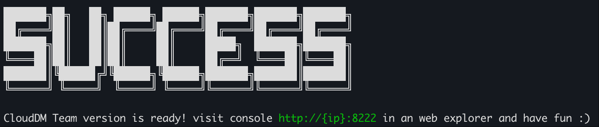
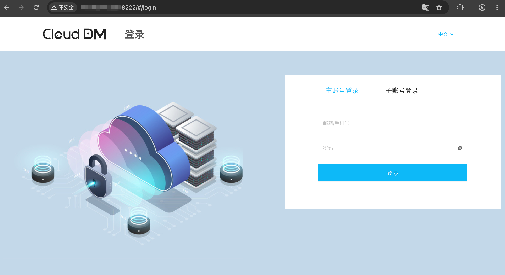

CloudDM Docker 化安装属于 “自托管” 模式，适用于有安全/合规要求的业务场景。部署后与外界完全隔离，只需要一个 Docker 运行时即可快速实施部署。

## 前置条件

1. 在开始之前请确保系统环境符合 **[依赖需求](./install_require)**。
2. 请确保 Docker 容器可以正常工作，请参考 **[Docker 官方安装文档](https://docs.docker.com/engine/install/)**。

:::info
已部署过 CloudDM 的环境，请进行 [升级安装](./upgrade_docker)，如果重复执行安装可能导致系统出现异常！
:::

## 安装准备

- 安装 docker 和 docker-compose 请参考 Docker 官方网站 **[安装手册](https://docs.docker.com/engine/install/)**。
- CloudDM Team 容器化安装脚本对 Docker 的版本要求是 `17.+`。

在安装时，建议创建一个 clougence 账号并切换到该账号下进行安装。    
在安装前需要安装 7z 工具用以解压下载的安装包，如果你的环境中已经安装了 7z 工具，则可以忽略这个步骤。

```shell title='安装 7z 工具'
# install 7z util
apt-get install -y p7zip-full        # Ubuntu
#yum install -y p7zip p7zip-plugins  # CentOS/RHEL

# install user
useradd -m -s /bin/bash clougence
su - clougence && cd /home/clougence
```

```shell title='解压 CloudDM'
# download package.
wget -c "..." -Oclouddm.7z

# extract package
7z x clouddm.7z -o./clouddm_home
```

## 安装包结构

安装包在解压后包含如下主要内容：
- **镜像**
  - 位于 &lt;解压目录&gt;/images 目录下四个 tar 结尾的文件。
- **Docker 容器编排文件**
  - 位于 &lt;解压目录&gt;/install_on_docker/docker-compose.yml 文件。
- **安装运维脚本**
  - 位于 &lt;解压目录&gt;/install_on_docker/ 目录。

安装运维脚本由如下几个文件组成：

| 脚本           | 用途                                                    |
|--------------|-------------------------------------------------------|
| install.sh   | 全新安装 CloudDM, 其中会调用 ./scripts/precheck_install.sh 做预检 |
| upgrade.sh   | 升级安装 CloudDM, 清理相关内容后调用 install.sh 安装                 |
| uninstall.sh | 卸载 CloudDM，包含停止容器、删除镜像、删除元数据库、删除相应的卷等操作               |
| stop.sh      | 停止 CloudDM 相关容器运行                                     |
| start.sh     | 启动 CloudDM 相关容器                                       |
| restart.sh   | 重启 CloudDM 相关容器                                       |

## 产品安装

```shell title='运行 install.sh 安装'
cd /home/clougence/
7z x clouddm.7z -o./clouddm_home
cd clouddm_home/install_on_docker

install.sh
```

成功安装后会由如下标志性提示：



通过浏览器访问 **8222** 服务端口，例如：_**http://\{ip\}:8222**_
- 默认账号: test@clougence.com
- 默认密码: clougence2021



## 安装的内容

在安装成功后会在您的环境中新增如下内容：

1. 名称为 “clouddm-network” 的 Docker 网络配置。
   ```text title='命令 docker network ls 命令可以找到这个网络'
    NETWORK ID     NAME              DRIVER    SCOPE
    994aad97e4ac   clouddm-network   bridge    local
   ```
2. 加载了三个新镜像。
   ```text title='命令 docker images 命令可看到新镜像'
    REPOSITORY                  TAG       IMAGE ID       ...
    clougence/clouddm-sidecar   1.2.0.0   cf94d1f4cd6d   ...
    clougence/clouddm-console   1.2.0.0   2b82d36cf234   ...
    clougence/clouddm-mysql     1.2.0.0   c46bbfe65f12   ...
   ```
3. 运行了三个新容器。
   ```text title='命令 docker ps 可看到新容器'
    CONTAINER ID   IMAGE                              ...   NAMES
    42ac5a025545   clougence/clouddm-sidecar:1.2.0.0  ...   clouddm-sidecar
    1704128be21c   clougence/clouddm-console:1.2.0.0  ...   clouddm-console
    f20e4c4b8006   clougence/clouddm-mysql:1.2.0.0    ...   clouddm-mysql
   ```
4. 创建三个新的卷。
   ```text title='命令 docker volume ls 可以找到这些卷'
    DRIVER    VOLUME NAME
    local     cg_dm_mysql_volume
    local     install_on_docker_clouddm_console_volume
    local     install_on_docker_clouddm_sidecar_volume
   ```
5. 在 “install_on_docker” 目录下会创建两个文件夹分别指向 Console 和 Sidecar 容器的 _data 目录。
   ```text title='命令 ls -al | grep .*_data 可以看到连接目录'
    lrwxrwxrwx ... console_data -> /var/lib/docker/volumes/install_on_docker_clouddm_console_volume/_data/
    lrwxrwxrwx ... sidecar_data -> /var/lib/docker/volumes/install_on_docker_clouddm_sidecar_volume/_data/
   ```
6. 容器会对外开放 26000/8222/8008 三个端口。
   - 26000，容器内 CloudDM 的 MySQL 元信息数据库的端口
   - 8222，对外提供服务的端口
   - 8008，在多集群模式下，集群机器连接到同一个控制台的通信端口
