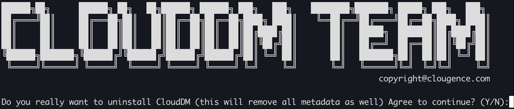
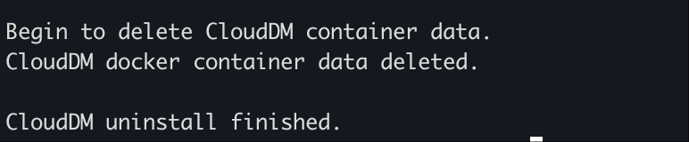

在 “自托管” 模式中安装包中提供了卸载脚本，在安装目录中通过执行卸载脚本即可完成卸载。

:::danger
卸载是不可逆操作，会删除所有数据，请做好数据备份在进行环境清理。
:::

## 操作步骤

```shell title='1. 在安装目录下运行卸载脚本'
cd /home/clougence/install_on_docker

uninstall.sh
```



- 出现提示后在 “Agree to continue? (Y/N):” 后面输入 “y” 回车继续。



- 卸载成功后会出现上述提示。

## 卸载的内容 

在卸载成功后您的环境会有如下变更：

1. 删除名称为 “clouddm-network” 的 Docker 网络配置。
   ```text title='命令 docker network ls 应无法找到如下类似内容'
    NETWORK ID     NAME              DRIVER    SCOPE
    994aad97e4ac   clouddm-network   bridge    local
   ```
2. 以下三个镜像会被删除。
   ```text title='命令 docker images 应无法找到如下类似内容'
    REPOSITORY                  TAG              IMAGE ID       ...
    clougence/clouddm-sidecar   <your version>   cf94d1f4cd6d   ...
    clougence/clouddm-console   <your version>   2b82d36cf234   ...
    clougence/clouddm-mysql     <your version>   c46bbfe65f12   ...
   ```
3. 以下三个容器会被删除。
   ```text title='命令 docker ps 应无法找到类似内容'
    CONTAINER ID   IMAGE                                     ...   NAMES
    42ac5a025545   clougence/clouddm-sidecar:<your version>  ...   clouddm-sidecar
    1704128be21c   clougence/clouddm-console:<your version>  ...   clouddm-console
    f20e4c4b8006   clougence/clouddm-mysql:<your version>    ...   clouddm-mysql
   ```
4. 所有 CloudDM 创建的卷都被删除。
   ```text title='命令 docker volume ls 应无法找到类似内容'
    DRIVER    VOLUME NAME
    local     cg_dm_mysql_volume
    local     install_on_docker_clouddm_console_volume
    local     install_on_docker_clouddm_sidecar_volume
   ```
5. 在 “install_on_docker” 目录下 console_data，sidecar_data 两个软连接目录会被删除。
6. 由于容器已经不存在 26000/8222/8008 三个端口将被释放。
