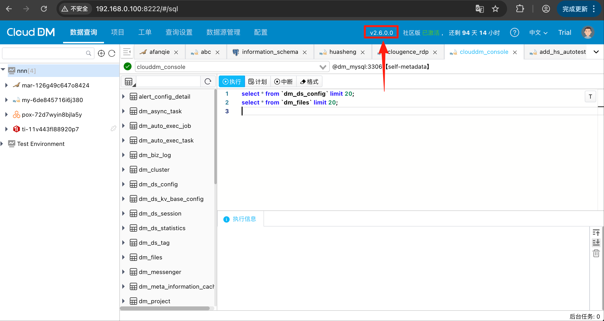

在 “自托管” 模式中使用 Docker 化方式安装 CloudDM 的环境，在进行产品升级时讲下载的更新包解压到原安装目录。然后通过升级脚本进行升级。

## 前置条件

请确保 Docker 容器正在运行。

## 升级准备

升级包是以 7z 格式提供并且在安装时推荐是以非 root 用户进行安装。因此除 7z 工具外安装时还需要切换到安装用户身份。

```shell title='安装 7z 工具'
# install 7z util
apt-get install -y p7zip-full        # Ubuntu
#yum install -y p7zip p7zip-plugins  # CentOS/RHEL

# install user
useradd -m -s /bin/bash clougence
su - clougence && cd /home/clougence
```

```shell title='解压 CloudDM'
# download package.
wget -c "..." -Oclouddm.7z

# extract package
7z x clouddm.7z -o./clouddm_home
```

## 安装包结构

Docker 安装包在解压后包含如下主要内容：
- **镜像**
    - 位于 &lt;解压目录&gt;/images 目录下四个 tar 结尾的压缩文件。
- **Docker 容器编排文件**
    - 位于 &lt;解压目录&gt;/install_on_docker/docker-compose.yml 文件。
- **安装运维脚本**
    - 位于 &lt;解压目录&gt;/install_on_docker/ 目录。

安装运维脚本由如下几个文件组成

| 脚本           | 用途                                                    |
|--------------|-------------------------------------------------------|
| install.sh   | 全新安装 CloudDM, 其中会调用 ./scripts/precheck_install.sh 做预检 |
| upgrade.sh   | 升级安装 CloudDM, 清理相关内容后调用 install.sh 安装                 |
| uninstall.sh | 卸载 CloudDM，包含停止容器、删除镜像、删除元数据库、删除相应的卷等操作               |
| stop.sh      | 停止 CloudDM 相关容器运行                                     |
| start.sh     | 启动 CloudDM 相关容器                                       |
| restart.sh   | 重启 CloudDM 相关容器                                       |

## 产品升级

```shell title='运行 install.sh 升级'
cd /home/clougence/
7z x clouddm.7z -o./clouddm_home
cd clouddm_home/install_on_docker

upgrade.sh
```

```text title='升级安装过程中的提示'
Network clouddm-network is already exist,continue install may have unknown problems.

出现提示后在 “Agree to continue? (Y/N):” 后面输入 “y” 回车继续。
```

成功安装后会由如下标志性提示：


通过浏览器访问 **8222** 服务端口，例如：_**http://\{ip\}:8222**_
- 登录系统检查版本是否升级成功。



## 升级的内容

在升级成功后 CloudDM 版会在您的环境中做如下变更：

1. 以下三个镜像从老版本升级到新版本。
   ```text title='命令 docker images 可看到新版本镜像'
    REPOSITORY                  TAG       IMAGE ID       ...
    clougence/clouddm-sidecar   2.6.0.0   cf94d1f4cd6d   ...
    clougence/clouddm-console   2.6.0.0   2b82d36cf234   ...
    clougence/clouddm-mysql     2.6.0.0   c46bbfe65f12   ...
   ```
3. 以下三个容器会被终止并删除，在镜像更新后会重新启动新版本的三个容器。
   ```text title='命令 docker ps 可看到新版本容器'
    CONTAINER ID   IMAGE                                    ...   NAMES
    42ac5a025545   clougence/clouddm-sidecar:<old version>  ...   clouddm-sidecar
    1704128be21c   clougence/clouddm-console:<old version>  ...   clouddm-console
    f20e4c4b8006   clougence/clouddm-mysql:<old version>    ...   clouddm-mysql
   ```
4. 名称为 “cg_dm_mysql_volume” 的卷的数据会被保留，sidecar、console 的卷数据会被删除。
   ```text title='命令 docker volume ls 可以找到这些卷'
    DRIVER    VOLUME NAME
    local     cg_dm_mysql_volume                       (被保留数据的卷)
    local     install_on_docker_clouddm_console_volume
    local     install_on_docker_clouddm_sidecar_volume
   ```
5. 在 “install_on_docker” 目录下的两个软链接会被重新创建。
   ```text title='命令 ls -al | grep .*_data 可以看到连接目录'
    lrwxrwxrwx ... console_data -> /var/lib/docker/volumes/install_on_docker_clouddm_console_volume/_data/
    lrwxrwxrwx ... sidecar_data -> /var/lib/docker/volumes/install_on_docker_clouddm_sidecar_volume/_data/
   ```
6. 容器会对外开放 26000/8222/8008 三个端口。
    - 26000，容器内 CloudDM 的 MySQL 元信息数据库的端口
    - 8222，对外提供服务的端口
    - 8008，在多集群模式下，集群机器连接到同一个控制台的通信端口

## 升级说明
- [1.x 到 2.x 版本升级说明](../faq/upgrade_to_2_x)
