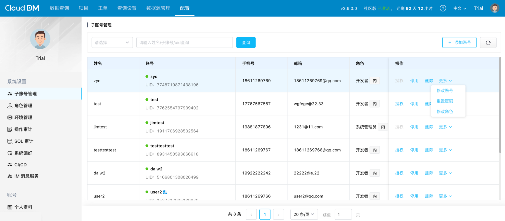

在 CloudDM 中账号分为：**主账号** 和 **子账号**、**外部账号** 三种。
- **主账号** 也被称为管理账号，它是唯一的，并且无需任何授权即可直接拥有最高权限。
- **子账号** 在使用过程中主要接触的账号，子账号可以通过赋予不同角色实现权限控制。
- **外部账号** 它特指通过 统一身份认证(SSO) 登录系统后自动产生的账号，和子账号具有完全相同的效果。

## 账号管理

通过 **配置** > **子账号管理** 菜单，您可以进行账号的创建、停用、启用、修改以及删除等操作。

- **添加子账号**：用于添加新的登录账号。当启用 统一认证 SSO 时按钮不可见，详情请参阅 [统一认证 SSO](#type) 部分。
- **停用账号**：停用后该账号将无法登录与操作，停用会释放账号占用额度，详情请参阅 [许可证](../maintain/license.md) 部分。
- **启用账号**：将停用的账号恢复正常使用。
- **删除账号**：操作不可逆，删除账号后其所有权限将被自动回收。对于外部账号，删除并不能阻止其再次登录，正确的做法是禁用该账号。
- **修改账号**：可供修改显示的姓名和用于登录的用户名。
- **重置密码**：在重置账号的登录密码时会要求验证当前登录人的登录密码。
  - 如果修改自己的密码，可以到 **配置** > **个人资料**，详情请参阅 [修改密码/邮箱/手机号](../faq/info_modify) 部分。

:::info
需要注意的是，对于外部账号的 **修改账号** 和 **重置密码** 操作，CloudDM 不支持。请在账号原始平台上进行这些操作。
:::

## 统一认证 SSO {#type}

单点登录（SSO）是一种认证方法，它能让用户通过使用仅一组凭证即可安全地与多个应用程序和网站进行认证。

CloudDM  支持多种方式实现单点登录：
- **[Lightweight Directory Access Protocol (LDAP)](../integrations/sso/sso_ldap)**
- **[OpenID Connect (OIDC)](../integrations/sso/sso_oidc)**
- **[Windows 域](../integrations/sso/sso_ad)**
- **[钉钉](../integrations/sso/sso_dingtalk)**
- **[飞书](../integrations/sso/sso_feishu)**
- **[企业微信](../integrations/sso/sso_wechat)**

:::info
在 **配置** > **系统偏好** > **通用参数** 选项卡中，subAccountAuthType 参数决定了当前登录方式。可选项有：
- PASSWORD / LDAP / AD / DingTalk / Feishu / Wechat / OIDC
:::
