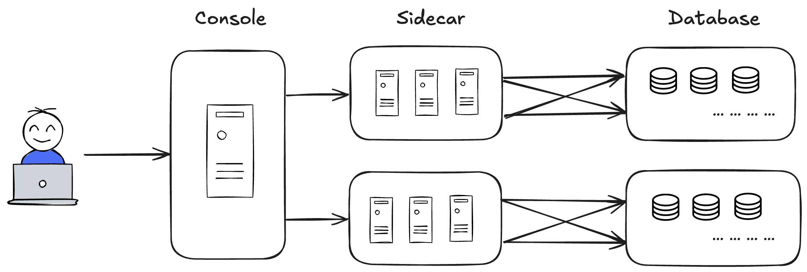
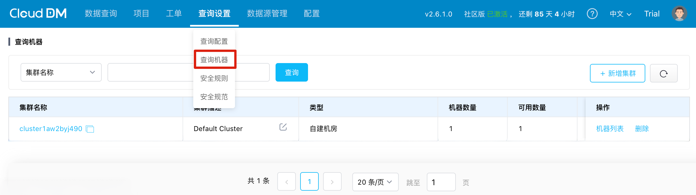
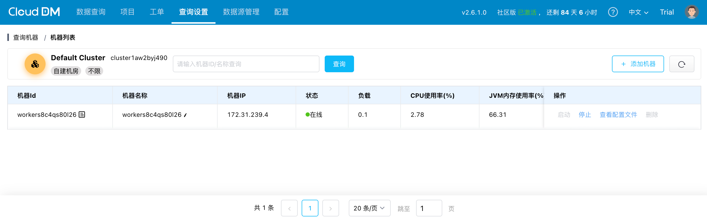
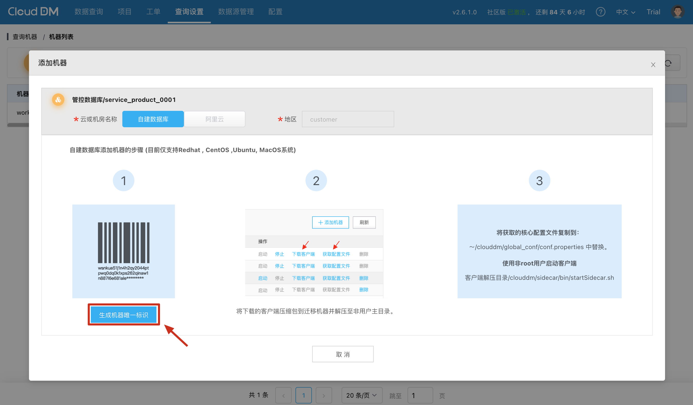
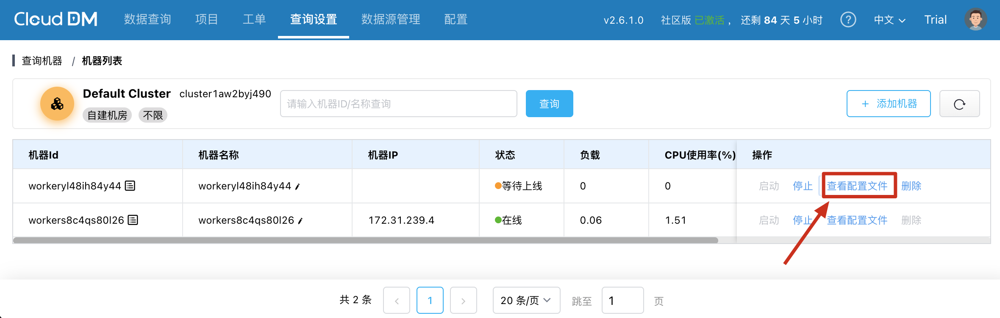
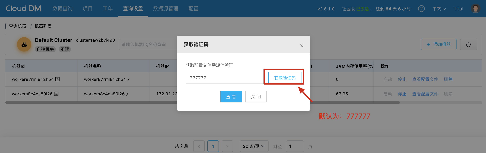
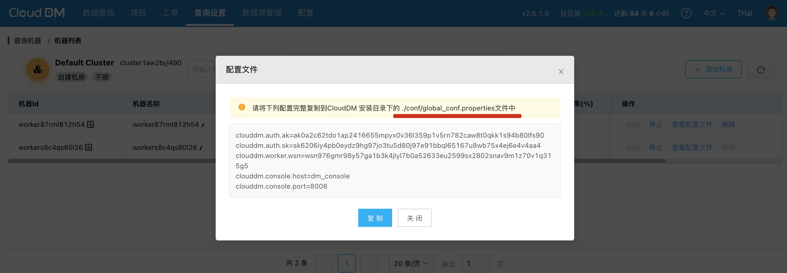

在集群模式下，CloudDM 通过多台 Sidecar 机器作为执行节点并由统一 Console 对外提供服务，实现了无需公开数据库 IP 的跨网络访问以及提升了系统稳定性和可用性。

当 CloudDM 部署成功后，默认会创建一个集群，集群描述为 `default_cluster`，并且在集群中有一台默认的执行机器。可以在 **查询设置** > **查询机器** 中查看它们。

## 集群管理

集群作为逻辑管理单元，包含多台执行机器，在 **查询设置** > **查询机器** 页面中，可进行集群的创建、删除、修改及机器管理等操作。

- **创建**，新建一个新的集群。当数据源和这个集群绑定后，数据源的查询请求将随机分发至集群内各机器执行。
- **删除**，删除集群前需要确保集群内没有机器，且没有数据源绑定在该集群上。
- **修改描述**，您可以修改集群的描述信息，方便识别。
- **机器列表**，用于查看和管理集群内的机器及其状态等信息。

## 机器管理

机器管理主要包括两个方面：**添加机器** 和 **删除机器**。添加机器时，需要生成一个具有唯一标识的新配置，并使用该配置在新机器上启动Sidecar进程；
机器删除后该机器将不再参与集群查询任务且其上的Sidecar会停止运行。此外，还可以通过 **启动** 或 **停止** 按钮控制机器的运行状态。

- **添加机器**，用于向集群中新增执行机器，详情参考 **[集群扩容](#add_worker)**。
- **删除机器**，删除后该机器将不再参与集群查询任务。此操作会立即终止其上正在运行的查询命令，并停止 Sidecar 的运行。
- **启动**，您可以修改集群的描述信息，方便识别。
- **停止**，用来查看集群内的机器列表及机器状态等信息。
- **查看配置**，用来查看集群内的机器列表及机器状态等信息。
  - 如需要输入验证码，默认是 `777777`。

## 集群扩容 {#add_worker}

当集群内机器数不足以支撑业务需求时，可以通过添加机器的方式进行扩容。

- 在 **机器列表** 页面中点击添加机器在弹出的对话框中点击 **生成机器唯一标识**，会生成一个具有唯一标识的新配置。
  
- 在新生成的机器配置上点击 **查看配置文件**。
  
- 如需要输入验证码，默认是 `777777`。
  
- 配置中包含内容如下。 
  

复制配置文件内容到 Sidecar 安装路径下的 `./conf/global_conf.properties` 启动 Sidecar 进程。
