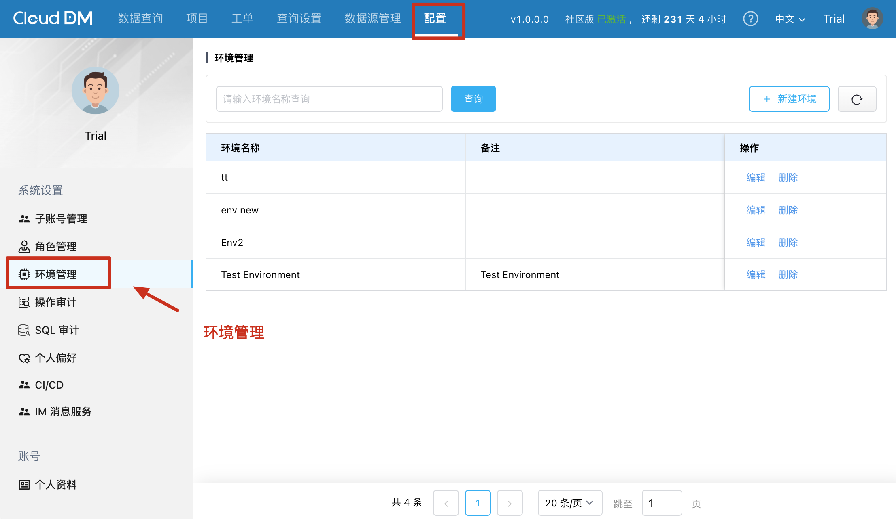
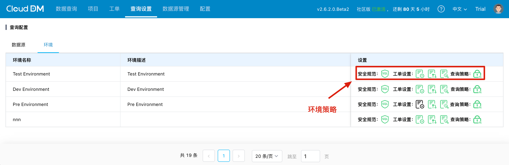
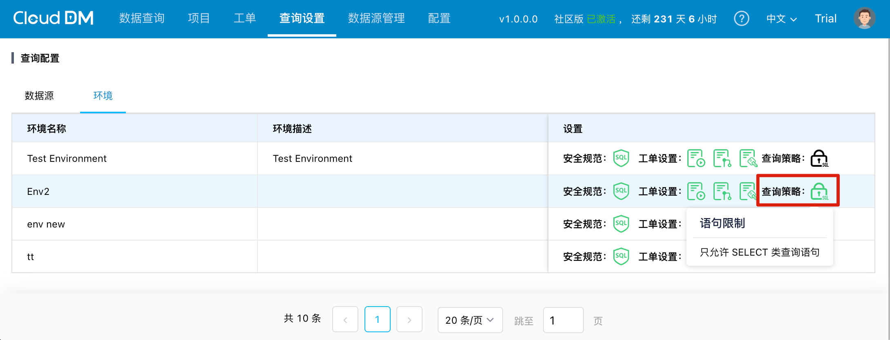
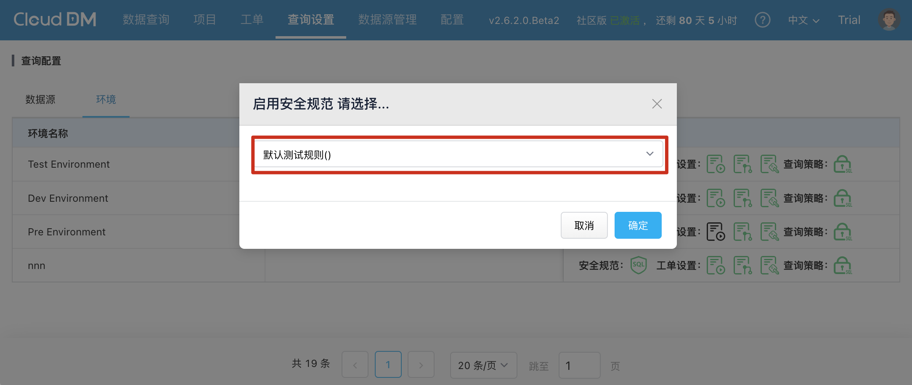
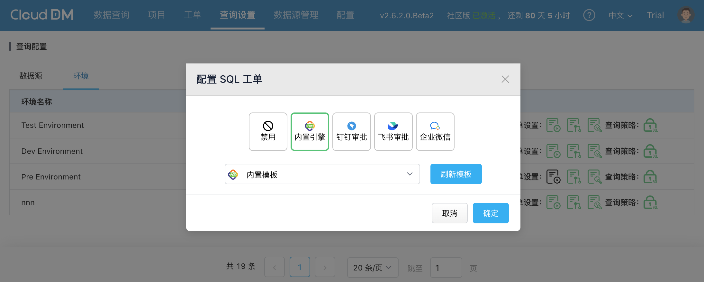

您可以通过菜单 **配置** > **环境管理** 来管理环境。环境管理功能支持**创建**、**编辑** 和 **删除** 环境。
CloudDM 通过定义不同的环境策略来帮助用户区分数据源的业务场景，从而更有效地识别与管理数据源。
默认情况下，系统预设了 **生产**、**测试** 和 **开发** 三种环境。此外，用户还可以根据自身的业务需求自定义新的环境。

## 环境管理

- **创建**，创建一个新的环境，在添加数据源时可以选择该环境。
- **编辑**，编辑操作可以修改环境的名称和描述。
- **删除**，在删除环境前，需确保该环境下没有绑定任何数据源。

## 环境策略

环境策略包含 规范、工单设置和查询策略等内容。通过环境策略，用户可以在不同的业务场景下应用差异的环境策略，以应对不同的风险等级。
通过菜单 **查询设置** > **查询配置** > **环境**，可以对环境策略进行配置。

### 查询策略

即使您拥有 `DML` 和 `DDL` 数据库权限，默认情况下您也只能在 SQL 编辑器中运行诸如 `SELECT` 这类只读语句。
尝试运行修改数据的 DML 语句或 DDL 语句，系统将提示您一个关于环境策略的提示。

### 安全规范

从控制台或者工单执行 SQL 时对 SQL 语句进行一系列检查。默认情况下 CloudDM 不会开启安全规范，在启用前需要先 **[创建安全规范](../console/sql_rules.md)**。

### 审批流程

每个环境都可以配置自己独有的审批流程，以符合不同安全级别的需要。也可以对接外部审批系统，满足企业的审批需求。

每个环境可以为三种不同的产经配置审批流程：

- **工单流程**，通过工单递交的 SQL 语句在审批时使用的审批流程。
- **变更流程**，在使用 CI/CD 功能时，对于变更所使用的审批流程。
- **权限流程**，用户在申请权限时所使用的审批流程。
