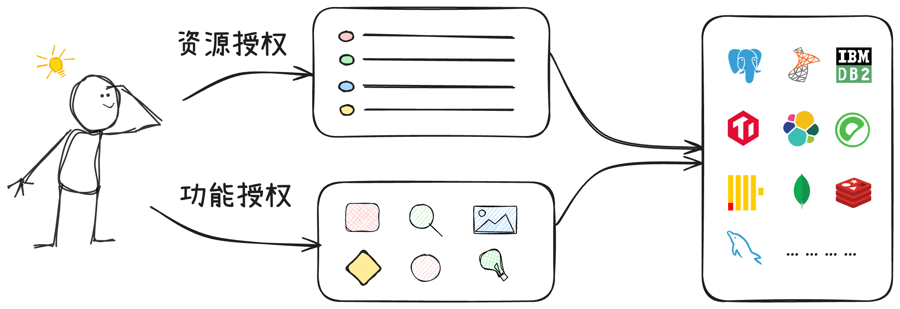
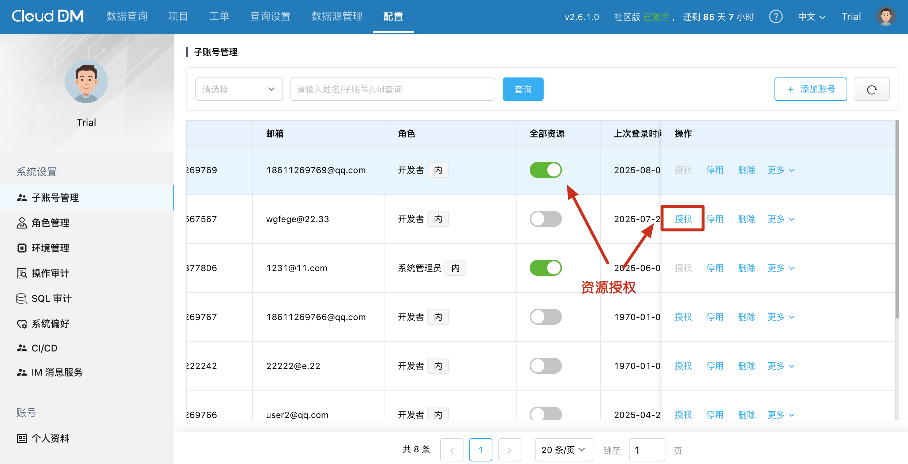
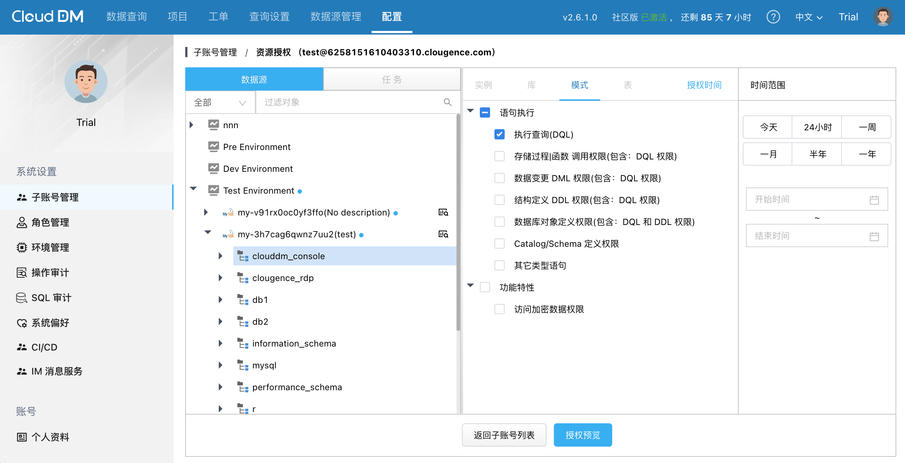

CloudDM 采用 **资源** 与 **功能** 分离的授权模式。资源权限可细化到表级别，具体取决于语句类型；而功能授权则基于角色的访问控制（RBAC）模式，权限被分配给角色，而角色则授予给用户。

## 功能权限

CloudDM 内置了 4 个角色，分别是 **开发者**、**管理员**、**数据库管理员（DBA）** 和 **项目管理员（PM）**，每个用户只能分配一个角色。
默认情况下新的子账号会被分配 **开发者** 角色，主账号可以创建 **自定义角色**，并分配给子账号。下面是不同角色所具备的功能权限。

### 数据查询权限

| 权限点                              | 管理员 | DBA | PM | 开发者 |
|----------------------------------|-----|-----|----|-----|
| [查询控制台使用权限](#dm_query_console)   | ✔ ️ | ✔   |    | ✔   |
| [对象管理权限](#dm_object_manager)     | ✔ ️ | ✔   |    | ✔   |
| [数据库运维权限](#dm_object_manager)    | ✔ ️ | ✔   |    | ✔   |
| [导出查询结果集到本地](#dm_query_export)   | ✔ ️ | ✔   |    |     |
| [安全规则/规范查看](#dm_secrules_read)   | ✔ ️ | ✔   |    |     |
| [安全规则/规范管理](#dm_secrules_manage) | ✔ ️ | ✔   |    |     |

### 工单权限

| 权限点                               | 管理员 | DBA | PM | 开发者 |
|-----------------------------------|-----|-----|----|-----|
| [工单查看](#rdp_worker_order_read)    | ✔ ️ | ✔   |    | ✔   |
| [发起工单](#rdp_worker_order_request) | ✔ ️ | ✔   |    | ✔   |
| [工单审批](#rdp_worker_order_approve) | ✔ ️ | ✔   |    |     |
| [工单执行](#rdp_worker_order_execute) | ✔ ️ | ✔   |    |     |

### CI/CD 权限

| 权限点                            | 管理员 | DBA | PM | 开发者 |
|--------------------------------|-----|-----|----|-----|
| [项目查看](#dm_project_read)       | ✔ ️ |     | ✔  | ✔   |
| [项目管理](#dm_project_manage)     | ✔ ️ |     | ✔  |     |
| [变更执行](#dm_change_operate)     | ✔ ️ |     | ✔  | ✔   |
| [IM 消息服务查看](#dm_im_read)       | ✔ ️ |     | ✔  |     |
| [IM 消息服务管理](#dm_im_manage)     | ✔ ️ |     | ✔  |     |
| [CI/CD 提供者查看](#dm_cicd_read)   | ✔ ️ |     | ✔  |     |
| [CI/CD 提供者管理](#dm_cicd_manage) | ✔ ️ |     | ✔  |     |

### 系统管理权限

| 权限点                              | 管理员  | DBA | PM | 开发者 |
|----------------------------------|------|-----|----|-----|
| [子账号查看](#rdp_user_read)          | ✔  ️ | ✔   |    |     |
| [子账号管理](#rdp_user_manage)        | ✔ ️  | ✔   |    |     |
| [子账号管理-资源授权查看](#rdp_auth_read)   | ✔  ️ | ✔   |    |     |
| [子账号管理-资源授权管理](#rdp_auth_manage) | ✔ ️  | ✔   |    |     |
| [角色查看](#rdp_role_read)           | ✔ ️  | ✔   | ✔  | ✔   |
| [角色管理](#rdp_role_manage)         | ✔ ️  | ✔   |    |     |
| [查询配置查看](#dm_ds_read)            | ✔ ️  | ✔   |    |     |
| [查询配置管理](#dm_ds_manage)          | ✔ ️  | ✔   |    |     |
| [查询机器查看](#dm_worker_read)        | ✔ ️  | ✔   |    |     |
| [查询机器管理](#dm_worker_manage)      | ✔ ️  | ✔   |    |     |
| [环境查看](#rdp_env_read)            | ✔ ️  | ✔   |    |     |
| [环境管理](#rdp_env_manage)          | ✔ ️  | ✔   |    |     |
| [数据源查看](#rdp_ds_read)            | ✔ ️  | ✔   |    | ✔   |
| [数据源管理](#rdp_ds_manage)          | ✔ ️  | ✔   |    |     |
| [操作审计查看](#rdp_op_audit_read)     | ✔ ️  | ✔   |    |     |
| [操作审计导出](#rdp_op_audit_export)   | ✔ ️  | ✔   |    |     |
| [SQL 执行审计查看](#dm_sql_audit_read) | ✔ ️  | ✔   |    |     |

### 参数配置权限

| 权限点                                                   | 管理员  | DBA | PM | 开发者 |
|-------------------------------------------------------|------|-----|----|-----|
| [主账号偏好配置查看](#rdp_pri_user_kv_conf_r)                  | ✔  ️ | ✔   |    | ✔   |
| [主账号偏好配置修改](#rdp_pri_user_kv_conf_w)                  | ✔  ️ | ✔   |    |     |
| [主账号 AccessKey 和 SecretKey 查看](#rdp_pri_user_ak_sk_r) | ✔  ️ | ✔   | ✔  | ✔   |
| [主账号 AccessKey 和 SecretKey 修改](#rdp_pri_user_ak_sk_w) | ✔  ️ | ✔   | ✔  | ✔   |
| [主账号普通配置查看(邮箱、手机号等)](#rdp_pri_user_normal_conf_r)     | ✔  ️ | ✔   |    |     |
| [主账号第三方配置修改](#rdp_pri_user_third_party_conf_w)        | ✔  ️ | ✔   |    |     |

## 资源权限

在使用 CloudDM 时，除了需要拥有功能权限外，用户还必须具备对其所操作的数据源的相应权限。这样的设计允许 CloudDM 根据组织架构和资源归属来精细地划分权限，最小授权单位可达表级别。
资源授权方式有两种：**全资源授权** 和 **按资源授权**。

### 资源权限分类 {#da_cat}

- 语句权限
    - [执行查询(DQL)](#data_dm_query)
    - [存储过程 & 函数 调用权限](#data_dm_call)
    - [数据变更 DML 权限](#data_dm_dml)
    - [结构定义 DDL 权限](#data_dm_ddl)
    - [数据库对象定义权限](#data_dm_obj)
    - [Catalog/Schema 定义权限](#data_dm_space)
    - [数据库控制 DCL 权限](#data_dm_dcl)
    - [其它类型语句](#data_dm_other)
- 数据权限
    - [访问加密数据权限](#data_dm_sensitive)
- 功能权限
    - [处理工单权限(可以审批和执行)](#data_dm_ticket)
    - [数据源查看](#data_rdp_ds_read)
    - [数据源管理](#data_rdp_ds_manage)

### 权限授予 {#da_auth}

在使用 CloudDM 时，除了需要拥有功能权限外，用户还必须具备对其所操作的数据源的相应权限。这样的设计允许 CloudDM 根据组织架构和资源归属来精细地划分权限，最小授权单位可达表级别。
资源授权方式有两种：**全资源授权** 和 **按资源授权**。

- 当赋予了 **全部资源** 权限后相当于拥有了该数据源的所有权限，并且可以对该数据源下的所有对象进行操作。

- 当 **按资源授权** 时，可以根据需要对数据源下的不同对象赋予不同的权限。比如：对某个数据库下的所有表赋予查询权限，对另一个数据库下的某个表赋予数据变更权限。

## 权限字典 {#code}

### 功能权限

#### 数据查询权限 {#dm_query_console}

具备该权限的用户或角色可以 **访问** CloudDM 查询控制台。

- 继承关系：**无**
- 权限路径：**全部** > **数据查询** > **查询控制台使用权限**
- 相关页面：**数据查询**

#### 对象管理权限 {#dm_object_manager}

具备该权限的用户或角色可以通过可视化方式管理数据库中的对象。

- 继承关系：**控制台使用权限**
- 权限路径：**全部** > **数据查询** > **对象管理权限**
- 相关页面：**数据查询**

#### 数据库运维权限 {#dm_object_manager}

具备该权限的用户或角色可以通过可视化方式管理数据库中的对象，并且可以执行一些运维相关的操作。

- 继承关系：**控制台使用权限**，**对象管理权限**
- 权限路径：**全部** > **数据查询** > **数据库运维权限**
- 相关页面：**数据查询**

#### 导出查询结果集到本地 {#dm_query_export}

具备该权限的用户或角色在执行 SQL 查询后，可以将查询结果集导出到本地。

- 继承关系：**无**
- 权限路径：**全部** > **数据查询** > **导出查询结果集到本地**
- 相关页面：**数据查询**

#### 安全规则/规范查看权限 {#dm_secrules_read}

具备该权限的用户或角色可以 **查看** CloudDM 中设置的安全规则与安全规范。

- 继承关系：**无**
- 权限路径：**全部** > **查询设置** > **安全规则** > **安全规则/规范查看**
- 相关页面：**查询设置** > **安全规则**、**查询设置** > **安全规则** > **详情**、**查询设置** > **安全规范**、**查询设置** > **安全规范** > **详情**

#### 安全规则/规范管理权限 {#dm_secrules_manage}

具备该权限的用户或角色可以 **新增** 、 **删除** 和 **编辑** CloudDM 中设置的安全规则与安全规范。

- 继承关系：**安全规则/规范查看权限**
- 权限路径：**全部** > **查询设置** > **安全规则** > **安全规则/规范管理**
- 相关页面：**查询设置** > **安全规则**、**查询设置** > **安全规则** > **详情**、**查询设置** > **安全规范**、**查询设置** > **安全规范** > **详情**

#### 工单查看权限 {#rdp_worker_order_read}

具备该权限的用户或角色可以 **查看** CloudDM 中创建的工单列表和详情。

- 继承关系：**无**
- 权限路径：**全部** > **工单** > **工单查看**
- 相关页面：**工单**、**工单** > **详情**

#### 发起工单权限 {#rdp_worker_order_request}

具备该权限的用户或角色可以 **创建** CloudDM 中的工单，并支持对自己创建的工单进行 **操作**。

- 继承关系：**工单查看权限**
- 权限路径：**全部** > **工单** > **发起工单**
- 相关页面：**工单**、**工单** > **详情**、**工单** > **提交工单**

#### 工单审批权限 {#rdp_worker_order_approve}

具备该权限的用户或角色可以 **查看** 、 **审批** CloudDM 中的所有工单。

- 继承关系：**工单查看权限**
- 权限路径：**全部** > **工单** > **工单审批**
- 相关页面：**工单**、**工单** > **详情**

#### 工单执行 {#rdp_worker_order_execute}

具备该权限的用户或角色可以 **查看** 、 **审批** CloudDM 中的所有工单。

- 继承关系：**工单查看权限**
- 权限路径：**全部** > **工单** > **工单审批**
- 相关页面：**工单**、**工单** > **详情**

#### 项目/变更查看权限 {#dm_project_read}

具备该权限的用户或角色可以 **查看** CloudDM 中创建的 **项目**、项目配置的 **发布流**、项目包含的 **变更** 和变更内容。

- 继承关系：**无**
- 权限路径：**全部** > **项目** > **项目查看**
- 相关页面：**项目**、**项目** > **项目详情**、**项目** > **项目详情** > **变更详情**

#### 项目/变更管理权限 {#dm_project_manage}

具备该权限的用户或角色可以在 CloudDM **新建**、**归档**、**删除** 项目，也可以对已有项目进行 **发布流配置**、**消息服务配置** 等。

- 继承关系：**项目/变更查看**
- 权限路径：**全部** > **项目** > **项目管理**
- 相关页面：**项目**、**项目** > **项目详情**、**项目** > **项目详情** > **变更详情**

#### 变更执行权限 {#dm_change_operate}

具备该权限的用户或角色可以 **执行** 执行阶段的变更，执行操作包括通过对执行的 SQL 任务进行 **执行**、**重试**、**忽略**、**跳过**、**取消** 等操作。

- 继承关系：**项目/变更查看**
- 权限路径：**全部** > **项目** > **变更执行**
- 相关页面：**项目** > **项目详情** > **变更详情** > (执行阶段)

#### IM 消息服务查看权限 {#dm_im_read}

具备该权限的用户或角色可以 **查看** CloudDM 中创建的 IM 消息服务列表。

- 继承关系：**无**
- 权限路径：**全部** > **系统设置** > **IM 消息服务**
- 相关页面：**系统设置** > **IM 消息服务**

#### IM 消息服务管理权限 {#dm_im_manage}

具备该权限的用户或角色可以 **新增**、**删除**、**配置** CloudDM 中创建的 IM 消息服务。

- 继承关系：**IM 消息服务查看**
- 权限路径：**全部** > **系统设置** > **IM 消息服务**
- 相关页面：**系统设置** > **IM 消息服务**

#### CI/CD 查看权限 {#dm_cicd_read}

具备该权限的用户或角色可以 **查看** CloudDM 中创建的 CI/CD 服务列表。

- 继承关系：**无**
- 权限路径：**全部** > **系统设置** > **CI/CD**
- 相关页面：**系统设置** > **CI/CD**

#### CI/CD 管理权限 {#dm_cicd_manage}

具备该权限的用户或角色可以 **新增**、**删除**、**配置** CloudDM 中创建的 CI/CD 服务。

- 继承关系：**CI/CD 查看权限**
- 权限路径：**全部** > **系统设置** > **CI/CD**
- 相关页面：**系统设置** > **CI/CD**

#### 子账号查看权限 {#rdp_user_read}

具备该权限的用户或角色可以 **查看** CloudDM 中创建的子账号列表。

- 继承关系：**无**
- 权限路径：**全部** > **系统设置** > **子账号管理** > **子账号查看**
- 相关页面：**系统设置** > **子账号管理**

#### 子账号管理权限 {#rdp_user_manage}

具备该权限的用户或角色可以 **新增**、**删除**、**编辑** CloudDM 中创建的子账号列表。

- 继承关系：**子账号查看**
- 权限路径：**全部** > **系统设置** > **子账号管理** > **子账号管理**
- 相关页面：**系统设置** > **子账号管理**

#### 子账号管理-资源授权查看权限 {#rdp_auth_read}

具备该权限的用户或角色可以 **查看** CloudDM 中创建的子账号列表及已授的资源权限。

- 继承关系：**无**
- 权限路径：**全部** > **系统设置** > **子账号管理** > **子账号管理-资源授权查看权限**
- 相关页面：**系统设置** > **子账号管理**、**系统设置** > **子账号管理** > **权限**

#### 子账号管理-资源授权管理权限 {#rdp_auth_manage}

具备该权限的用户或角色可以 **查看**、 **编辑** CloudDM 中子账号的资源权限。

- 继承关系：**子账号管理-资源授权查看权限**
- 权限路径：**全部** > **系统设置** > **子账号管理** > **子账号管理-资源授权管理权限**
- 相关页面：**系统设置** > **子账号管理**、**系统设置** > **子账号管理** > **权限**、**系统设置** > **子账号管理** > **资源授权**

#### 角色查看权限 {#rdp_role_read}

具备该权限的用户或角色可以 **查看** CloudDM 中角色列表的权限。

- 继承关系：**无**
- 权限路径：**全部** > **系统设置** > **角色管理** > **角色查看**
- 相关页面：**系统设置** > **角色管理**

#### 角色管理权限 {#rdp_role_manage}

具备该权限的用户或角色可以 **新增**、 **编辑** 、 **删除** CloudDM 中角色的权限。

- 继承关系：**角色查看权限**
- 权限路径：**全部** > **系统设置** > **角色管理** > **角色管理**
- 相关页面：**系统设置** > **角色管理**

#### 查询配置查看权限 {#dm_ds_read}

具备该权限的用户或角色可以 **查看** CloudDM 中查询配置的页面和详情。

- 继承关系：**无**
- 权限路径：**全部** > **查询设置** > **查询配置** > **查询配置查看**
- 相关页面：**查询设置** > **查询配置**

#### 查询配置管理权限 {#dm_ds_manage}

具备该权限的用户或角色可以 **配置** CloudDM 中查询配置页面相关的设置。

- 继承关系：**查询配置查看权限**
- 权限路径：**全部** > **查询设置** > **查询配置** > **查询配置管理**
- 相关页面：**查询设置** > **查询配置**

#### 查询机器查看权限 {#dm_worker_read}

具备该权限的用户或角色可以 **查看** CloudDM 用于连接数据库实现查询功能的机器列表。

- 继承关系：**无**
- 权限路径：**全部** > **查询设置** > **查询机器** > **查询机器查看**
- 相关页面：**查询设置** > **查询机器**、**查询设置** > **查询机器** > **机器列表**

#### 查询机器管理权限 {#dm_worker_manage}

具备该权限的用户或角色可以 **新增** 、 **删除** 和 **编辑** CloudDM 用于连接数据库实现查询功能的机器。

- 继承关系：**查询机器查看权限**
- 权限路径：**全部** > **查询设置** > **查询机器** > **查询机器管理**
- 相关页面：**查询设置** > **查询机器**、**查询设置** > **查询机器** > **机器列表**

#### 环境查看权限 {#rdp_env_read}

具备该权限的用户或角色可以 **查看** CloudDM 中定义的环境列表和详细信息。

- 继承关系：**无**
- 权限路径：**全部** > **系统设置** > **环境管理** > **环境查看**
- 相关页面：**系统设置** > **环境管理**

#### 环境管理权限 {#rdp_env_manage}

具备该权限的用户或角色可以 **新增**、**删除**、**编辑** CloudDM 中定义的环境。

- 继承关系：**环境查看权限**
- 权限路径：**全部** > **系统设置** > **环境管理** > **环境管理**
- 相关页面：**系统设置** > **环境管理**

#### 数据源查看权限 {#rdp_ds_read}

具备该权限的用户或角色可以 **查看** CloudDM 中添加的数据源列表。

- 继承关系：**无**
- 权限路径：**全部** > **数据源管理** > **数据源查看**
- 相关页面：**数据源管理**

#### 数据源管理权限 {#rdp_ds_manage}

具备该权限的用户或角色可以 **新增**、**删除**、**编辑** CloudDM 中添加的数据源。

- 继承关系：**数据源查看权限**
- 权限路径：**全部** > **数据源管理** > **数据源管理**
- 相关页面：**数据源管理**

#### 操作审计查看权限 {#rdp_op_audit_read}

具备该权限的用户或角色可以 **查看** CloudDM 中记录的用户操作审计。

- 继承关系：**无**
- 权限路径：**全部** > **系统设置** > **操作审计** > **操作审计查看查看**
- 相关页面：**系统设置** > **操作审计**

#### 操作审计导出权限 {#rdp_op_audit_export}

具备该权限的用户或角色可以 **查看** CloudDM 中操作审计记录导出到本地。

- 继承关系：**操作审计查看权限**
- 权限路径：**全部** > **系统设置** > **操作审计** > **操作审计查看查看**
- 相关页面：**系统设置** > **操作审计**

#### SQL 审计查看 {#dm_sql_audit_read}

具备该权限的用户或角色可以 **查看** CloudDM 中操作审计记录导出到本地。

- 继承关系：**操作审计查看权限**
- 权限路径：**全部** > **系统设置** > **SQL 审计** > **SQL 审计查看**
- 相关页面：**系统设置** > **操作审计**

#### 主账号偏好配置查看权限 {#rdp_pri_user_kv_conf_r}

具备该权限的用户或角色可以 **查看** CloudDM 中系统偏好的参数列表。

- 继承关系：**无**
- 权限路径：**全部** > **系统设置** > **偏好配置** > **主账号偏好配置查看**
- 相关页面：**系统设置** > **系统偏好**

#### 主账号偏好配置修改权限 {#rdp_pri_user_kv_conf_w}

具备该权限的用户或角色可以 **查看** 、 **修改** CloudDM 中系统偏好的参数列表。

- 继承关系：**主账号偏好配置查看权限**
- 权限路径：**全部** > **系统设置** > **偏好配置** > **主账号偏好配置查看**
- 相关页面：**系统设置** > **系统偏好**

#### 主账号 AccessKey 和 SecretKey 查看权限 {#rdp_pri_user_ak_sk_r}

具备该权限的用户或角色可以 **查看** CloudDM 中系统偏好的AccessKey 和 SecretKey 查看功能。

- 继承关系：**无**
- 权限路径：**全部** > **系统设置** > **偏好配置** > **主账号 AccessKey 和 SecretKey 查看**
- 相关页面：**系统设置** > **系统偏好**

#### 主账号 AccessKey 和 SecretKey 修改权限 {#rdp_pri_user_ak_sk_w}

具备该权限的用户或角色可以 **修改** CloudDM 中系统偏好的 AccessKey 和 SecretKey。

- 继承关系：**主账号 AccessKey 和 SecretKey 查看**
- 权限路径：**全部** > **系统设置** > **偏好配置** > **主账号 AccessKey 和 SecretKey 修改**
- 相关页面：**系统设置** > **系统偏好**

#### 主账号普通配置查看权限 {#rdp_pri_user_normal_conf_r}

具备该权限的用户或角色可以 **查看** CloudDM 中系统偏好的普通配置（验证邮箱、手机号）功能。

- 继承关系：**无**
- 权限路径：**全部** > **系统设置** > **偏好配置** > **主账号普通配置查看（邮箱、手机号等）**
- 相关页面：**系统设置** > **系统偏好**

#### 主账号第三方配置修改权限 {#rdp_pri_user_third_party_conf_w}

具备该权限的用户或角色可以 **修改** CloudDM 中的第三方配置。

- 继承关系：**无**
- 权限路径：**全部** > **系统设置** > **第三方配置** > **主账号第三方配置修改（阿里云 AccessKey 和 SecretKey, 第三方流程系统 AccessKey 和 SecretKey 等）**
- 相关页面：**系统设置** > **第三方配置**

#### 主账号第三方配置修改权限 {#rdp_pri_user_third_party_conf_w}

具备该权限的用户或角色可以 **修改** CloudDM 中的第三方配置。

- 继承关系：**无**
- 权限路径：**全部** > **系统设置** > **第三方配置** > **主账号第三方配置修改（阿里云 AccessKey 和 SecretKey, 第三方流程系统 AccessKey 和 SecretKey 等）**
- 相关页面：**系统设置** > **第三方配置**

### 数据权限

#### 执行查询(DQL)权限 {#data_dm_query}

具备该权限的用户可以在 CloudDM 的数据查询页面中 **执行查询语句**。

- 继承关系：**无**
- 权限路径：**数据查询** > **执行查询**
- 相关页面：**数据查询**

#### 存储过程 & 函数 执行权限 {#data_dm_call}

具备该权限的用户可以在 CloudDM 的数据查询页面中 **执行数据变更**。

- 继承关系：**执行查询(DQL)权限**
- 权限路径：**数据查询** > **数据变更 DML 权限**
- 相关页面：**数据查询**

#### 数据变更(DML)权限 {#data_dm_dml}

具备该权限的用户可以在 CloudDM 的数据查询页面中 **执行数据变更**。

- 继承关系：**执行查询(DQL)权限**
- 权限路径：**数据查询** > **数据变更 DML 权限**
- 相关页面：**数据查询**

#### 结构定义(DDL)权限 {#data_dm_ddl}

具备该权限的用户可以在 CloudDM 的数据查询页面中 **执行结构变更**。

- 继承关系：**执行查询(DQL)权限**
- 权限路径：**数据查询** > **数据变更 DDL 权限**
- 相关页面：**数据查询**

#### 数据库对象定义权限权限 {#data_dm_obj}

具备该权限的用户可以在 CloudDM 的数据查询页面中 **执行结构变更**。

- 继承关系：**执行查询(DQL)权限**、**结构定义(DDL)权限**
- 权限路径：**数据查询** > **数据变更 DDL 权限**
- 相关页面：**数据查询**

#### Catalog/Schema 定义权限 {#data_dm_space}

具备该权限的用户可以在 CloudDM 的数据查询页面中 **执行结构变更**。

- 继承关系：**无**
- 权限路径：**数据查询** > **数据变更 DDL 权限**
- 相关页面：**数据查询**

#### 数据库控制 DCL 权限 {#data_dm_dcl}

具备该权限的用户可以在 CloudDM 的数据查询页面中 **执行结构变更**。

- 继承关系：**无**
- 权限路径：**数据查询** > **数据变更 DDL 权限**
- 相关页面：**数据查询**

#### 其它类型语句 {#data_dm_other}

具备该权限的用户可以在 CloudDM 的数据查询页面中 **执行结构变更**。

- 继承关系：**无**
- 权限路径：**数据查询** > **数据变更 DDL 权限**
- 相关页面：**数据查询**

#### 查看敏感数据权限 {#data_dm_sensitive}

具备该权限的用户可以在 CloudDM 的数据查询结果中查看敏感被保护的数据字段。

- 继承关系：**无**
- 权限路径：**数据查询** > **访问加密数据**
- 相关页面：**数据查询**

#### 处理工单权限 {#data_dm_ticket}

具备该权限的用户可以在 CloudDM 的工单的审批页面中 **处理** 对应的工单。

- 继承关系：**无**
- 权限路径：**数据查询** > **处理工单**
- 相关页面：**工单**、**工单** > **详情**

#### 数据源查看权限 {#data_rdp_ds_read}

具备该权限的用户可以 **查看** CloudDM 中数据源管理页面的相应数据源。

- 继承关系：**无**
- 权限路径：**数据源管理** > **数据源查看**
- 相关页面：**数据源管理**

#### 数据源管理权限 {#data_rdp_ds_manage}

具备该权限的用户可以 **新增** 、**编辑** 、**删除** CloudDM 中数据源管理页面的相应数据源。

- 继承关系：**数据源查看权限**
- 权限路径：**数据源管理** > **数据源管理**
- 相关页面：**数据源管理**
