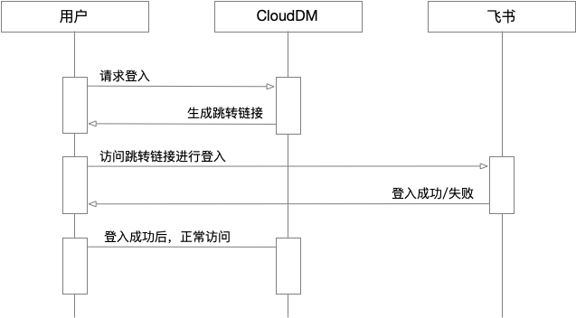
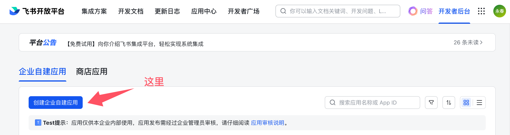
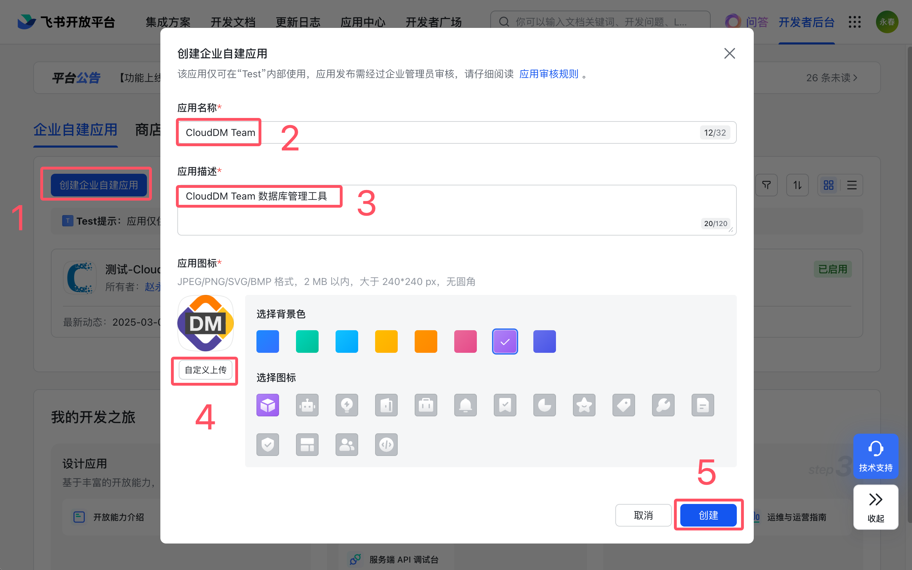
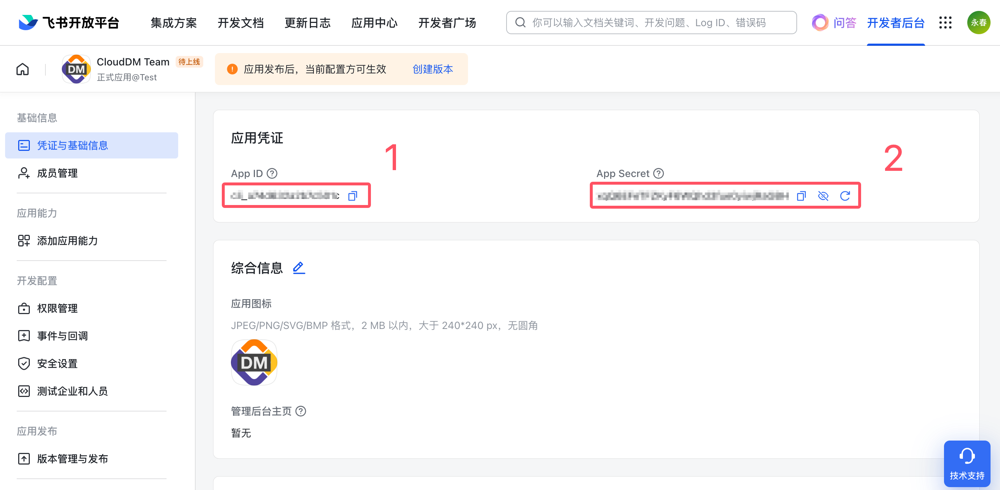
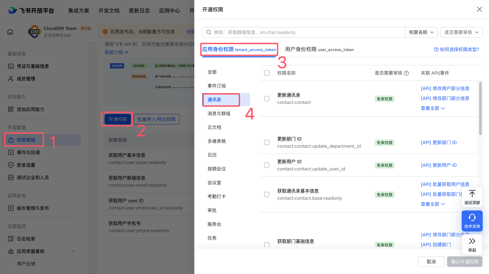
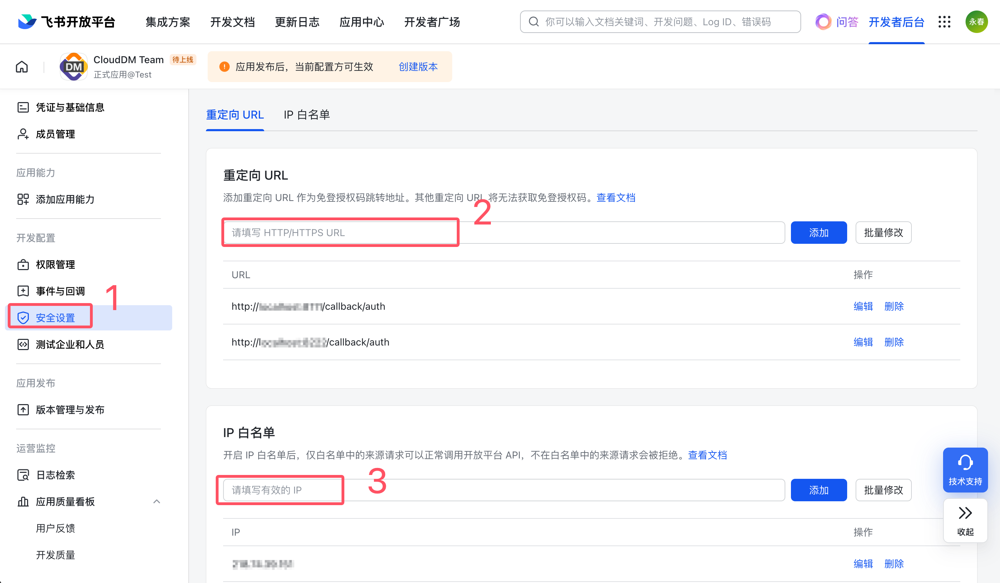
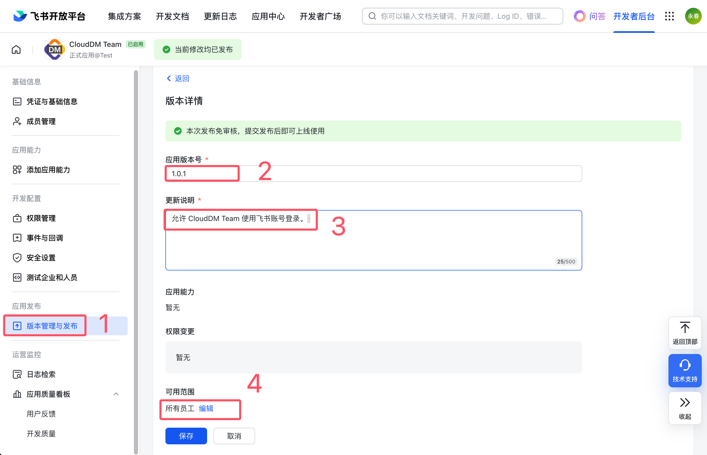

本文档主要介绍如何将 CloudDM Team 产品接入企业的 [飞书](https://www.feishu.cn/) 以实现统一身份认证。

## 约束限制

CloudDM Team 版在使用统一身份认证功能时具有如下约束限制：
- **统一身份认证** 的配置需要由主账号进行。
- 多个主账号之间 **统一身份认证配置** 彼此独立。
- 当启用后产品将 **只允许** 飞书企业组织中的用户作为子账号登录。
- 当启用后 **系统设置** > **子账号管理** 页面中的 **添加账号** 功能将不可用。
- 当启用后 CloudDM Team 的账号有效性验证将会由 **飞书** 验证。
- 用户首次登录时会根据选项参数 dingLoginRoleMap 预先定义的角色进行分配。
- 使用飞书认证后用户账号有效性及密码强度过期策略等将会全部交由 **飞书** 管理。

## 工作原理



- CloudDM Team 采用 OAuth 2.0 流程进行接入。
- 在登录页面的 **子账号登录** 选项卡中点击 **飞书登录**，跳转到飞书登录页面。
- 登录完成后飞书会将浏览器跳转回 CloudDM Team 并携带 Authorization code 代码。
- CloudDM Team 根据 Authorization code 代码向飞书获取用户信息以完成登录动作。

## 如何配置

CloudDM Team 版开启飞书认证步骤如下：
1. [创建并配置飞书应用](#config_app)。
2. 使用主账号登录 CloudDM Team 产品。
3. 进入页面 **系统设置** > **系统偏好** > **通用参数** 选项卡。
4. 参考如下表格修改配置项。最后点击右上角 **保存** 按钮后 **确认** 保存。

```text title='(必选) 需要修改的配置'
配置项                    │ 修改后       │ 说明
─────────────────────────┼─────────────┼───────────────────────────────
subAccountAuthType       │ Feishu      │ 统一身份认证使用飞书服务
feishuLoginAppID         │ xxxxx       │ 飞书应用 App ID
feishuLoginAppSecret     │ xxxxx       │ 飞书应用 App Secret
```

```text title='(可选) 高级参数选项说明'
配置项                    │ 修改后      │ 说明
─────────────────────────┼────────────┼───────────────────────────────
feishuLoginApiTimeoutSec │ 5          │ 调用飞书 API 时的超时时间单位/秒，默认 5 秒
feishuLoginRoleMap       │ Developers │ 首次登录时绑定的角色，默认是 Developers（开发角色）
```

- **feishuLoginRoleMap** 参数
  - **Manager** 表示系统内置 **[管理员](../../permission/role/role_info_admin)** 角色。
  - **DBA** 表示系统内置 **[DBA](../../permission/role/role_info_dba)** 角色。
  - **Developers** 表示系统内置 **[开发者](../../permission/role/role_info_developer)** 角色。

:::info
- 首次登录时，用户需确认或补全 **手机号、邮箱**。
- 首次进入控制台时会根据其 feishuLoginRoleMap 参数配置分配 CloudDM Team 用户角色。
:::

## 恢复设置

在开启了 **飞书** 认证服务后，若想恢复 **内置账号** 方式登录需要按照如下操作进行。

1. 使用主账号登录 CloudDM Team 产品。
2. 进入页面 **系统设置** > **系统偏好** > **通用参数** 选项卡。
3. 参考如下表格修改配置项。最后点击右上角 **保存** 按钮后 **确认** 保存。

```text title='(必选) 需要修改的配置'
配置项               │ 修改后          │ 说明
────────────────────┼────────────────┼───────────────────────────────
subAccountAuthType  │ PASSWORD       │ 使用系统内置账号方式登录系统
```

## 飞书应用参考 {#config_app}

:::info
您可以将 CloudDM Team 中[工单应用](../../approval/engine/feishu_approval)和 SSO 整合为一个，也可以分开两个应用。CloudDM Team 支持独立配置它们。
:::

**准备工作**
1. 登录 [飞书开放平台](https://open.feishu.cn/)，如您存在多个组织请选择对应的组织进入。
2. 获取 **飞书开放平台** > **企业自建应用** 中找到 **目标应用**，并在 **成员管理** 设置中 **添加您的账号**。
   - 如已有权限则略过。
   - 如创建新的应用则参考下面应用创建流程。

**创建应用**
1. 点击 **应用开发** > **飞书应用** > **创建应用**。
   
2. 填写应用的基础信息，并点击 **保存**。涉及图标资源可以在 [资源下载](../../resource/resource_download) 中获取。
   

**配置应用**
1. 在 **凭证与基础信息信息**，获取 **App ID** 和 **App Secret**。
   
2. 【可选】点击 **权限管理** > **开通权限** > **应用身份权限**，给应用分配读取邮箱和手机号权限。该权限会在用户首次登录时获取相关信息时使用，如无此权限，首次登录会要求用户填写。具体权限点有：`contact:user.email:readonly`、`contact:user.phone:readonly`。
   
3. 点击 **安全设置**。<br/>在 **IP 白名单** 选项下配置您 CloudDM Team 环境中公网出口 IP。<br/>在 **重定向 URL** 中设置您部署 CloudDM Team 回调地址（例：`http://192.168.0.100:8222/callback/auth`）。
   
4. 点击 **版本管理与发布**，发布应用。应用可用范围选择 **所有员工**。
   
