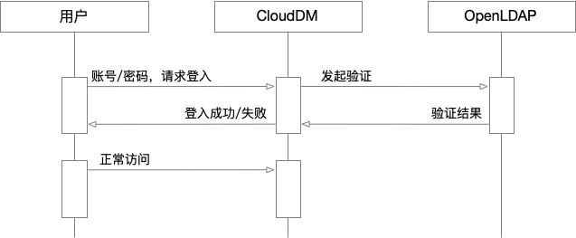

本文档主要介绍如何将 CloudDM Team 产品接入企业自身 **LDAP 服务** 以实现统一身份认证。

## 什么是 LDAP？

轻型目录访问协议（英文：Lightweight Directory Access Protocol，缩写：LDAP）是一个开放的、中立的、工业标准的应用协议，通过 IP 协议提供访问控制和维护分布式信息的目录信息。
LDAP 的一个常用用途是单点登录，用户可以在多个服务中使用同一个密码，通常用于公司内部网站的登录中。

LDAP 基于 X.500 标准的子集。因为这个关系，LDAP有时被称为 X.500-lite。
而 [OpenLDAP](https://www.openldap.org/) 是对 LDAP 标准的一个开源实现。

## 约束限制

CloudDM Team 版在使用统一身份认证功能时具有如下约束限制：
- **统一身份认证** 的配置需要由主账号进行。
- 多个主账号之间 **统一身份认证配置** 彼此独立。
- 当启用后产品将 **只允许** OpenLDAP 中配置的用户作为子账号登录。
- 当启用后 **系统设置** > **子账号管理** 页面中的 **添加账号** 功能将不可用。
- 当启用后 CloudDM Team 的账号有效性验证将会由 **OpenLDAP** 验证。
- 用户首次登录时会根据其 OpenLDAP 用户的 **gidNumber** 属性确定其 CloudDM Team 角色归属。具体参考高级选项参数 ldapRoleMap。
- 使用 LDAP 认证后用户账号有效性及密码强度过期策略等将会全部交由 **OpenLDAP** 管理。

## 工作原理



- 在登录页面选择 **子账号登录**，输入 OpenLDAP 中定义用户的用户名和密码。
- 在点击登录按钮后，CloudDM Team 会和 OpenLDAP 通信以验证用户身份。


## 如何配置

```text title='例如存在如下 OpenLDAP 服务器信息'
LDAP 服务器：192.168.0.100
LDAP Domain：clougence.com
LDAP Base DN：dc=clougence,dc=com
LDAP 服务账号：cn=admin,dc=clougence,dc=com
LDAP 服务密码：admin
```

CloudDM Team 版开启 OpenLDAP 认证步骤如下：
1. 使用主账号登录 CloudDM Team 产品。
2. 点击 **系统设置** > **系统偏好** > **通用参数** 选项卡。
3. 参考如下表格修改配置项。最后点击右上角 **保存** 按钮后 **确认** 保存。

```text title='(必选) 需要修改的配置'
配置项               │ 修改后                         │ 说明
────────────────────┼───────────────────────────────┼────────────────────────────────
subAccountAuthType  │ LDAP                          │ 统一身份认证使用 OpenLDAP 服务
ldapHost            │ 192.168.0.100                 │ OpenLDAP 服务 IP
ldapPort            │ 389                           │ OpenLDAP 服务端口，默认 389
ldapBase            │ dc=clougence,dc=com           │ Base DC，使用范例中 Base DN 配置
ldapUser            │ cn=admin,dc=clougence,dc=com  │ 连接 OpenLDAP 服务的账号
ldapPassword        │ admin                         │ 连接 OpenLDAP 服务的密码
```

```text title='(可选) 高级参数选项说明'
配置项               │ 修改后                         │ 说明
────────────────────┼───────────────────────────────┼────────────────────────────────────
ldapSoTimeout       │ 3000                          │ 与 OpenLDAP 服务通信的超时时间，默认 30 秒
ldapRoleMap         │ Developers                    │ 首次登录时绑定的角色，默认是 Developers（开发角色）
ldapUserObjectClass │ posixAccount,sambaSamAccount  │ 代表账号的 OpenLDAP 实体 objectClass 类型
ldapFieldLogin      │ cn                            │ OpenLDAP 实体的 cn 属性，通常表示用户登录
ldapFieldUser       │ sn                            │ OpenLDAP 实体的 sn 属性，通常表示用户姓名
ldapFieldEmail      │ mail                          │ OpenLDAP 实体的 mail 属性，表示用户的邮箱
ldapFieldPhone      │ mobile                        │ OpenLDAP 实体的 mobile 属性，表示用户的手机号
```

- **ldapRoleMap** 参数
  - **Manager** 表示系统内置 **[管理员](../../permission/role/role_info_admin)** 角色。
  - **DBA** 表示系统内置 **[DBA](../../permission/role/role_info_dba)** 角色。
  - **Developers** 表示系统内置 **[开发者](../../permission/role/role_info_developer)** 角色。
- **ldapUserObjectClass** 参数
  - **posixAccount**，对应为 OpenLDAP 上的 **Generic: User Account** 实体。
  - **sambaSamAccount**，对应为 OpenLDAP 上的 **Samba: Account** 实体。

:::info
- 首次登录时，用户需确认或补全 **手机号、邮箱**。
- 首次进入控制台时会根据其 ldapRoleMap 参数配置分配 CloudDM Team 用户角色。
:::

## 恢复设置

在开启了 **OpenLDAP** 认证服务后，若想恢复 **内置账号** 方式登录，需要按照如下操作进行。

1. 使用主账号登录 CloudDM Team 产品。
2. 点击 **系统设置** > **系统偏好** > **通用参数** 选项卡。
3. 参考如下表格修改配置项。最后点击右上角 **保存** 按钮后 **确认** 保存。

```text title='(必选) 需要修改的配置'
配置项               │ 修改后                   │ 说明
────────────────────┼─────────────────────────┼──────────────────────────────
subAccountAuthType  │ PASSWORD                │ 使用系统内置账号方式登录系统
```
