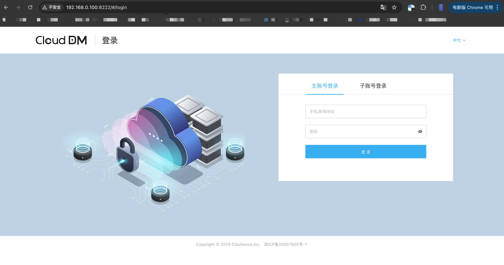
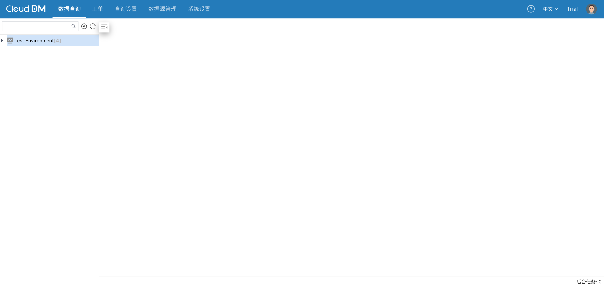
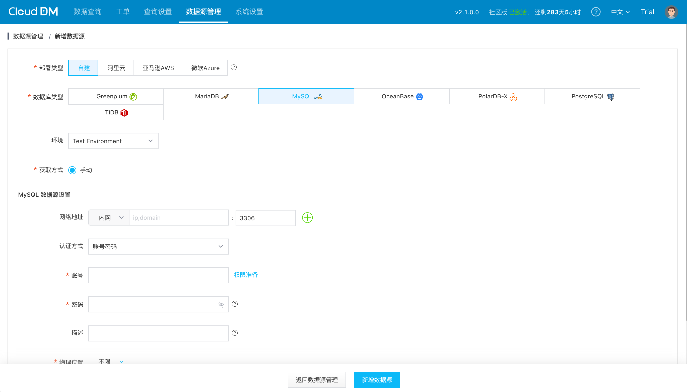
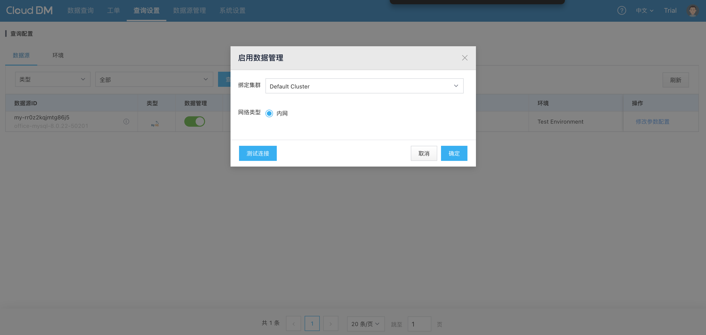
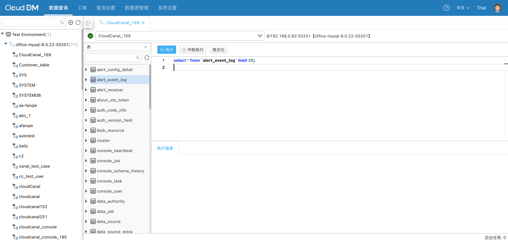
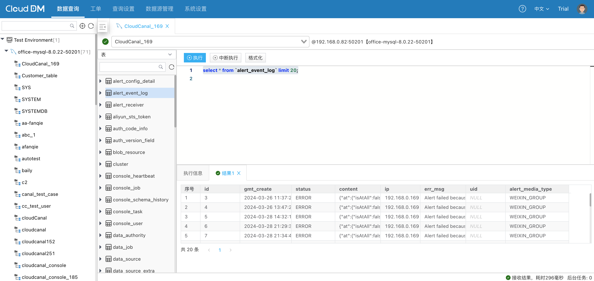

本文档以 Docker 方式部署连接自建 MySQL 数据源，演示如何从 0 到 1 快速熟悉 CloudDM Team 产品。

### 安装

1. 为 CloudDM Team 准备一台机器，并安装 Docker 环境。
   - **[运维手册推荐配置](../maintain/prepare/prepare_require)**（x86架构，4核CPU，16G内存，120GB硬盘）。
   - 为了简单方便您可以使用 **阿里云**、**AWS**、**Azure** 等云平台上云主机。
   - 安装 docker 和 docker-compose 请参考 Docker 官方网站 **[安装手册](https://docs.docker.com/engine/install/)**。
2. 跟随 **[安装手册](../maintain/prepare/prepare_install)**，初始化操作系统账号、以及必要的工具软件。
3. 从 **[CloudDM Team 官方网站](https://www.clougence.com/clouddm)** 下载最新安装包。
4. 跟随 **[安装手册](../maintain/install/install_docker)**，进行 Docker 版 CloudDM Team 的全新安装。
   - 当安装成功后会有醒目的 _**SUCCESS**_ 状态提示。
5. 安装完成后访问 _**http://&lt;部署服务器IP&gt;:8222**_ 即可看到登录页面，如下图：

### 登录

CloudDM Team Docker 版产品安装完成后会初始化一个 **[试用账号](../manual/login/login_by_main#trial)**。

- 试用账号信息如下：
  - 账号: `test@clougence.com`
  - 密码: `clougence2021`
  - 默认验证码: `777777`
- 使用试用账号登录后可以看到如下界面。

### 许可证获取
参考 [许可证获取](../license/license_use.md) 激活 CloudDM Team。

### 准备数据源

1. 点击 **数据源管理** 页面 > **添加数据源** 按钮，进入添加数据源页面。
   - 跟随 **[使用手册](../operation/datasource/self_maintain)** 添加自建数据源。
   - 通常只需要填写四个基本信息（**网络地址和端口号**、**认证方式**、**数据库账号**、**数据库密码**）。

2. 点击 **查询设置** 页面。
   - 在查询设置页面中在 **数据源**、**环境** 两个选项卡中切换到 **数据源** 选项卡下。
3. 在刚刚添加的数据源中点击 **数据管理** 分栏中的开关。
   - 新添加的数据源需要启用查询功能才可以访问。

4. 启用查询成功后，点击 **数据查询** 页面即可看到新添加的数据源。
   - 查询控制台的使用可以在文档 **[数据查询](../console/console_editor)** 中了解详细内容。

### SQL查询

1. 在查询控制台上点开添加的数据源。
   - 通过双击 **数据库** 或 **Schema** 可以打开一个新的查询编辑器。
   - 在查询编辑器中可以输入想要执行的 SQL。

2. 选中要执行的 SQL，通过点击 **编辑器** 上部 **执行** 按钮执行 SQL。
   - 当查询完毕查询结果会显示在查询编辑器下方。

### 进阶

更多详细功能介绍和使用请参考其它手册：
1. 产品使用手册
   - **[数据查询](../console/console_editor)**
   - **[数据库 CI/CD](../devops/devops_about)**
   - **[工单系统](../approval/approval_about)**
   - **[登录与账户](../manual/login/login_by_main)**
2. **[系统管理手册](../operation/operation_guide)**
3. **[权限说明手册](../permission/system/perm_sys)**
4. **[产品运维手册](../maintain/maintain_guide)**
