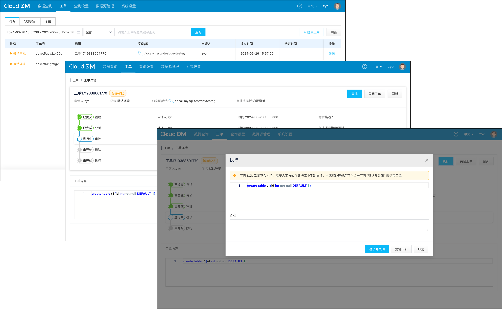
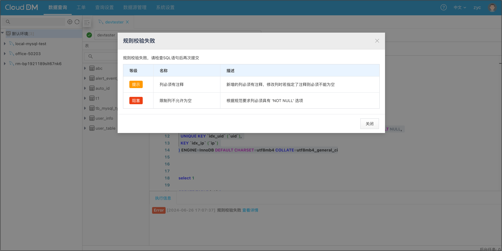
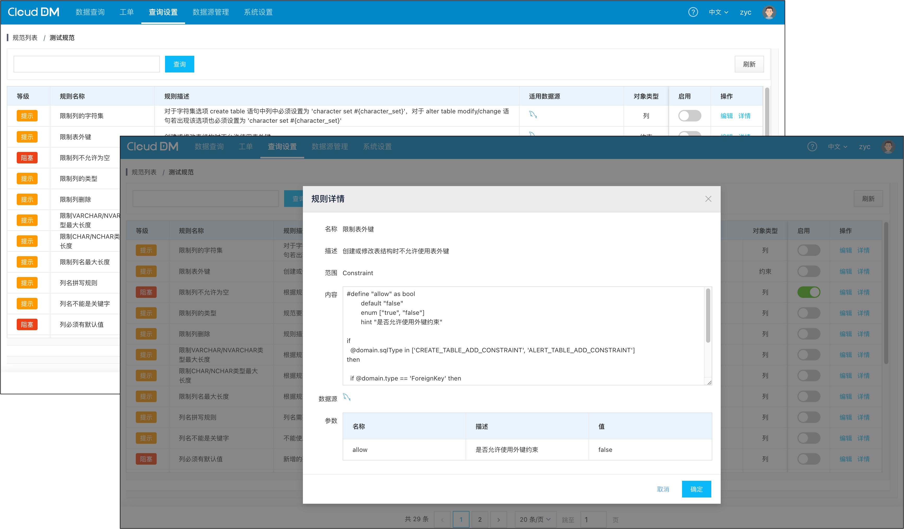

- 发版时间: 2024 年 6 月 26 日
- 版本号: v1.2.0.0

## 产品展示

- 团队协作工单功能

- 查询控制台规则校验

- 安全规则与安全规范管理

## 新增
- 新增 查询语句安全规则校验能力，产品默认提供 29 个 DDL 相关的安全规则可用。
- 新增 安全规范管理，用户可以选取任意的安全规则组合成一个安全规范。
- 新增 安全规范中的安全规则重要级别，当不满足规则时是提示用户还是不允许执行。
- 新增 控制台发出的 SQL 会经过安全规范的检验，不符合规范要求的查询会提示或拒绝执行。
- 新增 工单功能，用户可以将重要的数据源保护起来通过工单管理对数据源的访问。
- 新增 新建工单时可以对递交的查询进行规则校验，不满足规则的查询会提示或拒绝递交工单。
- 新增 查询控制台可用状态，位于查询窗口 Tab 选项卡下方。绿色表示：可用、红色表示不可用。
- 新增 查询控制台可以同时选择多条 SQL 一起执行。

## 优化
- 优化 控制台查询交互，执行过程中输出更详细的执行日志。新增包括各阶段执行耗时。
- 优化 控制台查询，使用 WebSocket 长连接代替短连接，控制台操作反应更加灵敏。
- 优化 控制台查询执行信息窗口，Info/Warn/Error 级别文案颜色。

## 修复
- 修复 在 SQL 执行过程中一些场景中取消查询按钮无法恢复查询状态的问题。
