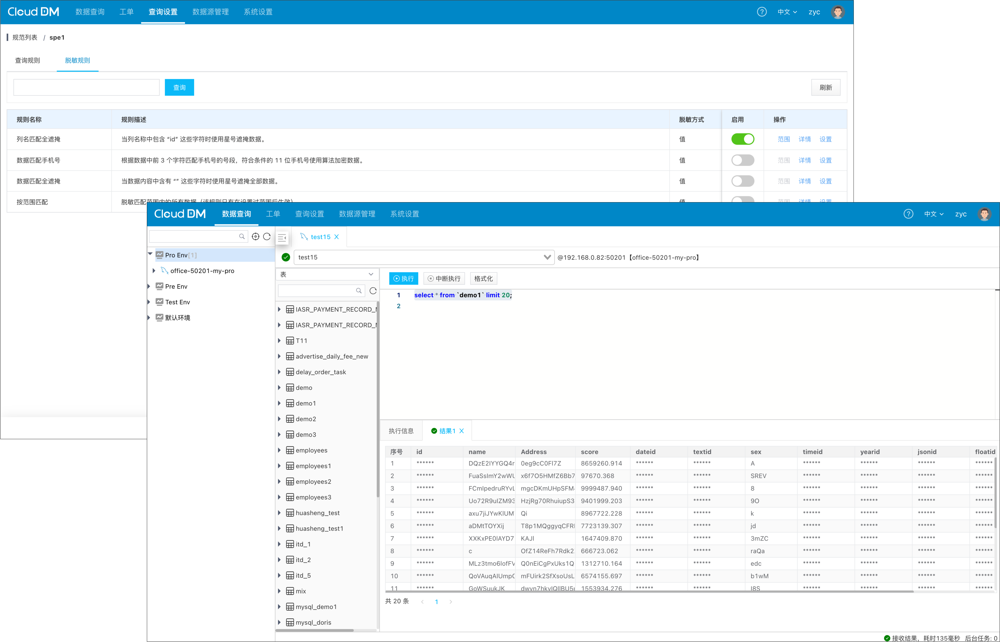
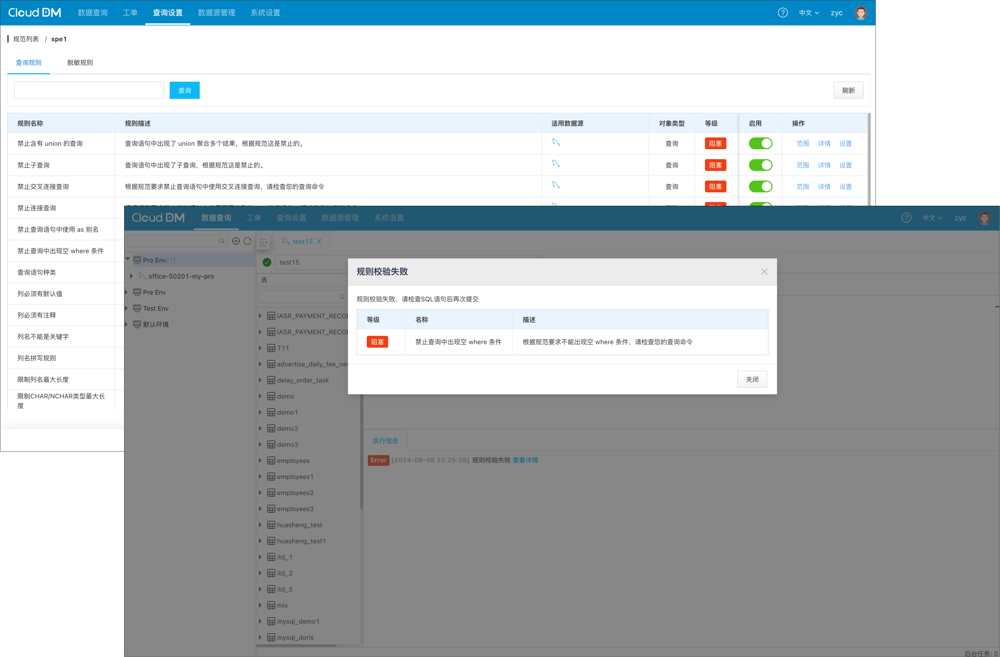
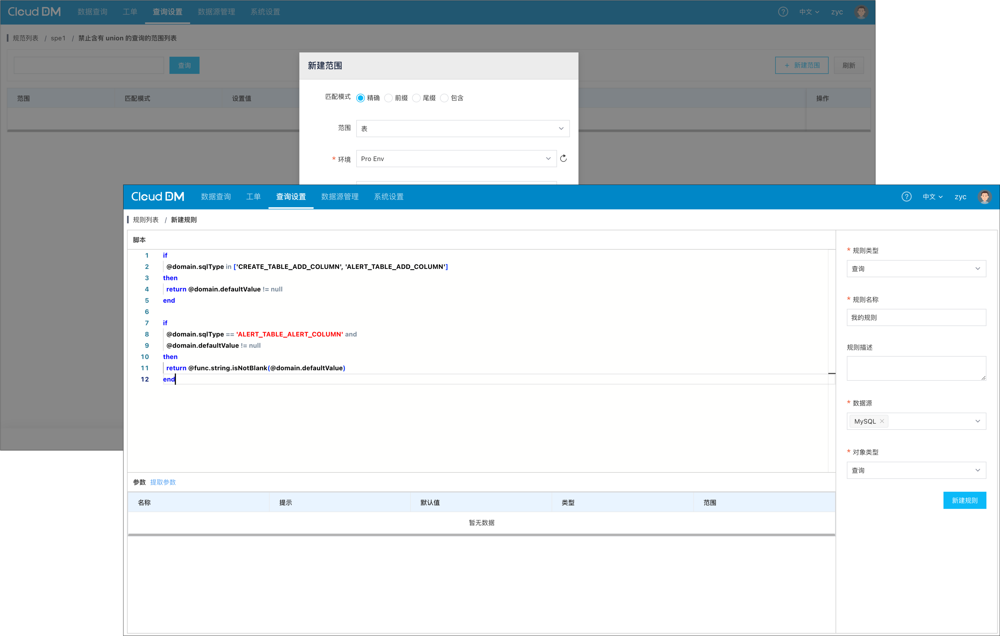

- 发版时间: 2024 年 8 月 08 日
- 版本号: v1.3.0.0

## 产品展示

- 脱敏查询的数据

- 针对查询语句的规则校验

- 规则使用更加灵活

## 新增
- 新增 安全规则模型新增支持 select 语句以及 with select 语句。
- 新增 内置的安全规则新增 7 个新的查询规则。
- 新增 脱敏规则可对查询结果进行星号遮掩，同时内置 4 种遮掩安全规则。
- 新增 规则生效范围用于在安全规范在启用规则时限定其生效范围。
- 新增 规则脚本模型基础属性中新增用户名、用户角色、环境名称和ID信息方便自定义规则使用。
- 新增 开放规则脚本自定义能力允许用户自由定制各式规则。
- 新增 在启用脱敏规则后无论是否启用了查询规则都会禁止使用 as、join、union。
- 新增 docker 版本部署新增 upgrade.sh 升级脚本从 v1.3.0.0 开始支持升级安装。

## 优化
- 优化 规则脚本本身编写报错可以提示规则脚本中报错的具体行号和列位置。
- 优化 限制表/列的字符集/排序规则/存储引擎 等 6 个内置规则中的脚本逻辑问题。
- 优化 使用阿里云 OpenAPI 时如果 AK/SK 已经失效情况下报错消息提示，例如通过 AK/SK 添加数据源。
- 优化 规则/规范 中规则列表中描述信息中含有的参数描述符会解析为正在生效的具体参数。
- 优化 查询控制台在执行多条语句时每条执行的语句都会展示在“执行信息窗口”中。
- 优化 多条查询语句一起执行时如果中途报错 “执行信息窗口” 会被展示报错的信息及报错的 SQL。
- 优化 通过子账号添加数据源会自动赋予当前账号新数据源的相关权限。
- 优化 查询控制台记录顺序改为习惯的从上倒下阅读习惯，最新的日志会保持在最下。
- 优化 角色/环境 列表按照创建时间排序后创建的保持在前面。角色列表中内置角色始终在最前面。

## 修复
- 修复 修复规则引擎在处理规则脚本中 in 操作时无法正确匹配模型中枚举类型的问题。
- 修复 删除无效的 Role 角色权限点：数据保护配置查看、数据保护配置管理。
- 修复 删除无效的数据权限点：访问加密数据权限。
- 修复 隐藏 DM 产品还不支持的数据源保留支持的数据源。
- 修复 子账号为开发者身份情况下无法访问查询控制台的问题。
- 修复 添加阿里云 RDS 数据源时同时存在内/外 网情况下测试链接失败的问题。
- 修复 由于 Docker 启动过程中 mysql 容器启动时间过长导致 console 容容器启动失败的问题。
- 修复 子账号下当只有子账号查看权限时，子账号管理页面仍然可以进行“删除”操作的问题。
