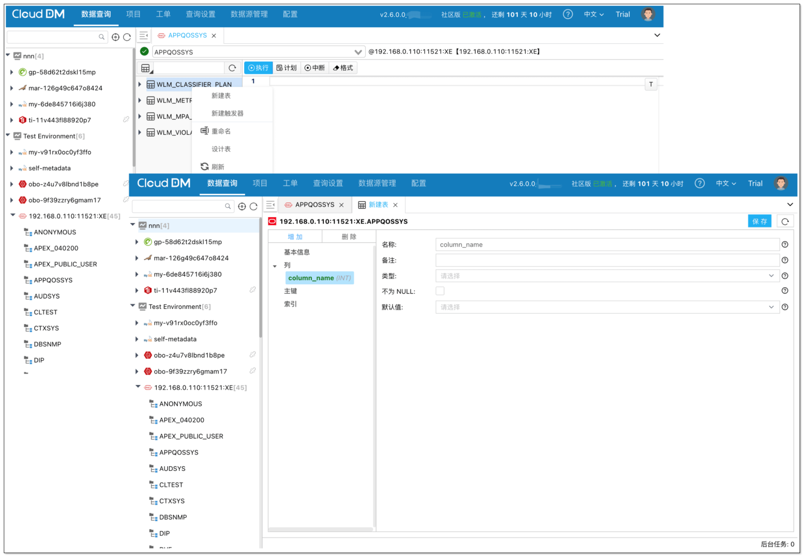
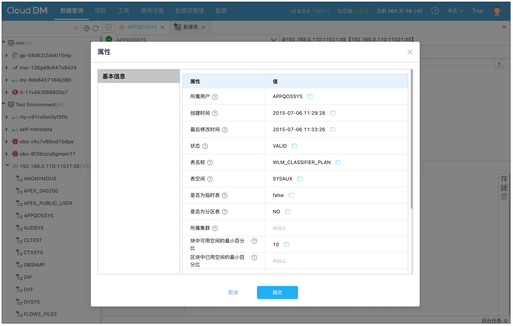

- 发版时间: 2025年 07月 21日
- 版本号: v2.6.0.0

## 更新亮点
- 支持可视化创建、修改、删除数据库对象，包括表、触发器、视图、函数等。

- 支持查看数据源表、视图、存储过程、函数、触发器等属性。

## 新增
- 新增 对象管理权限和数据库运维权限，用于控制查询控制台交互式 UI 编辑器的使用。
- 新增 可视化创建、修改、删除数据库对象，包括表、触发器、视图、函数等，如若缺少权限可使用可视化页面快速提交工单。
- 新增 查看数据库对象（表、视图、物化视图、存储过程、函数、触发器等），支持的数据源包括 MySQL、Oracle、MariaDB、TiDB、 PolarDB-X、PostgreSQL、Db2。
- 新增 查看 SQL 语句的查询计划功能，支持的数据源包括 MySQL、TiDB、MariaDB、PolarDB-X、PostgreSQL、Greenplum、Oracle、Db2 for i、Db2 for oz。
- 新增 SQL 审计功能，可以在 配置 -> SQL审计 页面查看历史执行的 SQL。
- 新增 控制台的查询结果可以导出为 Excel。

## 优化
- 优化 开启数据脱敏规则后，针对 SQL 语句允许使用别名、JOIN、UNION 等操作。支持的数据源包括 MySQL、Greenplum、PostgreSQL、PolarDB For PG。
- 优化 将结构定义 DDL 权限分割为结构定义 DDL、数据库对象定义、Catalog/Schema 定义三个权限。
- 优化 对于已访问过的数据库元信息进行缓存，加快二次查询速度。
- 优化 已授权限和未授权的区分。
- 优化 预览授权可以通过颜色区分本次新增/删除。

## 修复
- 修复 PolarDB-X 数据源视图列表查询为空问题。
- 修复 继承权限问题。在编辑权限时，可动态继承权限。
- 修复 来自不同层级的授权时间问题。