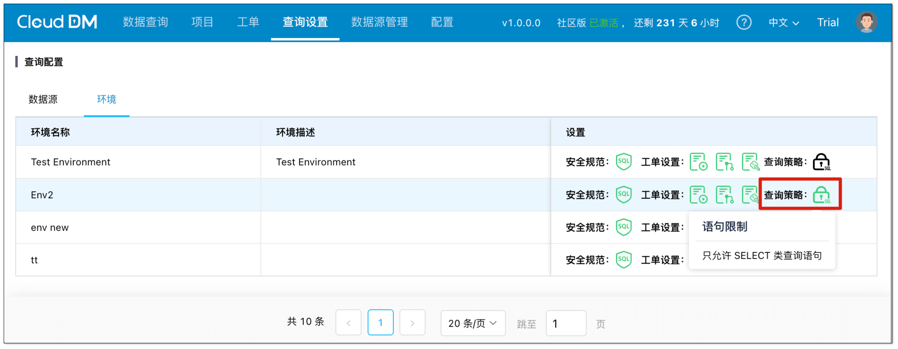

- 发版时间: 2025年 08月 12日
- 版本号: v2.7.0.0

## 更新亮点
- 支持 **查询策略** 功能，可配置环境是否只允许执行 **查询类 SQL**。

## 新增
- 新增 支持 OpenGauss 和 GaussDB 数据源，可对 OpenGauss 进行新建/重命名/清空/删除表、新建/重命名/删除视图等可视化操作、数据脱敏、权限管理等操作。
- 新增 查询策略 功能，用于管理环境中是否只允许执行查询类 SQL。

## 优化
- 优化 Oracle 解析器使用 ANTLR 实现，具备更强的可控性。

## 修复
- 修复 无权限提示信息重复显示的问题。
- 修复 子账号授权提示信息未国际化的问题。
- 修复 已授权限的环境下没有资源时，环境未隐藏的问题。
- 修复 子账号有资源授权查看权限，操作列表中未显示“授权” 的问题。
- 修复 主账号给子账号授权，时间范围设置无法显示的问题。
- 修复 不支持特殊库名/schema 名/表名显示的问题。
- 修复 操作审计表单中有空白列的问题。