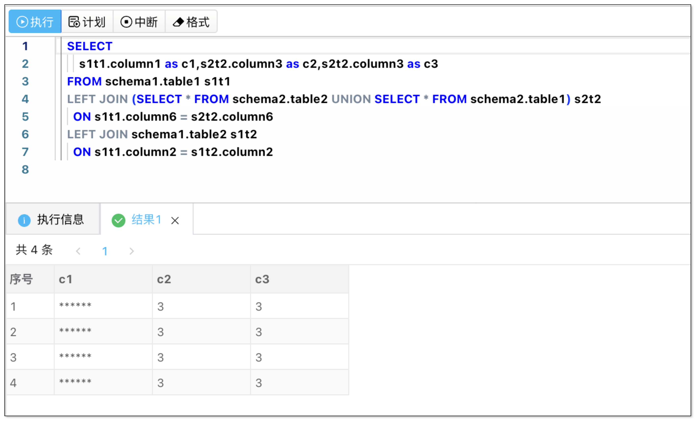

- 发版时间: 2025 年 8 月 20 日
- 版本号: v2.7.1.0

## 更新亮点
- MariaDB、PolarDB-X、OceanBase for MySQL、AnalyticDB for MySQL、TiDB 数据脱敏允许使用复杂 SQL。

## 新增
- 新增 CI/CD 列表操作栏中增加 测试 按钮，可以测试当前配置是否有效。
- 新增 IM 消息服务提供者列表操作栏中增加 测试 按钮，可以测试当前配置是否有效。

## 优化
- 优化 MySQL、MariaDB、PolarDB-X、OceanBase for MySQL、AnalyticDB for MySQL、TiDB 解析器使用 ANTLR 实现，具备更强的可控性。
- 优化 MariaDB、PolarDB-X、OceanBase for MySQL、AnalyticDB for MySQL、TiDB 开启脱敏后允许使用复杂 SQL。
- 优化 MariaDB、PolarDB-X、OceanBase for MySQL、AnalyticDB for MySQL、TiDB 支持可执行注释。
- 优化 CI/CD 和 IM 消息服务在已经被使用的情况下，允许通过编辑配置修改名称/配置信息。
- 优化 导出的 Excel 每个单元格最大写入 1048576 个字符，如遇到超长数据采用批注方式提示用户有截断。
- 优化 查询结果中如果遇到类型不支持将会提示 Unsupported，并且在导出的 Excel 中会以批注形式提示。
- 优化 子账号查询数据结果集中，导出脱敏数据后，将会以批注形式提示数据被脱敏。

## 修复
- 修复 子账户有 MySQL 某个 schema DDL 权限时，可以通过 rename 把该 schema 的表移到另一个无权限的 schema 下。
- 修复 子账户有 MySQL 某个 schema DDL 权限时，可以通过类似 `CREATE unique INDEX test_index ON db2.test (c1, c2 ASC) comment 'sss';` `ALTER TABLE her.test ADD KEY www (c1(33),c2(33)) comment 'sss';`的语句删除其他无权限 schema 中的索引。
- 修复 子账户有 MySQL 某个 schema DDL 权限时，可以通过类似 `drop index aa from db2.test`的语句删除其他无权限 schema 下的索引。
- 修复 子账户有 MySQL 某个 schema DDL 权限时，可以通过类似 `ALTER TABLE db2.employee rename index old1 to new1;`的语句修改其他无权限 schema 下的索引名称。
- 修复 子账户有 MySQL 某个 schema DDL 权限时，可以通过类似 `drop table db2.tablename`的语句删除其他无权限 schema 表。
- 修复 开启脱敏后子账户查询视图、物化视图出错的问题。
- 修复 子账号权限配置过程中，在有未提交的情况下切换资源类型，提示对话框中按钮本应显示取消，但显示为确定的问题。
- 修复 结果集中如果包含 Bytes、Date 类型时无法下载的问题。