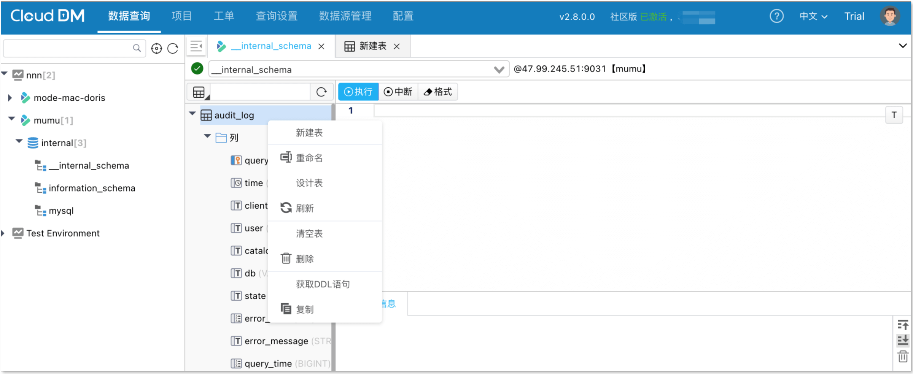

- 发版时间: 2025 年 9 月 15 日
- 版本号: v2.8.0.0

## 更新亮点
- 新增 **Doris**、**SelectDB** 数据源可视化操作、数据查询、数据脱敏、SQL 审核、SQL 审计、CI/CD 等功能。

## 新增
- 支持 Doris 数据源可视化操作、数据查询、数据脱敏、SQL 审核、SQL 审计、CI/CD 等功能。
- 支持 SelectDB 数据源可视化操作、数据查询、数据脱敏、SQL 审核、SQL 审计、CI/CD 等功能。
- 支持 解析、执行 truncate 类型语句。
- 支持 项目使用[**飞书消息机器人**](../devops/provider/devops_im_feishu.md)、[**企业微信**](../devops/provider/devops_im_wechat.md) 作为 IM 消息服务。
- 支持 查询控制台在执行 SQL 时，若 SQL 规则检测失败会明显地提示问题 SQL 所在行，支持的数据源包括：AnalyticDB(MySQL)、Gauss、OpenGauss、Greenplum、MariaDB、MySQL、OceanBase(MySQL)、OceanBase(Oracle)、Oracle、PolarDB-X、PolarDB for MySQL、PolarDB(PostgreSQL)、PostgreSQL、TiDB。
- 支持 工单和查询控制台使用 `set global|session|local name = value` 语句，支持的数据源包括：AnalyticDB(MySQL)、MariaDB、MySQL、OceanBase(MySQL)、PolarDB-X、PolarDB(MySQL)、Doris、TiDB。
- 支持 CloudDM 安装之后，自动激活若干天社区版授权，使用更加便利。

## 优化
- 优化 在工单递交进行规则校验时，如遇到 SQL 问题提示信息，从弹窗方式改为选项卡，方便对照问题。
- 优化 当遇到存在语法错误的语句时，优化报错提示信息并提示报错语句所在行和列。

## 修复
- 修复 一次提交多条 SQL 语句执行时，SQL 执行出错后，后续语句会继续执行的问题。
- 修复 MySQL 语句之间有复数时解析器出错的问题。
- 修复 项目修改 IM 配置后，无法发送消息的问题。
- 修复 项目归档后恢复，无法发送消息的问题。
- 修复 递交工单时，若 SQL 规则检测失败，提示 SQL 所在行可能不准确的问题。
- 修复 在使用小写方式执行 `select @@version;` 查询语句时报错的问题，涉及的数据源包括：MySQL、MariaDB、OceanBase for MySQL、PolarDB-X、PolarDB for MySQL 和 TiDB。
- 修复 select 语句在 order by 字句后使用 limit 无法解析的问题，涉及的数据源包括：Gauss、OpenGauss、Greenplum、PolarDB(PostgreSQL)、PostgreSQL。
- 修复 PostgreSQL 插入浮点数，解析器报错的问题。
- 修复 MySQL 创建表时，若字段含有浮点数类型，解析器报错的问题。
- 修复 添加 IM 提供者时点击测试，系统报错的问题。