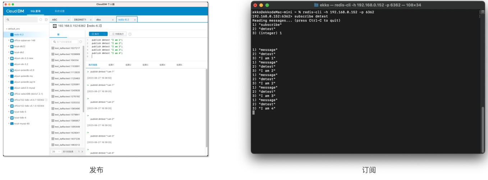
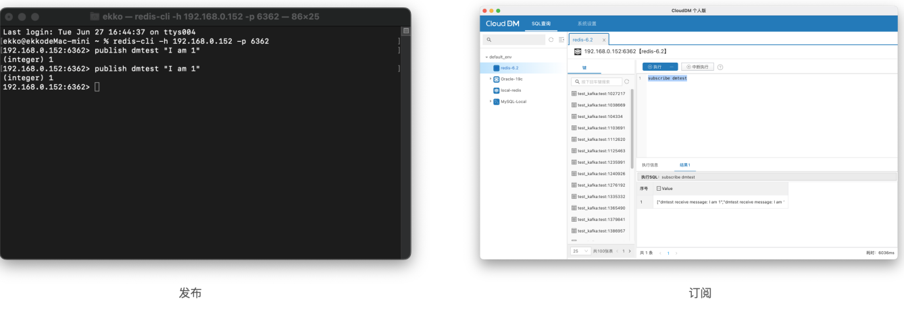

- 发版时间: 2023年 06月 27日
- 版本号: v2.1.1

# 更新内容

本次版本发布最大特点是支持了 Redis PubSub 命令组，如果您正在使用 Redis 提供的消息订阅机制，那么使用 CloudDM 可以帮助你更加方便的调试您的应用程序。

使用 CloudDM 模拟上游应用程序发布消息，通过 Redis-Cli 命令行工具模拟消息订阅消费。

通过 Redis-Cli 命令行工具模拟上游应用程序发布消息，使用 CloudDM 监听上游发来的消息。
- CloudDM 目前每次只能监听 6 秒内的消息，超过6秒后需要重新监听。

# 更新内容

## [新增]
- [新增] 完整支持 Redis 消息队列 Pub/Sub 命令组。

## [优化]
- [优化] IP 和 Port 输入框的 UI 显示。

## [修复]
- [修复] Oracle 快捷查询语句生成问题。
- [修复] 升级版本后出现的启动错误问题。
- [修复] 导出 Insert 语句错误问题。