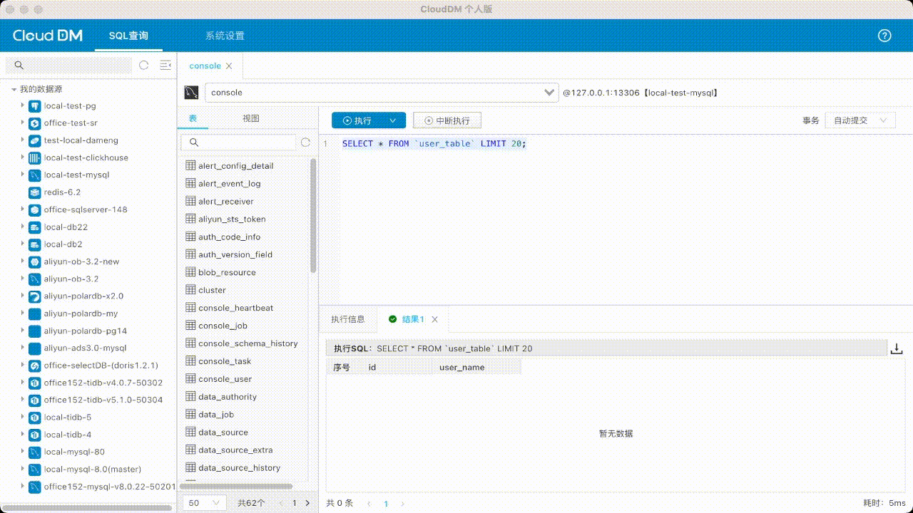

- 发版时间: 2023年 08月 25日
- 版本号: v2.1.3

# 更新内容

本次版本发布最大特点是重新设计了表结构编辑器。

# 更新内容

## [新增]
- [新增] 针对国产达梦数据库的查询支持。
- [新增] Redis 完整 Set 命令集的支持。
- [新增] 通过 异步执行 方式选择将 SQL 语句执行结果导出到指定位置。
- [新增] 数据库列表面板大小可以左右自由拖动。
- [新增] 表列表面板大小可以左右自由拖动。
- [新增] 查询结果集的标签页可以关闭的功能。
- [新增] 视图 Tab 没有右右键菜单，至少应该可以复制名字。

## [优化]
- [优化] 应用程序启动迎宾图显示分辨率为 2 倍图模式提升清晰度。
- [优化] 深度右键菜单弹出机制，屏蔽部分不适当的右键菜单弹出。
- [优化] UI 界面部分面板字体缩小以显示更多内容。
- [优化] UI 界面数据库列表的距缩小显示更多数据库。
- [优化] UI 界面表列表的间距缩小显示更多的表。
- [优化] UI 界面查询结果的行高缩小显示更多的数据。
- [优化] UI 界面右键功能菜单弹出机制，对于有些数据源不支持的功能进行隐藏。

## [修复]
- [修复] 数据源列表，点击详情出现偏移的问题。
- [修复] 结果集导出不成功的问题。
- [修复] 查询窗口下方 Redis key 显示的总数不正确的问题。
- [修复] 查询窗口结果集栏上下拖动鼠标定位严重偏移的问题。
- [修复] 操作系统选择英文语言时界面国际化问题。
- [修复] 选项卡上右击弹出菜单可以出现两套的问题。
- [修复] 在表列表空白处右键菜单不能新建表的问题。
- [修复] 窗口大小拖动过程中界面中布局可能超出显示范畴的问题。
- [修复] 数据源管理列表中点击详情出现偏移的问题。
- [修复] 查询结果集不能正确切换的问题。