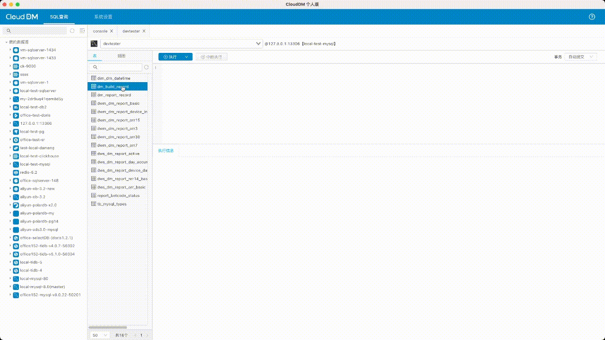
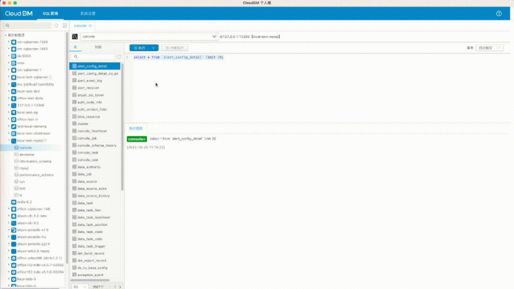
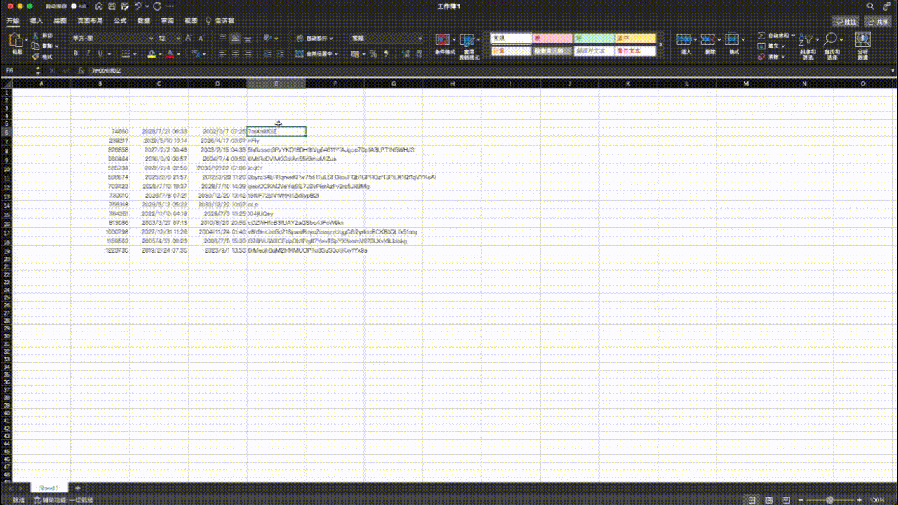

- 发版时间: 2023年 10月 25日
- 版本号: v2.3.0

# 更新内容

目前已经支持的 13 种数据源全部开放表结构设计器能力，包括如下数据源：
- 主流数据库：MySQL、PostgreSQL、Oracle、SQL Server、IBM Db2。
- 国产数据库：TiDB、StarRocks、Doris、PolarDB-X、OceanBase、达梦。
- 新型数据库：Greenplum、ClickHouse。

对支持的 13 种数据源提供针对表的数据编辑功能。

将数据数据复制到 Excel 以及将数据从 Excel 复制数据到数据库。

- 从数据库复制到 Excel

- 从 Excel 复制到数据库

# 更新内容

## [新增]
- [新增] 已支持的全部的 13 种数据库统一开放表结构设计功能。
- [新增] 单表数据编辑功能，可以完成新增/修改/删除/更新 操作。
- [新增] 将数据数据复制到 Excel 功能。
- [新增] 将数据从 Excel 复制数据到数据库的功能。
- [新增] 查询窗口右键菜单可以快捷关闭其它窗口。
- [新增] 查询结果集右键菜单可以快捷关闭其它查询结果。

## [优化]
- [优化] PostgreSQL/Greenplum 表编辑当删除列时，如果存在关联索引无需额外删除索引。
- [优化] MySQL 勾选自增主键保存时生成的 SQL语句。
- [优化] 创建数据库之后自动回显，在此之前需要再次点击刷新才能显示新数据库。
- [优化] 查询窗口 Table 的交互，当数据库加载较慢时，不会在锁定整个软件而是锁定查询窗口。
- [优化] 安装包体积缩减 140MB+。

## [修复]
- [修复] 添加 TiDB 数据库失败的问题。
- [修复] 数据导出功能提示导出成功了但实际上还没有进行导出的问题。
- [修复] SQL 查询标签页，关闭一个会导致两个同时关闭的问题。
- [修复] 批量执行结果如果有异常，Tab 结果没有提示的问题。
- [修复] StarRocks 通过表结构编辑器新建表报错的问题。
- [修复] SQL查询标签页，切换数据库无效的问题。
- [修复] 查询执行窗口快速点击“执行”出现 空指针报错的问题。
- [修复] MySQL 新增列类型为 Enum、Set 报错的问题。
- [修复] ClickHouse 表结构编辑默认创建表生成的建表语句无效的问题。
- [修复] Doris 创建 Decimal 数据类型报空指针的问题。
- [修复] 快捷键复制（Ctrl + C） 按一次，会出现三个复制成功提示的问题。
- [修复] 对列重命名后，主键，索引中对应列名字没有刷新的问题。
- [修复] Redis 数据源无法连接的问题。
- [修复] StarRocks, Doris, OceaBase, ClickHouse 等数据源删除和清空表失败的问题。
- [修复] 某些数据源快捷建库失败的问题。
- [修复] 表编辑索引只删除列语句生成错误的问题。