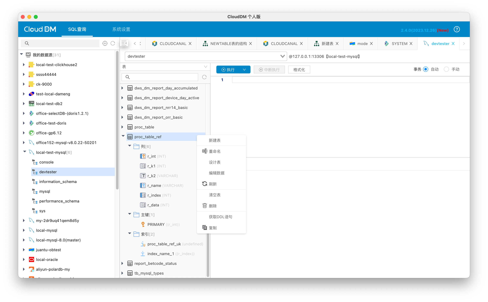
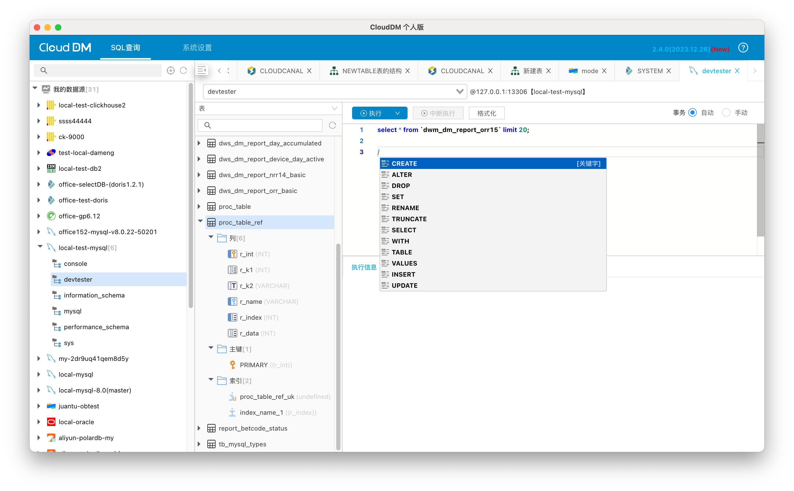
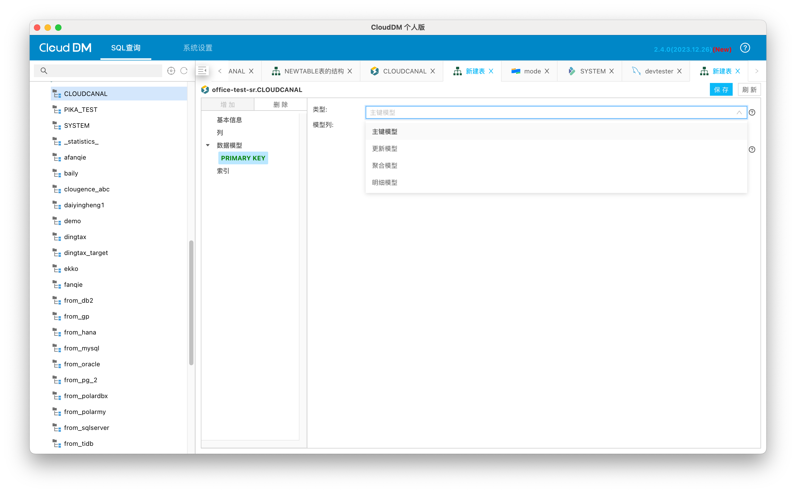
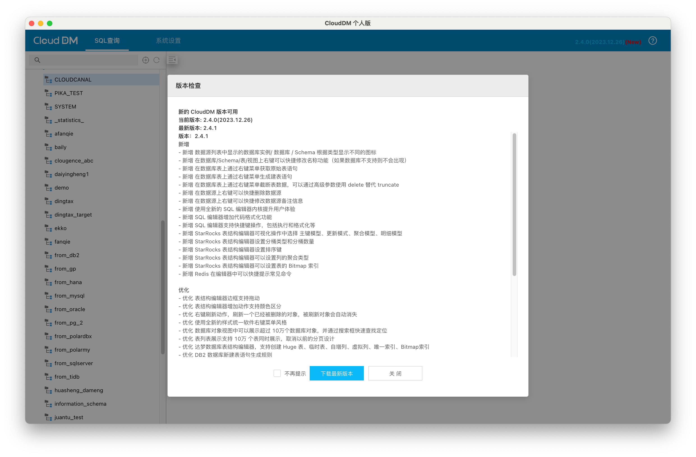

- 发版时间: 2023年 12月 26日
- 版本号: v2.4.0

CloudDM 新增 Ubuntu Linux 桌面支持，至此主流桌面操作系统上都可以运行 CloudDM 产品。使用相同的用户体验在不同平台上操作数据库。

# 本次亮点

CloudDM 全新的操作体验，可以看到数据库中更详细的内容；右键菜单会根据数据库对象类型不同提示不同的操作；可以获取 表/视图的 创建语句；可以看到表的列/索引 等详细信息。

全新的 SQL 编辑器使用起来更加顺畅。

针对 StarRocks 数据提供更全面的表结构可视化设计。

新版本提示功能，从此可以不在错过任何一次 CloudDM 的升级更新。

# 更新内容

## 新增
- [新增] 数据源列表中显示的数据库实例/ 数据库 / Schema 根据类型显示不同的图标。
- [新增] 在数据库/Schema/表/视图上右键可以快捷修改名称功能（如果数据库不支持则不会出现）。
- [新增] 在数据库表上通过右键菜单获取原始表语句。
- [新增] 在数据库表上通过右键菜单生成建表语句。
- [新增] 在数据库表上通过右键菜单截断表数据，可以通过高级参数使用 delete 替代 truncate。
- [新增] 在数据源上右键可以快捷删除数据源。
- [新增] 在数据源上右键可以快捷修改数据源备注信息。
- [新增] 使用全新的 SQL 编辑器内核提升用户体验。
- [新增] SQL 编辑器增加代码格式化功能。
- [新增] SQL 编辑器支持快捷键操作，包括执行和格式化等。
- [新增] StarRocks 表结构编辑器可视化操作中选择 主键模型、更新模式、聚合模型、明细模型。
- [新增] StarRocks 表结构编辑器设置分桶类型和分桶数量。
- [新增] StarRocks 表结构编辑器设置排序键。
- [新增] StarRocks 表结构编辑器可以设置列的聚合类型。
- [新增] StarRocks 表结构编辑器可以设置表的 Bitmap 索引。
- [新增] Redis 在编辑器中可以快捷提示常见命令。
- [新增] 新版本更新提示功能。

## [优化]
- [优化] 表结构编辑器边框支持拖动。
- [优化] 表结构编辑器增加动作支持颜色区分。
- [优化] 右键刷新动作，刷新一个已经被删除的对象，被刷新对象会自动消失。
- [优化] 使用全新的样式统一软件右键菜单风格。
- [优化] 数据库对象视图中可以展示超过 10万个数据库对象，并通过搜索框快速查找定位。
- [优化] 表列表展示支持 10万 个表同时展示，取消以前的分页设计。
- [优化] 达梦数据库表结构编辑器，支持创建 Huge 表、临时表、自增列、虚拟列、唯一索引、Bitmap索引。
- [优化] DB2 数据库新建表语句生成规则。

## [修复]
- [修复] PostgreSQL 数据库版本低于 14.2 时打开设计表报错的问题。
- [修复] Greenplum 数据库表结构编辑器分布键组件缺失的问题。
- [修复] 表结构编辑器无法删除索引的问题。
- [修复] 表结构编辑器版本判断失效的问题。
- [修复] StarRocks 数据库十六进制数据展示乱码问题。
- [修复] PostgreSQL 数据库在设置索引列时出现多余的选项设置。
- [修复] SQL Server 数据源无法展示 sys 下系统视图的问题。
- [修复] 在查询结果 Tab 上右键关闭，必须要点在字上才可用的问题。
- [修复] 在查询窗口 Tab 右键，必须要点在字上才可用的问题。
- [修复] 数据库对象视图中表列表部分有多余边框问题。
- [修复] 内网状态下所有图标都失效的问题。
- [修复] 数据源在修改配置报错后无法删除的问题。