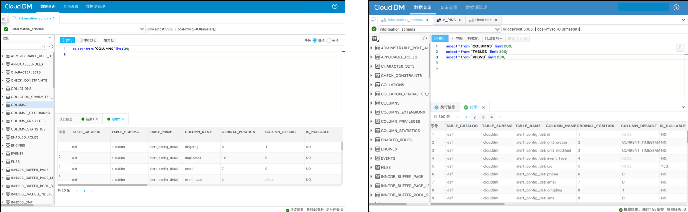

- 发版时间: 2025年 05月 07日
- 版本号: v3.0.5

# 更新内容

## [新增]
- [新增] 编辑器文本字体大小通过编辑器右上角新增悬浮按钮可以设置 大、中、小 三个级别。
- [新增] 查询控制台标签页最右侧新增下拉按钮，允许菜单形式查看所有标签，当点击后可快速跳到对应的页面。
- [新增] 查询结果标签页最右侧新增下拉按钮，允许菜单形式查看所有标签，当点击后可快速跳到对应的查询结果。
- [新增] 查询控制台 **窗口标签** 和 **查询结果标签** 的下拉菜单中，可以点击 **叉** 图标快速关闭对应页面。
- [新增] 查询控制台执行信息最右侧，新增竖向按钮组，可以点击删除图标清空控制台输出日志。

## [优化]
- [优化] 查询控制台中 **执行**、**中断**、**格式化** 合并为一个按钮组。
- [优化] 查询控制台中开启/关闭事务，及隔离级别设置从多个 UI 组件合并为一个下拉交互。
- [优化] 查询控制台中 **事务设置**、**递交**、**回滚**、**隔离级别**、**只读模式** 合并为一个按钮组。
- [优化] 查询控制台执行信息的内容配色方案。取消级别状态的直接显示，而是根据状态的不同，使用不同的字体颜色。
- [优化] 查询控制台整体 UI 减少边框和留白，让操作更加聚焦。
- [优化] 查询控制台，表列表 顶部的 数据库元素选择器，从独立下拉框缩减为一个图标以减少页面复杂度。
- [优化] 查询控制台查询标签 Tab 右侧的 锁进图标样式调整弱化突出。

## [修复]
- [修复] 查询控制台控制台日志面板在页面初始状态中面板没有最大化展示的问题。
- [修复] 查询控制台查询结果的结果集在拖动结果列时，当列名宽度大于表格宽度，出现自动换行影响视觉效果的问题。
- [修复] 查询控制台查询结果的结果集面板没有最大化展示的问题。
- [修复] 新版本提示窗口中底部按钮缺失间距的问题。
- [修复] 查询控制台 SQL 窗口 Tab 关联数据源的图标和数据源管理中图标不一致的问题。