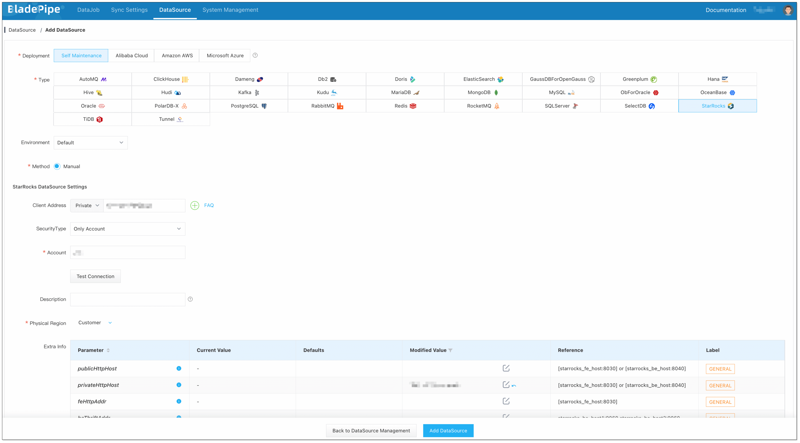
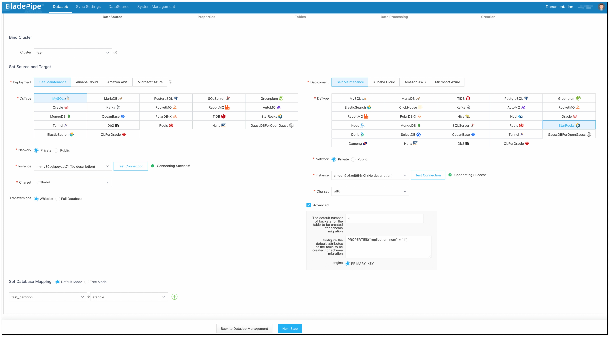
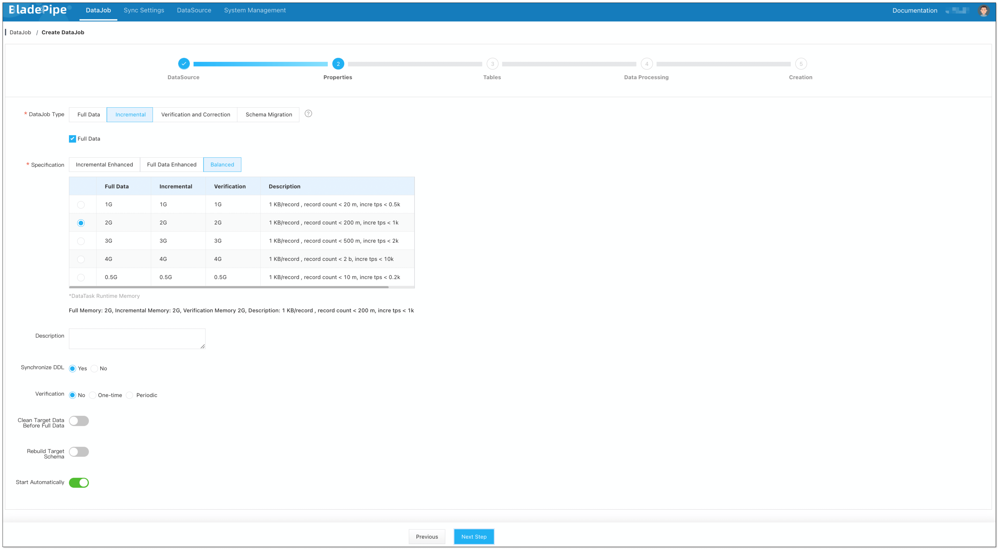
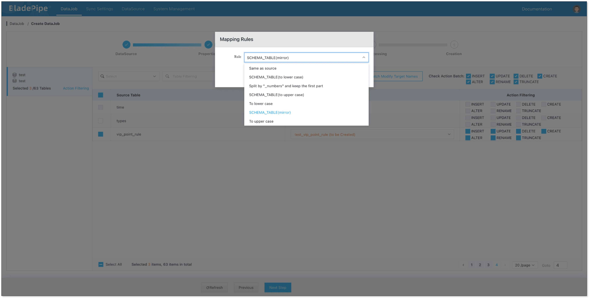
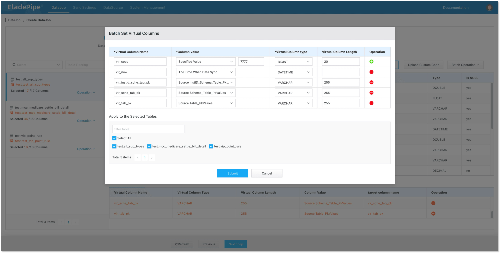
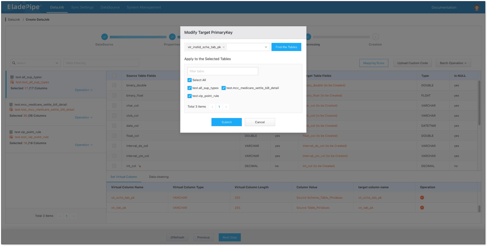
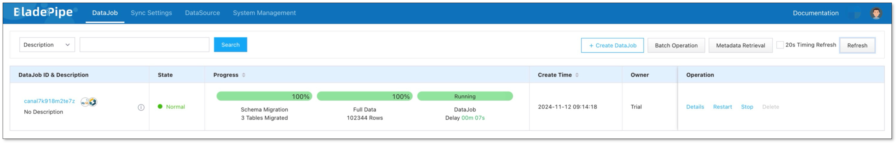

## Overview
Data aggregation is to combine data from multiple sources into a single body, and present the data in a summarized format. In the data movement process, there is great possibility that tables from different sources have the same table name or primary key/unique key value, resulting in duplication in the target instance.

Don't worry. [BladePipe](https://www.bladepipe.com) is equipped with the capabilities to prevent potential **table name conflicts** and **duplicate primary/unique key values** when aggregating data from different sources.

The highlights include:

- Adding common virtual columns
- Setting a virtual column as the primary key of the target table
- Concatenating metadata as target table names
- No-code intuitive interface

## Highlights

### Adding Various Virtual Columns

For different use cases and data sources, you can generate the following virtual columns in BladePipe, as shown in the table below.

BladePipe also supports **setting multiple virtual columns for a table**, **setting specific virtual columns for certain tables**, and **batch setting**.

| Virtual Column Type  | Description                    | Valid Operations       |
|----------------------| --------------------------|---|
| Specified Value                        | Add a new column to the target table with a specified number or string filled in | INSERT                 |
| Data Sync Time                | Add a new column to the target table with the time that the data arrives at BladePipe filled in | INSERT                 |
| Source InstID_Schema_Table_PKValues    | Add a new column to the target table and the values are generated by concatenating the source **Instance ID**, **Schema**, **Table**, and **Primary Key** | INSERT, UPDATE, DELETE |
| Source InstID_DB_Schema_Table_PKValues | Add a new column to the target table and the values are generated by concatenating the source **Instance ID**, **Catalog**, **Schema**, **Table**, and **Primary Key** | INSERT, UPDATE, DELETE |
| Source DB_Schema_Table_PKValues        | Add a new column to the target table and the values are generated by concatenating the source **Catalog**, **Schema**, **Table**, and **Primary Key** | INSERT, UPDATE, DELETE |
| Source Schema_Table_PKValues           | Add a new column to the target table and the values are generated by concatenating the source **Schema**, **Table**, and **Primary Key** | INSERT, UPDATE, DELETE |
| Source Table_PKValues                  | Add a new column to the target table and the values are generated by concatenating the source **Table** and **Primary Key** | INSERT, UPDATE, DELETE |

### Setting a Virtual Column as the Target Primary Key (Unique Key)

When aggregating data from multiple sources into a single table, conflicts often arise if there are primary key or unique constraints. A typical example is that when combining MySQL data with auto increment primary keys from different regions into a target database, duplicate key values are moved in a table and primary key conflicts often occur.

To address this issue, BladePipe allows to set a virtual column as the **target primary key**. By setting **SourceInstanceID_SCHEMA_Table_PrimaryKey** or another virtual column as the target primary key, we can maintain the primary key or unique key constraint.

This is applicable to specific tables. [Batch setting](../operation/job_manage/create_job/create_full_incre_task.md#select-columns) works. 

### Concatenating Metadata as Target Table Names

During data aggregation, you may need to keep data in separate tables instead of a single table in the target instance, which introduces the problem of table name conflicts.

BladePipe offers several table name concatenation rules for different data sources. During schema migration, the tables are renamed. The metadata mapping works in both data migration and synchronization.

| Table Name Mapping Rule   | Description                      |
| -------------------- | --------------------------|
| Concatenate by SCHEMA_TABLE (metadata mirroring)          | Concatenate the source **Schema** and **Table** to form the target table name |
| Concatenate by SCHEMA_TABLE (converted to lowercase)    | Concatenate the source **Schema** and **Table** and convert the name to **lowercase** for the target table |
| Concatenate by SCHEMA_TABLE (converted to uppercase)    | Concatenate the source **Schema** and **Table** and convert the name to **uppercase** for the target table |
| Concatenate by DB_SCHEMA_TABLE (metadata mirroring)       | Concatenate the source **Catalog**, **Schema**, and **Table** to form the target table name |
| Concatenate by DB_SCHEMA_TABLE (converted to lowercase) | Concatenate the source **Catalog**, **Schema**, and **Table** and convert the name to **lowercase** for the target table |
| Concatenate by DB_SCHEMA_TABLE (converted to uppercase) | Concatenate the source **Catalog**, **Schema**, and **Table** and convert the name to **uppercase** for the target table |

## Supported Data Pipelines

Now the features mentioned above are applicable to the following data pipelines:

| Source | Target  |
| -- | -- |
| MySQL | StarRocks, Doris, SelectDB, ClickHouse, MySQL, PostgreSQL, Oracle, Kafka  |
| Oracle | StarRocks, Doris, MySQL, Oracle, SQL Server, Kafka |
| SQL Server | MySQL, StarRocks, Kafka |
| PostgreSQL | MySQL |

## Procedure
Here we build a data pipeline from MySQL to StarRocks, showing how to prevent duplication of table names and primary/unique key values in data aggregation.

### Step 1: Install BladePipe

Follow the instructions in [Install Worker (Docker)](../productOP/byoc/installation/install_worker_docker.md) or [Install Worker (Binary)](../productOP/byoc/installation/install_worker_binary.md) to download and install a BladePipe Worker.

### Step 2: Add DataSources
1. Log in to the [BladePipe Cloud](https://cloud.bladepipe.com).
2. Click **DataSource** > **Add DataSource**.
3. Select the source and target DataSource type, and fill out the setup form respectively.
  
### Step 3: Create a DataJob

1. Click **DataJob** > [**Create DataJob**](https://doc.bladepipe.com/operation/job_manage/create_job/create_full_incre_task).
2. Select the source and target DataSources, and click **Test Connection** to ensure the connection to the source and target DataSources are both successful.
   
   
3. Select **Incremental** for DataJob Type, together with the **Full Data** option.
   
   
4. Select the tables. Click **Mapping Rules**, select **SCHEMA_TABLE (mirror)**, and the target table name will be concatenated based on the rule.
  
   

5. In **Data Processing** page, click **Batch Operation** > **Set Virtual Columns**, and add the virtual columns as needed.
  
   

6. Click **Batch Operation** > **Set Target Primary Key**. In this demonstration, we select `vir_instid_sche_tab_pk` as the target primary key.
  
   

7. Confirm the DataJob creation.   
   Now the DataJob starts. BladePipe will automatically run the following DataTasks:
   - **Schema Migration**: The schemas of the source tables will be migrated to the target instance.
   - **Full Data**: All existing data of the source tables will be fully migrated to the target instance.
   - **Incremental**: Ongoing data changes will be continuously synchronized to the target instance.
  
   

## Conclusion

[BladePipe](https://www.bladepipe.com) offers strong capabilities to prevent duplication of table names and primary/unique key values in data aggregation, thus making it easier for you to aggregate data and make full use of it.

