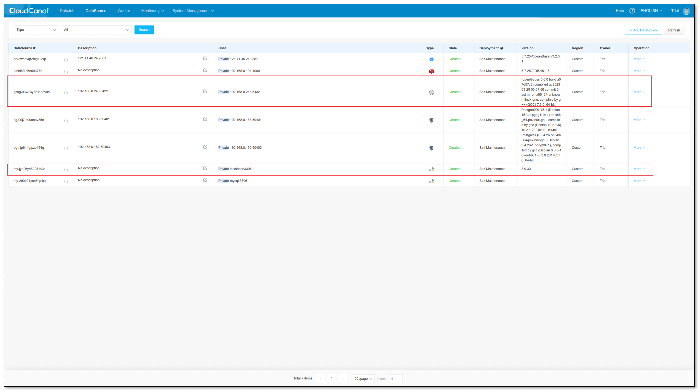
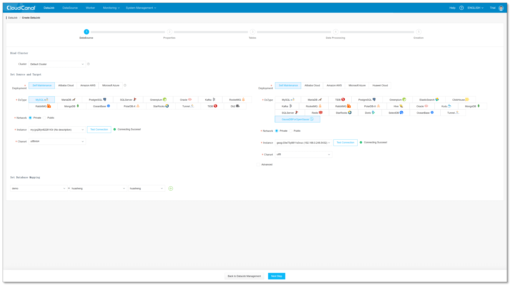
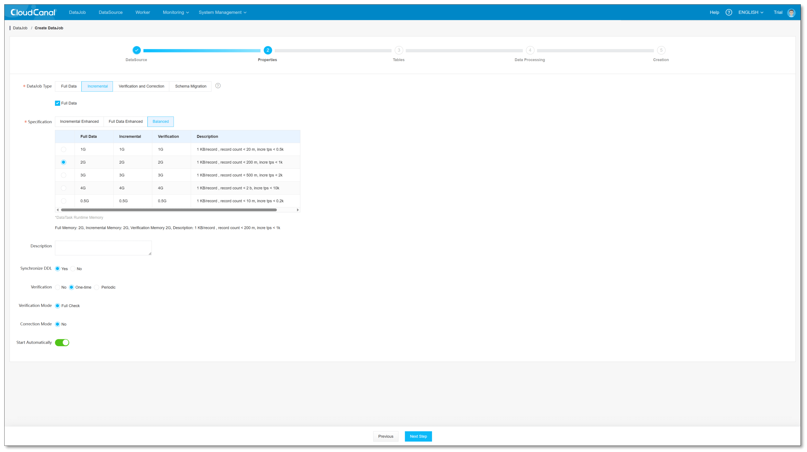
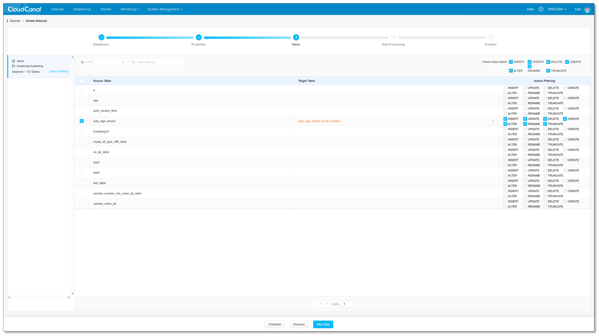
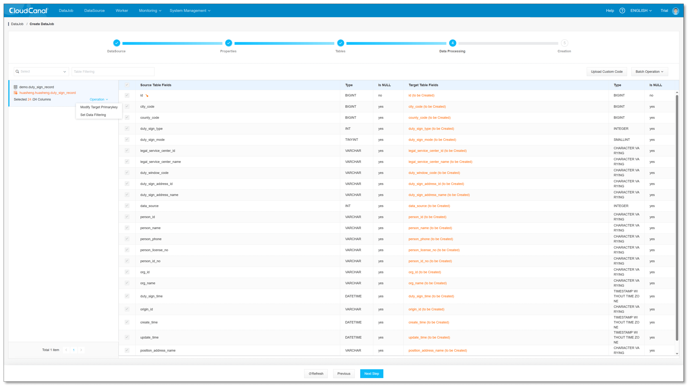
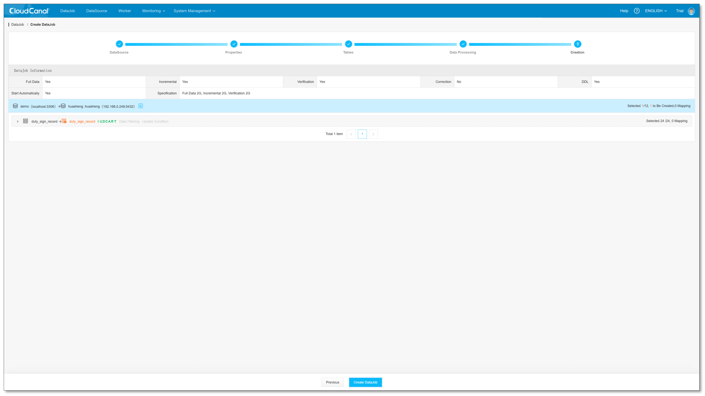
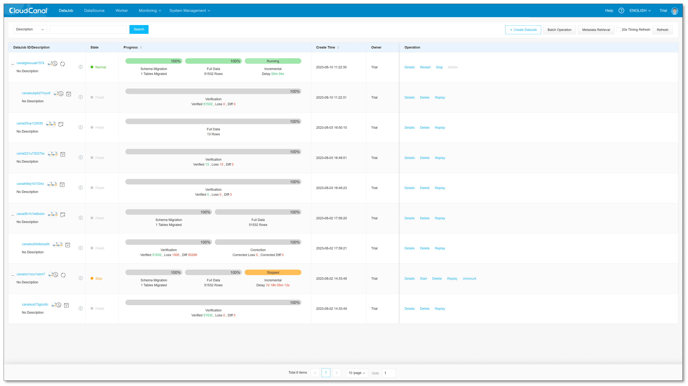

## Overview

BladePipe recently opened MySQL -> [GaussDB for MySQL](https://www.huaweicloud.com/product/gaussdbformysql.html) / [OpenGauss](https://opengauss.org) Data Link, this article introduces BladePipe support GaussDB for MySQL / OpenGauss target data synchronization, and the solution features include:

- Schema Migration Automatic Processing
- Custom Data Processing
- High-Performance Write Mode
- Visualization
- Automated Processes
- Monitoring Chart
- DataJob Alarm

### Features

#### Schema Migration Automatic Processing
There are differences in data type support among different datasource, BladePipe during schema migration **type mapping automatic** 

E.g., In MySQL defined in  `VARCHAR(0)`  data type, not supported in OpenGauss, BladePipe schema migration will automatic source side MySQL  `VARCHAR(0)`  type mapping  `VARCHAR(1)` .

#### Custom Data Processing

Users are data synchronization on during, if need customized processing of the transmitted data can be done using BladePipe **Customized Data Processing** capabilities provided. This is very helpful for data processing scenarios such as real-time wide table construction, adding dynamic columns, microservices based, and cache based data cleaning.

> For more usage methods of custom data, refer [data processing plugins](https://gitee.com/clougence/cloudcanal-data-process).

#### High-Performance Write Mode
BladePipe default use OpenGauss driver for batch writing through jdbc.If users have strict performance requirements, can enable high-performance write mode based on Copy mode.In **Copy Write Mode**, there is a significant improvement in write performance compared to using jdbc.

#### Visualization
BladePipe create GaussDB for MySQL / OpenGauss data synchronization DataJob is fully visualized, obtain **Database Metadata** through, enable users to decide which **Database**、**Tables**、**Columns** to migrate and synchronize on the browser page.

#### Automated Processes
After create GaussDB for MySQL / OpenGauss data migration and synchronization DataJob, BladePipe **automatically processes** DataTask from each stage, no user intervention required, direct data real-time synchronization status.

#### Monitoring Chart
BladePipe by GaussDB for MySQL / OpenGauss data migration and synchronization DataJob multiple practical **monitoring indicators** provided, include **Incremental RPS**、**Memory Buffer RPS**、**Memory Buffer Data Count** etc, when tuning DataTask performance or investigating the causes of task anomalies, monitoring indicators provide a good basis for judgment.

#### DataJob Alarm
BladePipe by GaussDB for MySQL / OpenGauss data migration and synchronization DataJob provided includes **Slack** / **Discord** / **Custom** etc webhook type alarm and **Email** type alarm, high availability of real-time guarantee synchronization DataTask.

## Example
This example takes data from MySQL synchronization GaussDB for OpenGauss, to better illustrate BladePipe ability to synchronize data between different datasource.

### Preparation
- Install [BladePipe](https://www.cloudcanalx.com?src=cc-doc-blog-gaussdb-target) refer [Quick Start](https://www.cloudcanalx.com/us/cc-doc/quick/quick_start)
- Get ready **MySQL**(version 8.0) and **GaussDB for OpenGauss**(version 5.0)
- Login **BladePipe Console** , add GaussDB for OpenGauss and MySQL

### Create DataJob
- **DataJob** -> **Create DataJob**
- **Test Connection** -> **Select Datasource**(Source / Target)
  
- Click Next Step
  

- Select **Incremental**、**Full Data** and Open One-time Full Check, other options default
  

- Select the table that needs to be migrated and synchronized
  
  

- Confirm Create DataJob
  

- The DataTask automatically performs Schema Migration、 Full Data and Incremental, performs Verification, and the results show that the verification is successful
  

## Summary
This article introduces the [BladePipe](https://www.cloudcanalx.com?src=cc-doc-blog-gaussdb-target) support **GaussDB for MySQL / OpenGauss** Target Data Synchronization function, users can easily synchronize data in real-time to **GaussDB for MySQL / OpenGauss** database, implement wider and more real-time applications of data.
