In most cases, data stored at a cloud provider can not be synchronized to a different cloud provider, or a different region of the same cloud provider, via a private network. What if we move data over the Internet? Well, exposing a database to the Internet is a highly risky practice that can pose significant threats to database security. Therefore, databases are typically prohibited from being directly exposed to the Internet in a production environment. 

Then, another challenge arises: 

**How to move data without exposing databases to the Internet?**

## BladePipe's Solution
A common and effective approach is to transfer data to a publicly accessible server, and use third-party tools for data migration. In this solution, the efficiency and reliability of the third-party tool count.

BladePipe developed a virtual data source called Tunnel. With Tunnel, we can sync data across the network securely and efficiently, simplifying cross-cloud or cross-region data migration.

BladePipe's solution for cross-network data movement presents the following features:

- Neither source nor target databases enable public network access.
- The schema of a source database can be mapped to the target end.
- Data sync is based on HTTPS protocol.
- Access is authenticated by username and password.
- It supports data movement between heterogeneous databases.
- It does not rely on software such as message middleware.

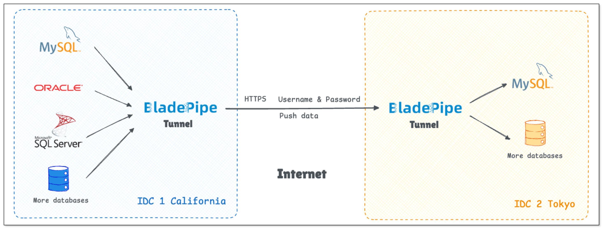

### Tunnel DataSource
The Tunnel virtual data source developed by BladePipe can move data across the network while not using message middleware. Tunnel itself is not a real database, but a set of information, including:

- IP (or domain name)
- port
- username
- password
- TLS certificate and password
- metadata

Through this virtual data source, we can pull or receive data via HTTP(S) or TCP protocol. 

## Example

This example shows the data sync from Aurora MySQL in California to Aurora MySQL in Tokyo. To run the data sync, 2 data pipelines should be created: **a pipeline from Aurora MySQL in California to Tunnel** and **a pipeline from Tunnel to Aurora MySQL in Tokyo**. Both databases have public network access disabled, and data is transmitted over the internet using HTTPS protocol with username and password authentication.

### Step 1: Prepare the Environment
Set up a publicly accessible server in **California** and prepare an Aurora MySQL cluster.

Connect the server to the Aurora MySQL cluster through VPC.

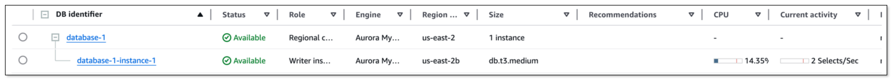
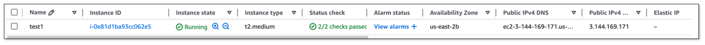

Similarly, set up a publicly accessible server in **Tokyo** and prepare an Aurora MySQL cluster.

Also, connect them through VPC.

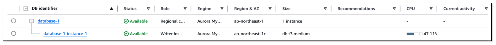
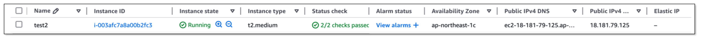

Open the port 18443 in security group to allow remote connections.

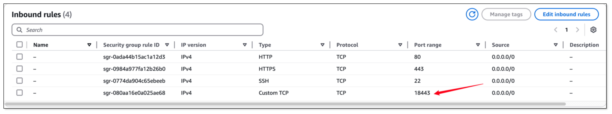

### Step 2: Install BladePipe
1. Log in to the [BladePipe Cloud](https://cloud.bladepipe.com).
2. In the top navigation bar, click **Sync Settings > Sync Worker**.
3. Click **Add Cluster**, and add 2 clusters for two different regions.
4. Follow the instructions in [Install Worker (Docker)](../productOP/byoc/installation/install_worker_docker.md) or [Install Worker (Binary)](../productOP/byoc/installation/install_worker_binary.md) to install a BladePipe Worker in clusters at different regions respectively (referred to as **Source Worker** and **Target Worker**).

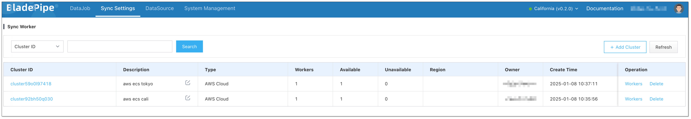

### Step 3: Migrate Schema to the Target DataSource
Since the schema can not be migrated to the target database through Tunnel, please use tools such as mysqldump to migrate the schema to the target database in advance.

### Step 4: Add DataSources
1. Click **DataSource** > **Add DataSource**.
2. Add a Tunnel DataSource for the Source and Target Worker respectively.

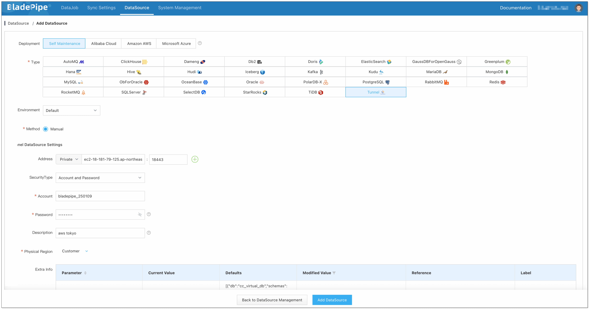

:::info
The data transmission mode of Tunnel is pushing data from the Client to the Server. The Tunnel in the target pipeline (Tunnel to Aurora MySQL in Tokyo) and the Tunnel in the source pipeline (Aurora MySQL in California to Tunnel) can be deemed as a Server-Client relation, hereinafter referred to as **Tunnel Server** and **Tunnel Client** respectively.

When configuring Tunnel DataSources, ensure the following requirements are met:
- The Worker running the **Tunnel Client** is able to communicate with the Worker running the **Tunnel Server**.
- The credentials (e.g. username and password) configured for the **Tunnel Client** are consistent with those for the **Tunnel Server**.
- The **Tunnel Server** host address is the public network address of the Worker it associates with, and the **Tunnel Client** host is consistent with the **Tunnel Server** host.  
:::

3. Add the source and target DataSource. 

After adding all the mentioned DataSources, the result is as follows:

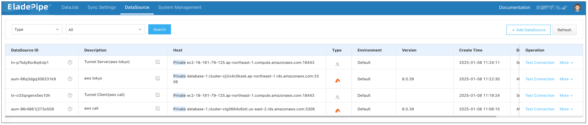

### Step 5: Migrate Schema to Tunnel

1. Create an **Aurora MySQL > Tunnel Client** Schema Migration DataJob. Select the cluster in California for schema migration.
   
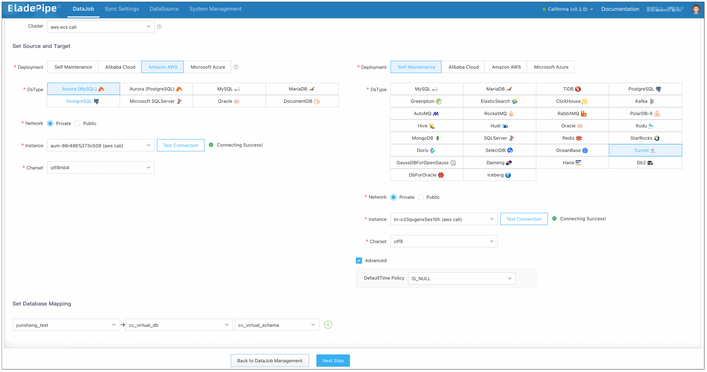
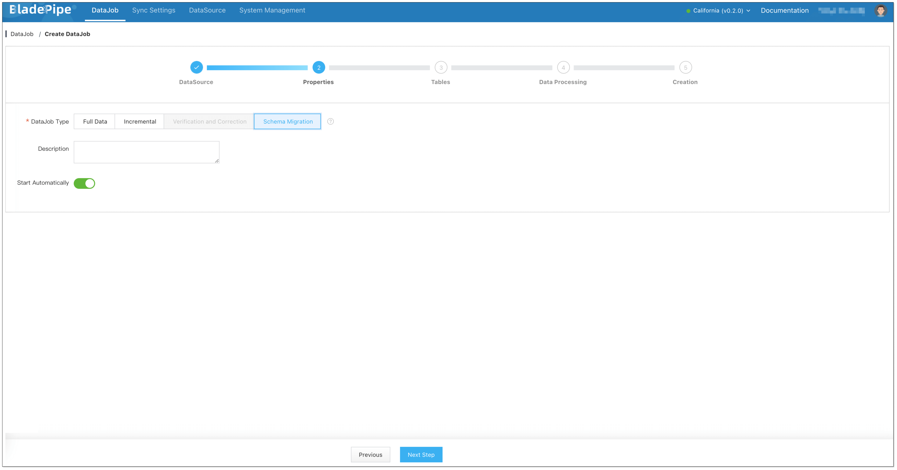

2. Copy the schema from the Tunnel Client to the Tunnel Server.
   1. In the top navigation bar, click **DataSource**.
   2. Choose the Tunnel Client and click **More** > **Modify DataSource Params** in the **Operation** column.
   3. Choose the parameter ***dbsJson*** and copy the parameter value.
   4. Choose the Tunnel Server and click **More** > **Modify DataSource Params** in the **Operation** column.
   5. Choose the parameter ***dbsJson*** and paste the copied parameter value in the **Modified Value** column.

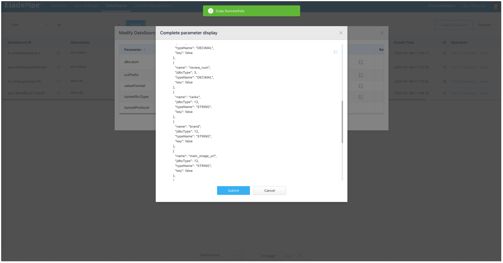
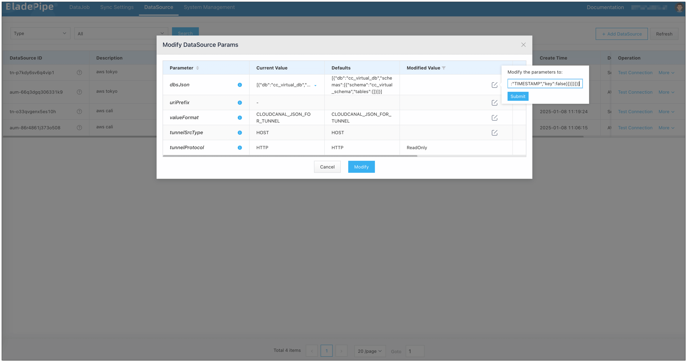

### Step 6: Create a Target DataJob
1. Click **DataJob** > [**Create DataJob**](https://doc.bladepipe.com/operation/job_manage/create_job/create_full_incre_task).
2. Select the Tunnel Server as the target database, and choose the cluster in Tokyo for the Incremental DataJob.

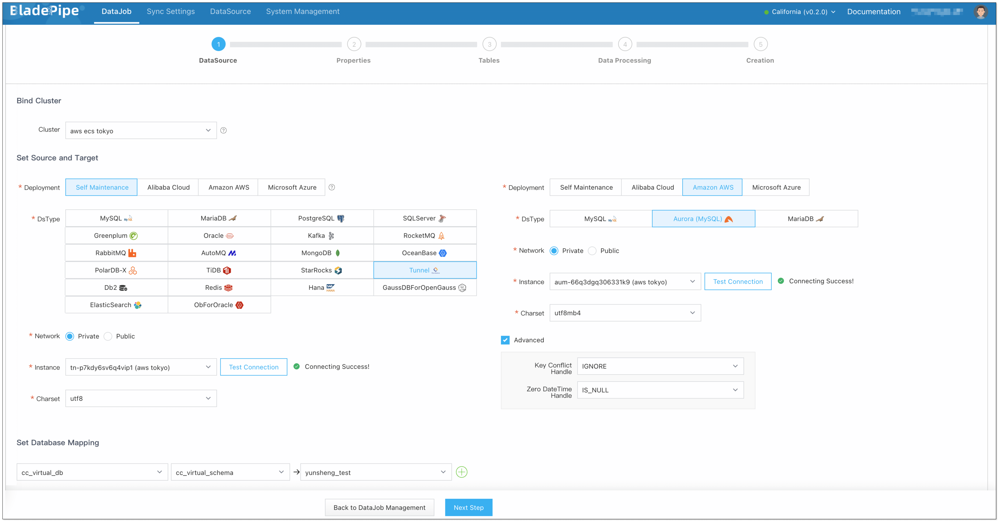

3. The DataJob starts running. Tunnel listens on the port and prepares to receive data.

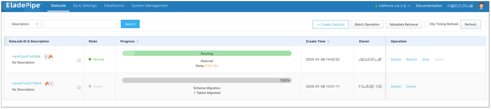
:::info
At this stage, since data transmission has not started yet, the increased latency is normal.
:::

### Step 7: Create a Source DataJob

1. Click **DataJob** > [**Create DataJob**](https://doc.bladepipe.com/operation/job_manage/create_job/create_full_incre_task).
2. Select the Tunnel Client as the source database, and choose the cluster in California for Incremental DataJob.

3. Select **Incremental** for DataJob Type, together with the **Full Data** option.

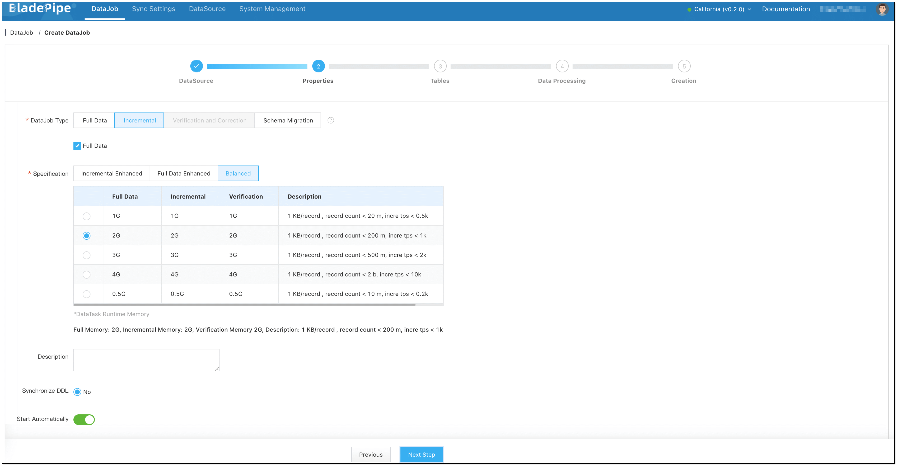

4. The DataJob starts running, and the data is kept in sync across the network.

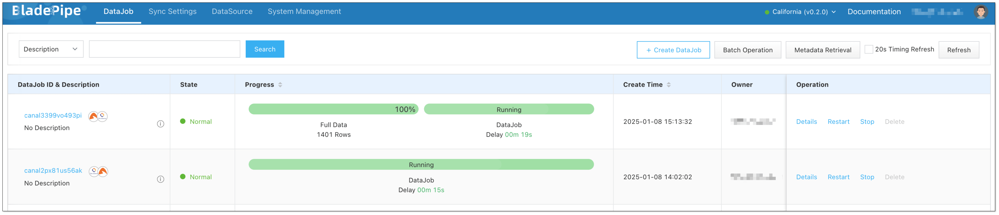

## Conclusion

The virtual data source - Tunnel developed by BladePipe facilitates data movement across the clouds and regions. With BladePipe, cross-network data sync becomes easier and more secure than ever before. 
