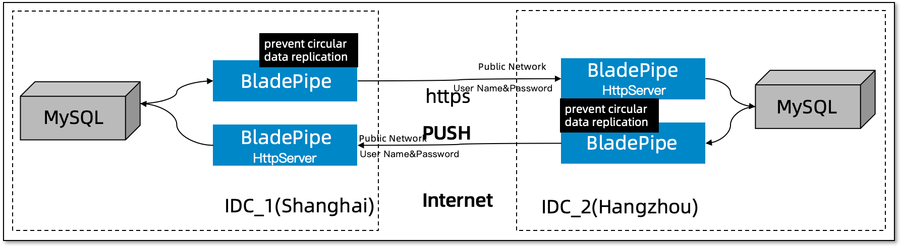

## Introduction

After [BladePipe](https://www.bladepipe.com) launched the [Secure Data Synchronization Across the Internet](./http_base_internet_data_sync.md) solution, some commercial customers have implemented it and the results are good. However, customers have also reported some improvements and new requirements, the biggest of which is **bidirectional synchronization anti-loop**.

The recent BladePipe version supports this feature, and the overall solution has been further upgraded. The biggest features include:

- The databases at both ends do not open public network ports at all.
- The databases at both ends can be synchronized bidirectionally without loops.
- The metadata of the databases at both ends can be mapped.
- It has transmission security and authentication.
- It does not rely on messaging and other software.

## Highlights

### Anti-loop

We reused BladePipe to handle the anti-loop logic of MySQL bidirectional synchronization. When writing to the other end, SQL automatically carries the /\*ccw\*/ mark.

Then open the MySQL **binlog_rows_query_log_events** parameter and change the binlog DML event sequence to QueryEvent(TxBegin), TableMapEvent, RowsQueryLogEvent, WriteRowEvent(IUD), QueryEvent(TxEnd).

If the SQL in **RowsQueryLogEvent** contains /\*ccw\*/, it is a cyclic event and is filtered. This prevents cyclic events.

## Procedure

### Data source preparation

- Use Alibaba Cloud Hangzhou and Shanghai RDS for MySQL.
- **Open the binlog_rows_query_log_events parameter**, and binlog events carry original SQL.
- The database does not open a public network port.
- Data goes through the Internet, using HTTPS transmission and username and password authentication.

- Initialize the database table structure on both sides (if necessary).

### BladePipe preparation

- Deploy BladePipe in Hangzhou environment and purchase RDS for MySQL.
- Deploy BladePipe in Shanghai environment and purchase RDS for MySQL.
- After decompressing the BladePipe docker installation package, you need to **modify the port mapping in docker-compose.yml and then install/upgrade**, taking port 18443 as an example.
- Open the ECS security group related ports for remote connection, taking port 18443 as an example.

### Add Tunnel data source

1. Configure Tunnel data source in **Hangzhou** and **Shanghai** BladePipe respectively.
2. Because of two-way synchronization, the two environments need to configure their own intranet Tunnel data source and the other party's public network Tunnel data source.

### Initialize metadata for Tunnel

1. **Hangzhou** Create two MySQL -> Tunnel structure migrations and complete.
2. **Shanghai** Create two MySQL -> Tunnel structure migrations and complete.

## Task creation

Use 4 synchronization tasks for two-way synchronization. The task list and capabilities are as follows:

 | Task | Data Source | Task Parameters |
 | -------------------- | -------|--------------------------|
 | Hangzhou Task A | Hangzhou Tunnel (public network) -> Hangzhou MySQL | |
 | Hangzhou Task B | Hangzhou MySQL -> Shanghai Tunnel (public network) | deCycle=true, filter loop events|
 | Shanghai Task C | Shanghai Tunnel (public network) -> Shanghai MySQL ||
 | Shanghai Task D | Shanghai MySQL -> Hangzhou Tunnel (public network) | deCycle=true, filter loop events|

### Create Hangzhou Task A 

- Select Tunnel (Hangzhou) and MySQL database (Hangzhou).
- Select tables, columns, and mappings.
- The task runs normally, listens to the port and is ready to receive data.
  
### Create Shanghai Task C

- Select Tunnel (Shanghai) and MySQL Database (Shanghai).
- Select Table, Column, and Mapping.
- The task runs normally, listens to the port and is ready to receive data.

### Create Hangzhou Task B

- Select MySQL (Hangzhou) and Tunnel data source (Shanghai).
- Select data synchronization and **turn off automatic task start**.
- Select tables, columns, and mappings.
- The task is created normally.
- Task details > More functions > Parameter settings, target data source configuration, deCycle parameter is set to true.
- Start the task and run normally.

### Create Shanghai Task D

- Select MySQL (Shanghai) and Tunnel data source (Hangzhou).
- Select data synchronization and **turn off automatic task start**.
- Select tables, columns, and mappings.
- The task is created normally.
- Task details > More functions > Parameter settings, target data source configuration, deCycle parameter is set to true.
- Start the task and run normally.
  
### Verify the Data

#### Create Incremental Data in Hangzhou MySQL 

- Create incremental data on Hangzhou MySQL.
- Hangzhou writes to Shanghai Tunnel task **with traffic**.
- Shanghai receives data task **with traffic**.
- Hangzhou receives data task **without traffic**.
- Shanghai writes to Hangzhou Tunnel task **without traffic**.

#### Create Incremental Data in Shanghai MySQL

- Create incremental data on Shanghai MySQL.
- Shanghai writes to Hangzhou Tunnel task **with traffic**.
- Hangzhou receives data task **with traffic**.
- Hangzhou writes to Shanghai Tunnel task **without traffic**.
- Shanghai receives data task **without traffic**.

## Summary
This article mainly introduces [BladePipe](https://www.bladepipe.com) for bidirectional data synchronization across the Internet, which has the characteristics of **no public network ports open to both database ends** and **bidirectional synchronization without loop**.
