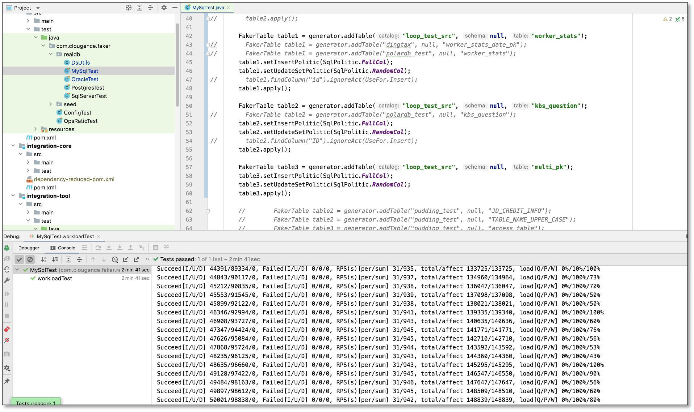
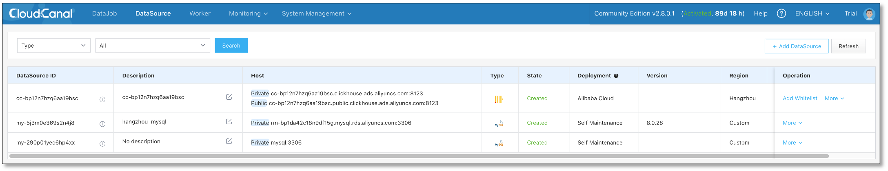
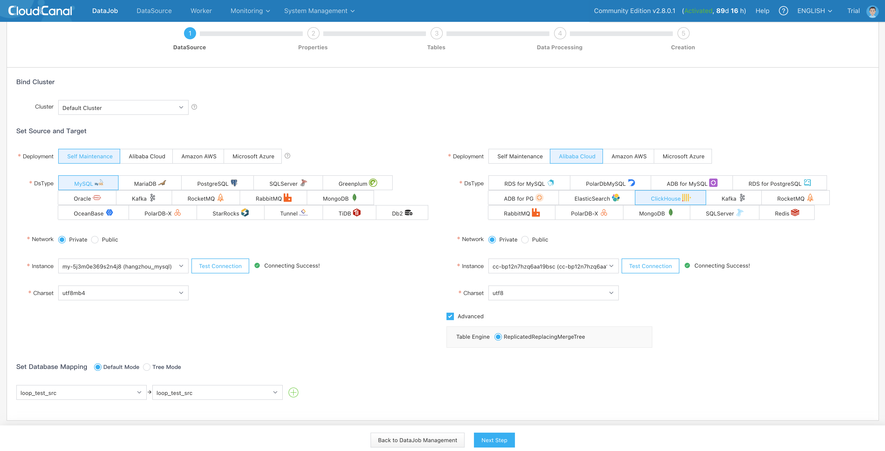
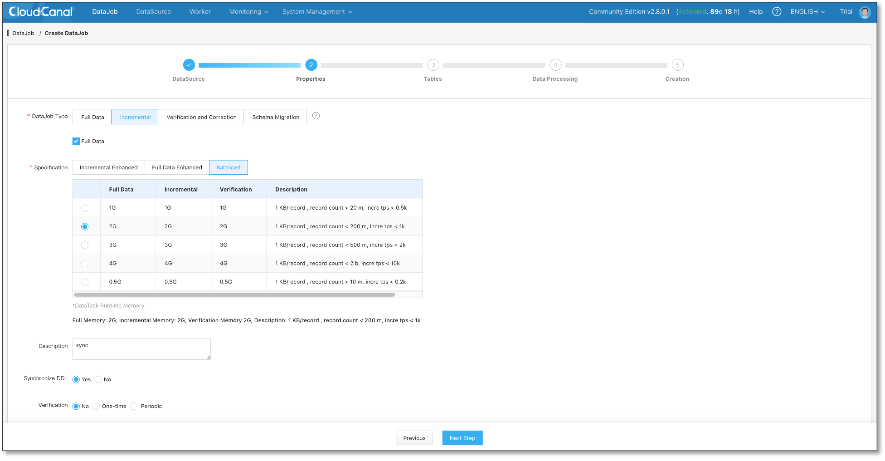
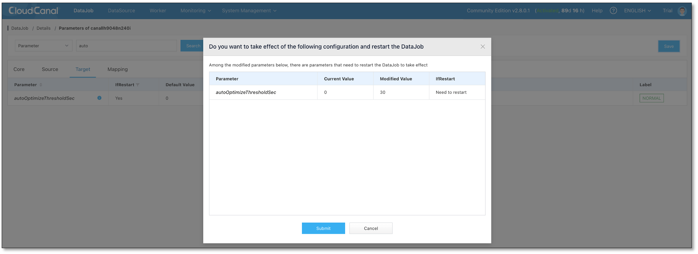
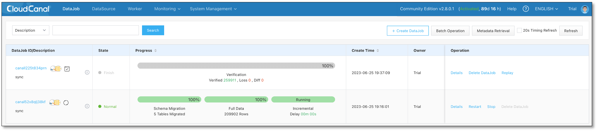

## Overview

This article briefly introduces how [BladePipe](https://www.bladepipe.com?kw=cc-doc-en-mysql-clickhouse-sync) synchronizes data from MySQL to ClickHouse, using ReplacingMergeTree / ReplicatedReplacingMergeTree as the ClickHouse table engine by default.

Features include:

- There are no extra fields for the ClickHouse table
- Strict merge by order by key
- Auto-optimize table (autoOptimizeThresholdSec parameter)
- DDL synchronization is supported

## Key Points

### Schema Migration

In the current structure migration to ClickHouse, ReplacingMergeTree / ReplicatedReplacingMergeTree is selected as the table engine by default, and the source primary key is used as the sortKey (tuple for tables without primary keys), as follows:

```
 CREATE TABLE console.worker_stats
(
    `id` Int64,
    `gmt_create` DateTime,
    `worker_id` Int64,
    `cpu_stat` String,
    `mem_stat` String,
    `disk_stat` String
)
ENGINE = ReplacingMergeTree()
ORDER BY id
SETTINGS index_granularity = 8192
```

### Data Written

Data writing to ClickHouse has done the following transformations
- Import using Insert batch
- Converts the Insert, Update operation to Insert
- The Delete operation is operated separately through the alter table delete statement

Therefore, if there are many delete operations, the Incremental performance will drop sharply, and it is recommended that the delete RPS not exceed 50.

```
  switch (rowChange.getEventType()) {
            case INSERT:
            case UPDATE: {
                for (CanalRowData rowData : rowChange.getRowDatasList()) {
                    CkTableBatchData.RecordWithState addRecord = new CkTableBatchData.RecordWithState(CanalEventType.INSERT, rowData.getAfterColumnsList());
                    batchData.getRecords().add(addRecord);
                }

                break;
            }
            case DELETE: {
                for (CanalRowData rowData : rowChange.getRowDatasList()) {
                    CkTableBatchData.RecordWithState delRecord = new CkTableBatchData.RecordWithState(CanalEventType.DELETE, rowData.getBeforePkColumnsList());
                    batchData.getRecords().add(delRecord);
                    batchData.setHasDelete(true);
                }
                break;
            }
            default:
                throw new CanalException("not supported event type,eventType:" + rowChange.getEventType());
 }
```

## Example

### Install BladePipe
- See [Install Worker (Docker)](../productOP/byoc/installation/install_worker_docker.md) document.

### Data Preparation
- Create Insert, Update loads, the ratio is 1:2
  

### Add DataSource
- Log in to the BladePipe console, **DataSource** > **Add DataSource** , add MySQL and ClickHouse DataSource.
  

### Create DataJob
- **DataJob** > **Create DataJob**
- Select the source and target DataSources.
- Click on the **Advanced** of ClickHouse to make sure the table engine is ReplacingMergeTree (ReplicatedReplacingMergeTree).
- Click **Next Step**.
  

- Select **Incremental**, then check **Full Data** option.
- Check **Synchronize DDL**.
- Click **Next Step**
  

- Select tables and columns, and click **Next Step**.
- Finally,click **Create DataJob**.

### DataJob Running
- Wait for automatic Schema Migration, Full Data, and Incremental to catch up.
- **Details** > **Functions** > **Modify Configurations**, turn on the automatic table optimize and set the 30 seconds interval by default (**autoOptimizeThresholdSec**)
  

- Stop loads when incremental catch up.
- Wait for the automatic optimization interval(30 seconds), create a verification DataJob, and the results are consistent.
- You can also wait for ClickHouse to optimize automatically, but the time is unpredictable.
  

## FAQ

### What Are The Remaining Problems?

Distribute tables are not supported, and Schema Migration supports personalized table schema definitions, which are not yet in place.

### Are Other DataSources Supported?

We will support more DataSources in the future, please refer to the product [introduction document](../intro/product_intro.mdx) for the current support list.

## Summary

This article briefly introduces [BladePipe](https://www.bladepipe.com?kw=cc-doc-en-mysql-clickhouse-sync) support MySQL to ClickHouse data synchronization, which can help businesses quickly build a real-time data analysis environment.
