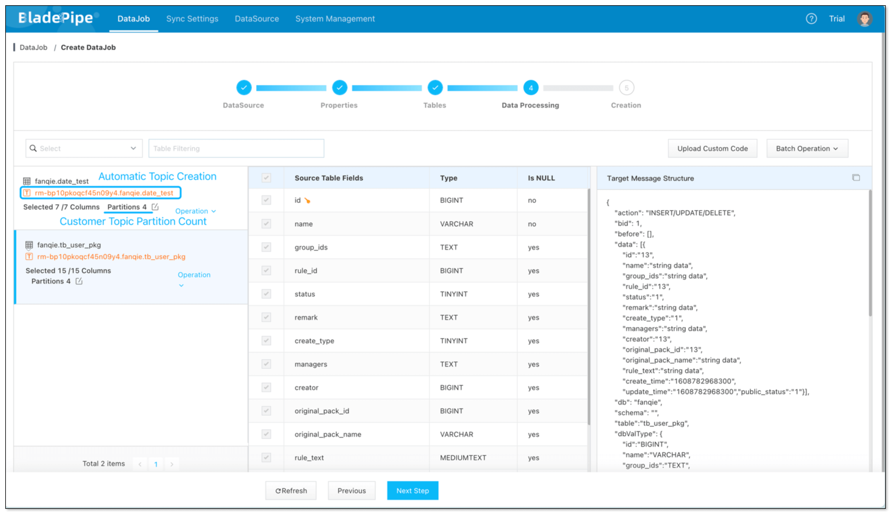
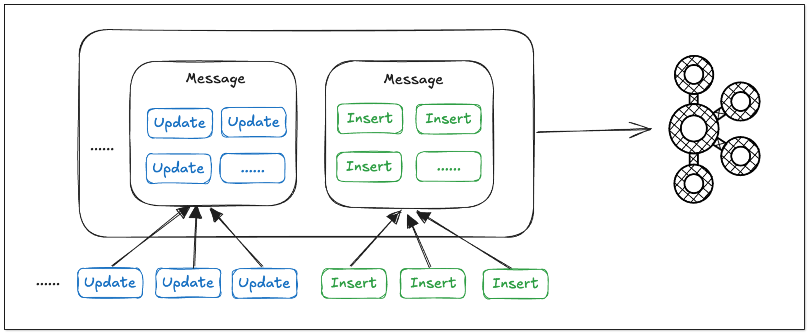
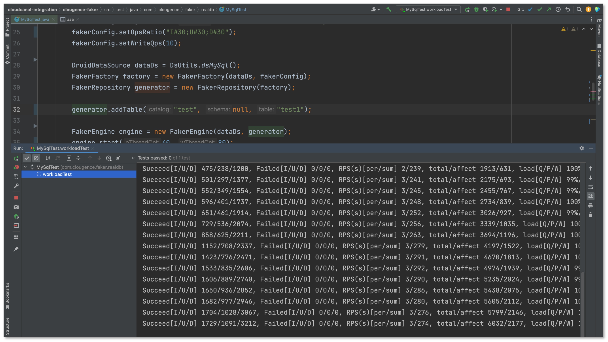
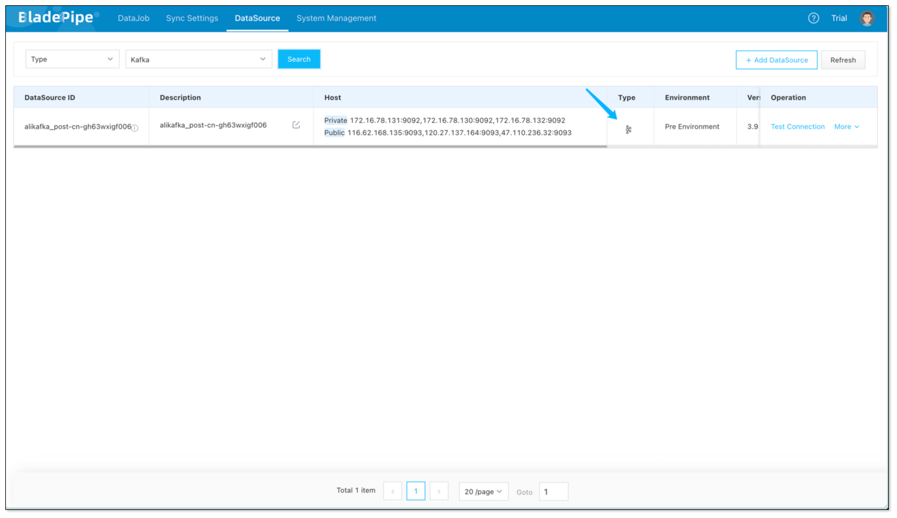
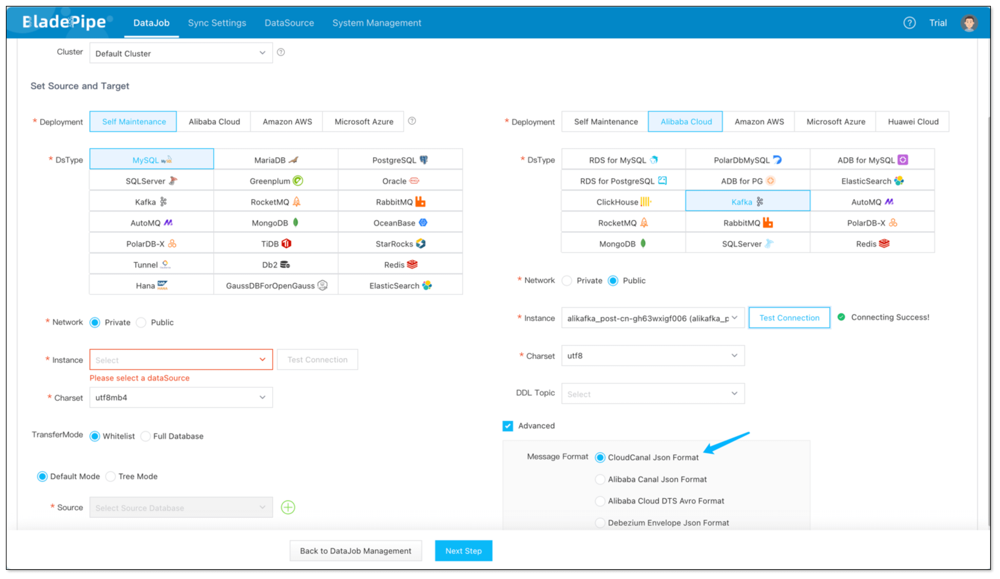
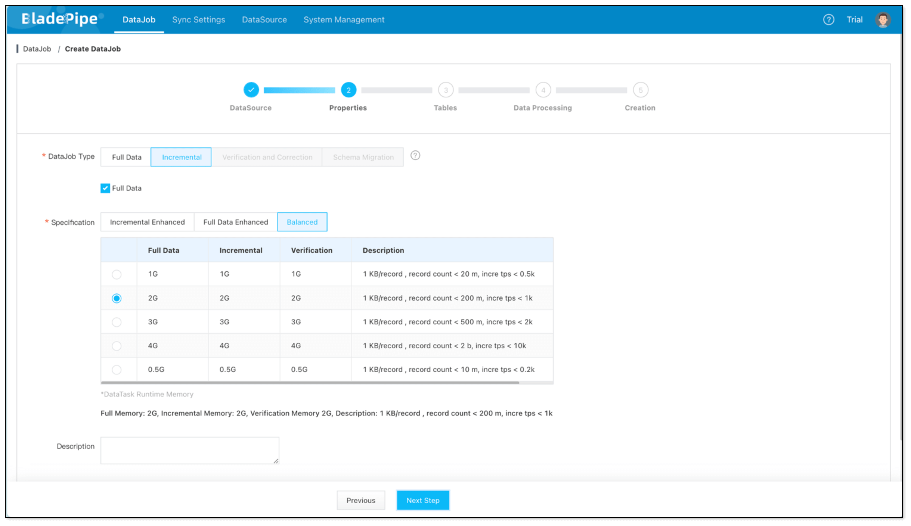
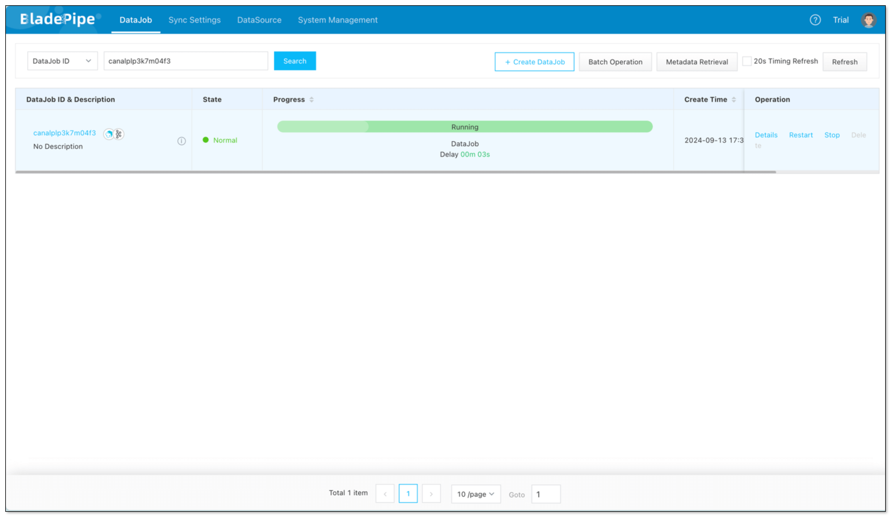

## Overview
This article briefly introduces how [BladePipe](https://www.cloudcanalx.com?kw=cc-doc-en-mysql-kafka-sync) synchronizes data from MySQL to Kafka, using the BladePipe Json Format for Kafka.

Features include:

- Supports [Multiple message formats](../reference/kafka_msg_format_type.md)
- Supports DDL synchronization (with customizable DDL Topics)
- Supports automatic Topic creation

## Key Points

### Automatic topic creation

The Current DataJob supports automatic creation of Kafka topics and allows customization of the number of partitions, as follows:

### Batch writing of data.

Support for merging identical operations on the same table into a single message, enabling batch writing of data and reducing network bandwidth usage to increase data processing efficiency.

### DataJob position reset.

BladePipe supports position reset for FullData and Incremental, allowing DataJobs to automatically resume from the last position after a restart by periodically recording the position.

For large tables with billions of records, this ability is essential, and the data initialization position reset feature minimizes the impact of such pauses on progress.

## Example

### Install BladePipe
- See [Install Worker (Docker)](../productOP/byoc/installation/install_worker_docker.md) document.

### Data Preparation
- Create Insert, Update, Delete loads, the ratio is 1:1:1
  

### Add DataSource
- Log in to the BladePipe console, **DataSource** > **Add DataSource** , add MySQL and Kafka DataSource.
  

### Create DataJob
- **DataJob** > **Create DataJob**
- Select the source and target DataSources.
- Click on the **Advanced** of Kafka to make sure the Message Format is BladePipe Json Format.
- Click **Next Step**.
  

- Select **Incremental**, then check **Full Data** option.
- Check **Synchronize DDL**.
- Click **Next Step**
  
- Select tables and columns, and click **Next Step**.
- Finally,click **Create DataJob**.

### DataJob Running
- Wait for automatic Schema Migration, Full Data, and Incremental to catch up.

## FAQ

### What other source data sources does it support?

Currently, MySQL, Oracle, SQL Server, Postgres, and MongoDB are open to Kafka. If you have any other requirements, please provide us with feedback in the community.

## Summary

This article briefly introduces [BladePipe](https://www.cloudcanalx.com?kw=cc-doc-en-mysql-kafka-sync) support MySQL to Kafka data synchronization, which can help businesses quickly implement real-time data processing and analysis.
