Real-time MySQL-to-MySQL two-way data sync is essential for high availability, seamless disaster recovery and active-active data architectures. It helps keep data consistent and up-to-date across various systems, regardless of where changes occur. 

However, it's not that easy to always keep data updated and consistent in a two-way MySQL pipeline. Replication loop is one of the biggest challenges. In this page, we'll explain how to perform MySQL bidirectional data sync, preventing infinite data replication loops.

## What is a Replication Loop?
The replication loop is a critical issue in MySQL two-way sync setups. It occurs when the same change keeps getting replicated back and forth between the two databases endlessly. For example, if Database A sends an update to Database B, and Database B thinks it's a new change, and sends it back to A, over and over again.

This cycle can lead to several serious issues:
- **Data Duplication**: The same update may be applied multiple times, potentially causing duplicate rows, incorrect data, or integrity violations.
- **Increased Latency and Load**: Continuous replication of the same changes consumes CPU, I/O, and network resources, degrading system performance.
- **Difficult Troubleshooting**: Even minor update conflicts can escalate when each system repeatedly re-applies changes, making conflict resolution complex. Identifying the source of the loop and the specific transactions causing it can be extremely challenging.

## How to Prevent Infinite Loops?

To prevent replication loops in MySQL two-way sync, GTID(Global Transaction Identifier) typically uses a combination of `server_uuid` and transaction IDs as conflict markers. However, this solution has its limitations.

[BladePipe](https://www.bladepipe.com), a professional data replication tool, introduces a more streamlined approach by **tagging binlog events** directly.

In a typical DML binlog sequence—`QueryEvent (TxBegin)`, `TableMapEvent`, `WriteRowEvent (IUD)`, and `QueryEvent (TxEnd)`—tagging the `WriteRowEvent` would be ideal for conflict handling. But doing so generally requires modifying the MySQL storage engine code, which is complex and invasive.

Upon deep investigation, BladePipe discovered that MySQL's binlog includes a special event called `RowsQueryLogEvent`, which logs the original SQL statement when the `binlog_rows_query_log_events` parameter is enabled. This event allows to be attached with comments, which opens up a clean tagging mechanism.

Leveraging this, BladePipe automatically adds a custom marker /\*ccw\*/ when writing data to the target MySQL database. This tag appears in the `RowsQueryLogEvent`, making it easy to identify and filter out in a bidirectional sync. 

This mechanism shows the following features:

- No dependency on GTID
- Order-independent and parallelizable replication
- Reduced operations on the target database
- Broad compatibility with cloud-based MySQL services
- Support database/table/column-level filtering, mapping, and custom data processing

With this enhancement, the new binlog event sequence becomes:
`QueryEvent (TxBegin)`, `TableMapEvent`, `RowsQueryLogEvent`, `WriteRowEvent`, and `QueryEvent (TxEnd)`.

## How to Perform MySQL Two-Way Sync Using BladePipe?
Next, we'll give a step-by-step guide on how to perform a MySQL two-way data sync. In the demonstration, we use RDS for MySQL instances.

### Step 1: Install BladePipe
Follow the instructions in [Install Worker (Docker)](https://www.bladepipe.com/docs/productOP/byoc/installation/install_worker_docker) or [Install Worker (Binary)](https://www.bladepipe.com/docs/productOP/byoc/installation/install_worker_binary) to download and install a BladePipe Worker.

### Step 2: Add DataSource
1. Log in to the RDS console. Go to the instance details page and click **Parameters**, then enable **binlog_rows_query_log_events**.
2. Log in to the [BladePipe Cloud](https://cloud.bladepipe.com). Click **DataSource** > **Add DataSource**. It is suggested to modify the description of the DataSource to prevent mistaking the databases when you configure two-way DataJobs.

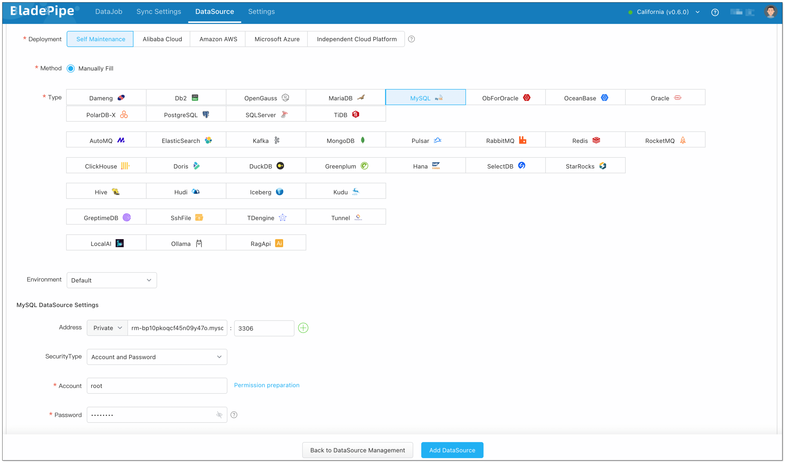  

### Step 3: Create Forward DataJob
:::info
In bidirectional sync, the forward DataJob generally refers to the DataJob where the source database has data and the target database has no data, which involves the initialization of data at the target database.
:::

1. Click **DataJob** > **Create DataJob**.
2. Select the source and target DataSources, and click **Test Connection** to ensure the connection to the source and target DataSources are both successful.

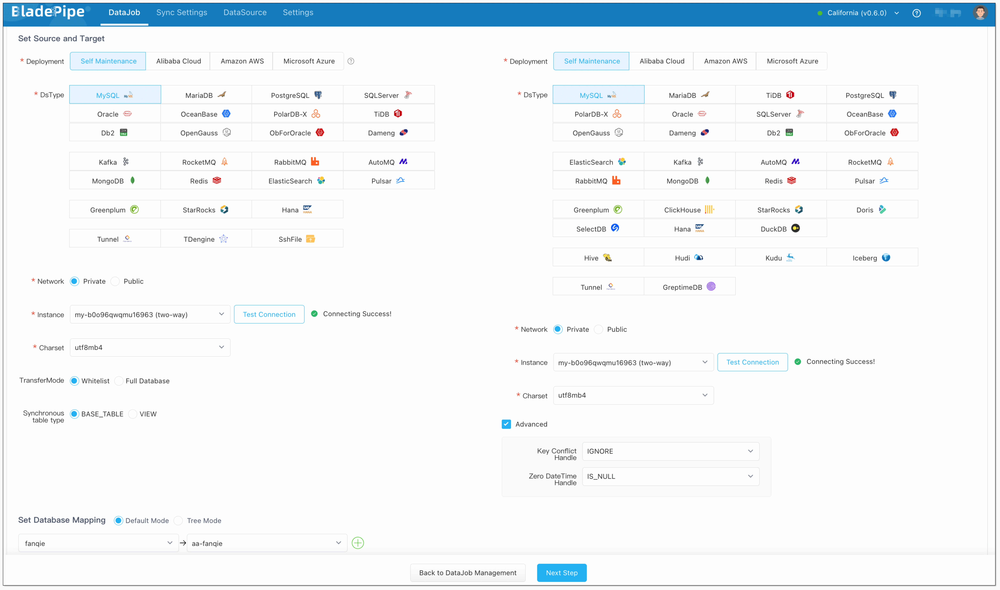 

3. In **Properties** Page:
   1. Select **Incremental** for DataJob Type, together with the **Full Data** option.
   2. Check **Synchronize DDL**.
   3. Grey out **Start Automatically** to set parameters after the DataJob is created.

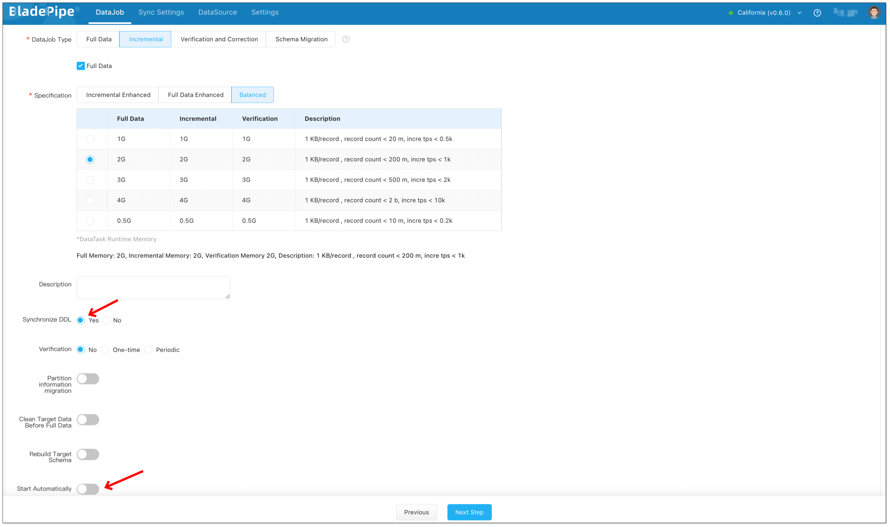  

4. Select the tables and columns to be replicated.
5. Confirm the DataJob creation.
6. Click **Details** > **Functions** > **Modify DataJob Params**.
   1. Choose Target tab, and set **deCycle** to true.
   2. Click **Save** and start the DataJob.

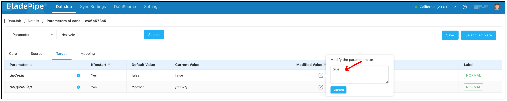 

### Step 4: Create Reverse DataJob
1. Click **DataJob** > **Create DataJob**.
2. Select the source and target DataSources(**reverse selection of Forward DataJob**), and click **Test Connection** to ensure the connection to the source and target DataSources are both successful.

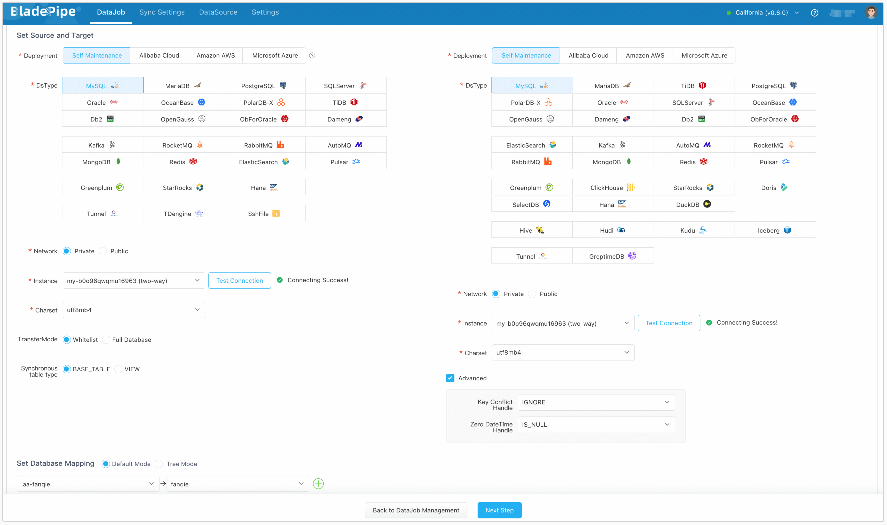  

3. In **Properties** Page:
   1. Select **Incremental**, and DO NOT check **Full Data** option.
   2. Check **Synchronize DDL**.
   3. Grey out **Start Automatically** to set parameters after the DataJob is created.

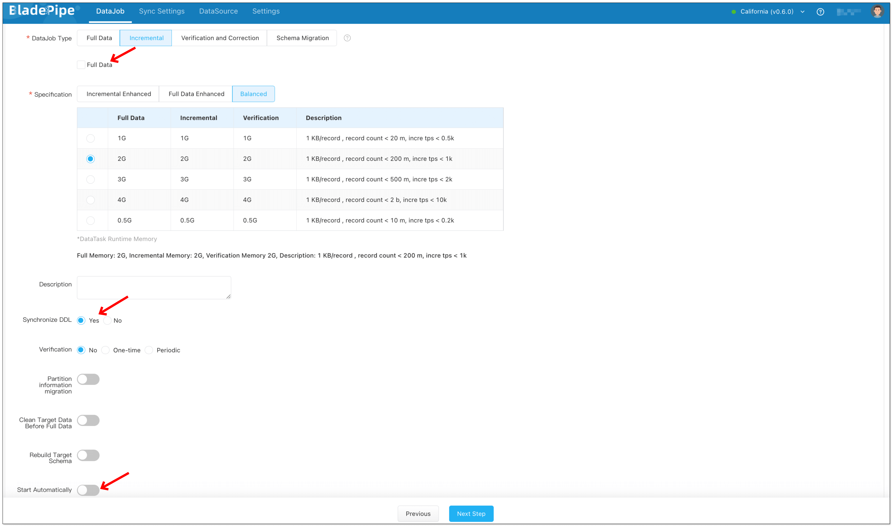  

4. Select the tables and columns to be replicated.
5. Confirm the DataJob creation.
6. Click **Details** > **Functions** > **Modify DataJob Params**.
   1. Choose Target tab, and set **deCycle** to true.
   2. Click **Save** and start the DataJob.

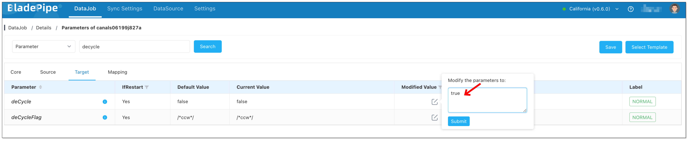  

7. Forward and reverse DataJobs are running well.

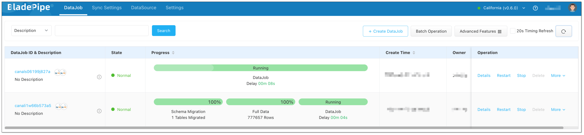  
 
### Step 5: Check the Result
- Do some DMLs in the source database. You can see there are changes in forward DataJob monitoring charts but no changes in reverse DataJob.

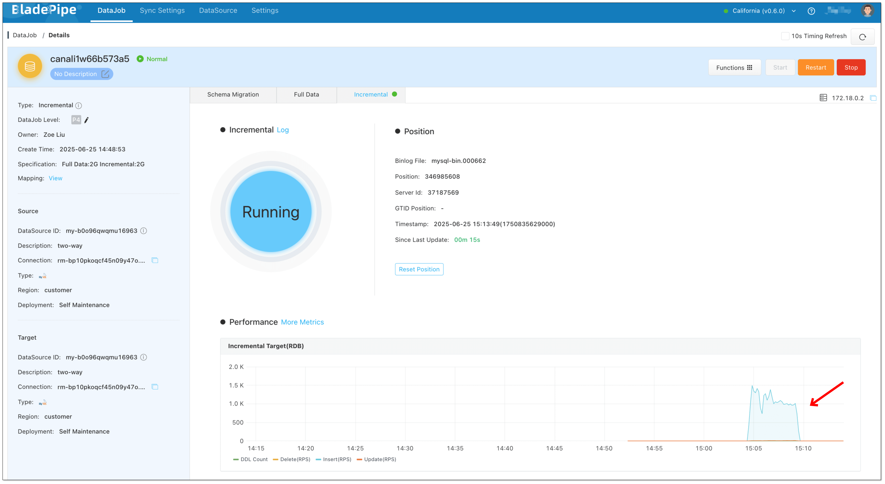  
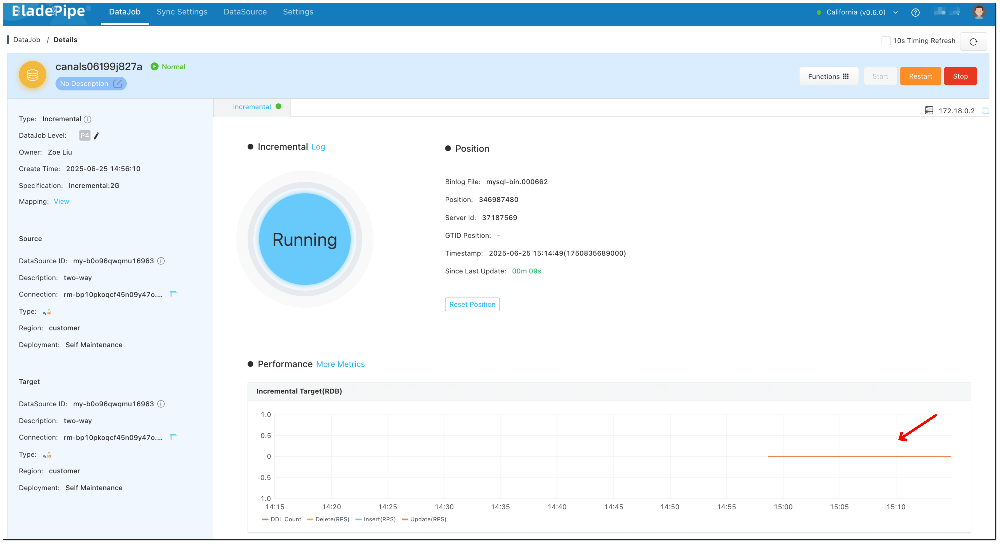  

- Do some DMLs in the target database. You can see there are changes in reverse DataJob monitoring charts but no changes in forward DataJob.

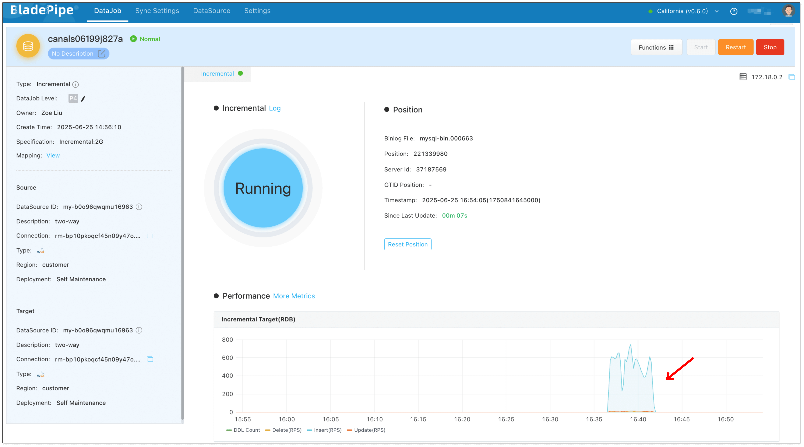
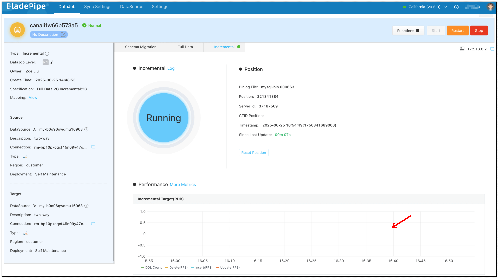    

## FAQ

### What are the drawbacks of this solution？

First, it requires enabling the MySQL global variable `binlog_rows_query_log_events`, which is disabled by default. Compared to GTID which is typically enabled, this is a relative disadvantage.

Second, enabling this feature can cause the binlog to grow faster, potentially leading to increased disk usage and shorter binlog retention cycles.

Third, for BladePipe, this approach increases in-memory usage due to storing SQL statement text, which results in higher resource consumption.

That said, considering the significant improvements in performance and stability, BladePipe believes the benefits outweigh the drawbacks.

### What other pipelines does this solution support?

At present, BladePipe has not conducted in-depth research on whether other data sources support tagging within DML statements or row data. However, tagging-based mechanisms remain a promising direction worth exploring.

## Summary
In this article, we dive into how to prevent infinite replication loops in MySQL bidirectional sync, boosting the construction of an architecture with high availability, elasticity and disaster recovery.
