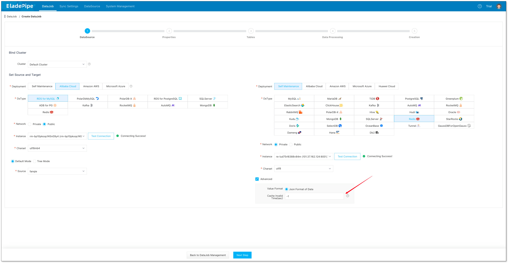
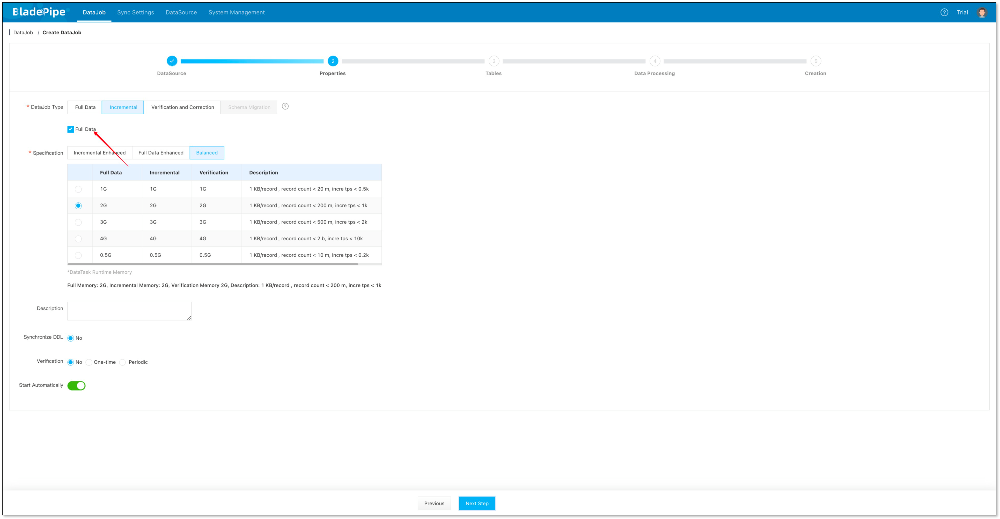
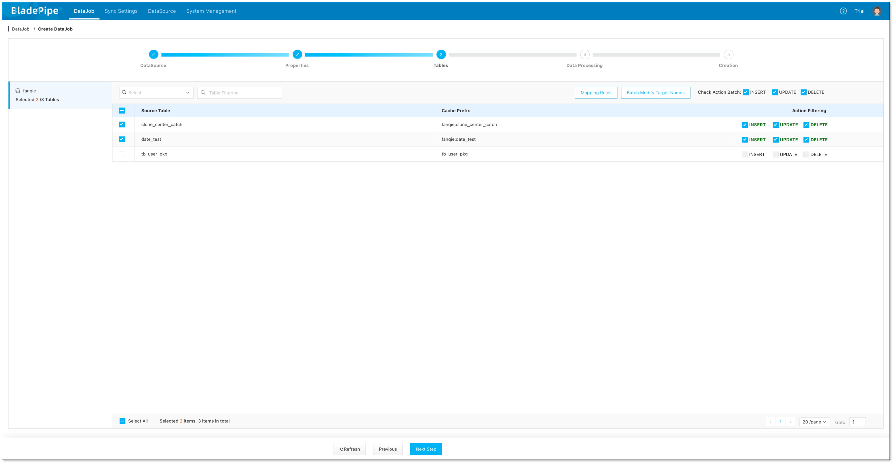
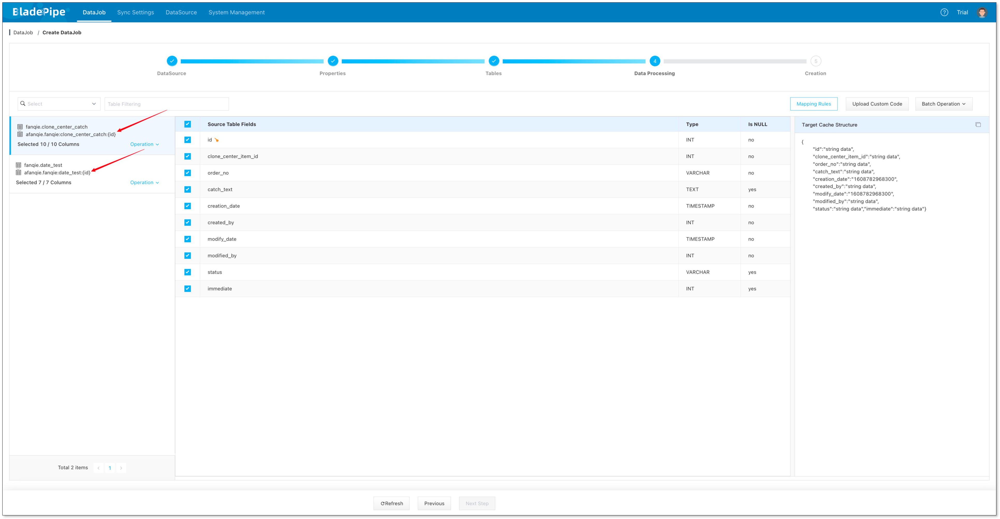
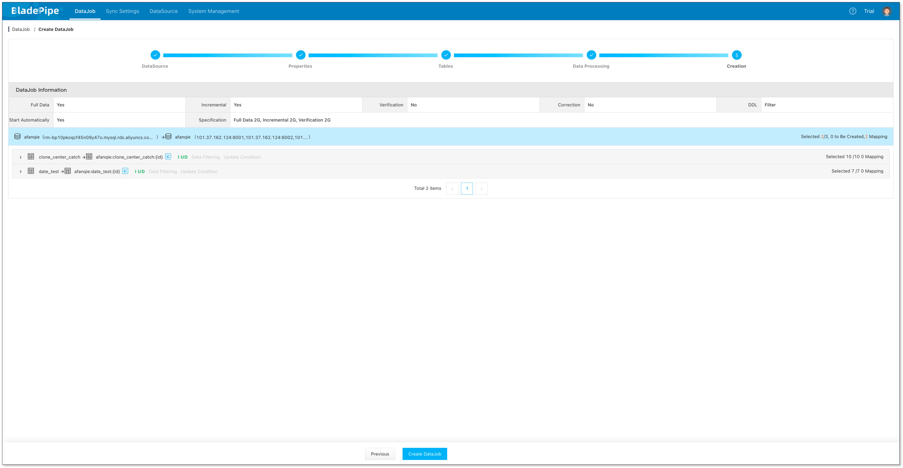
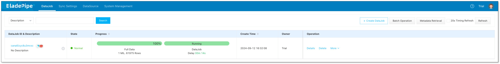
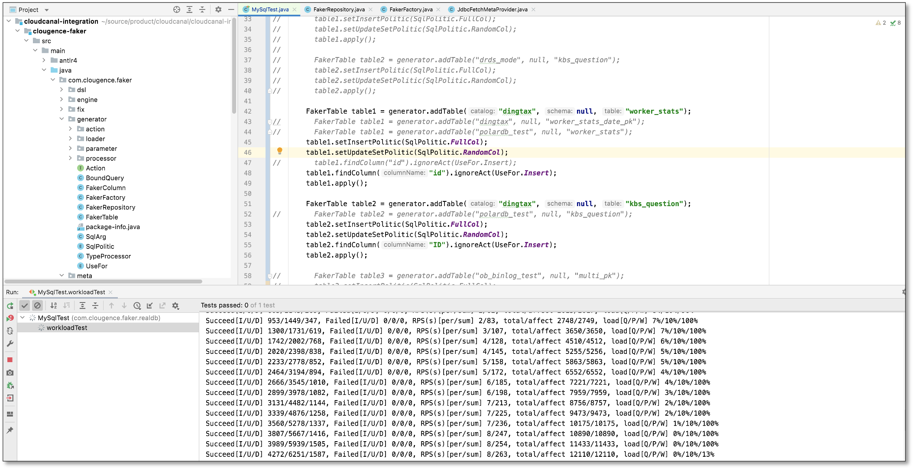
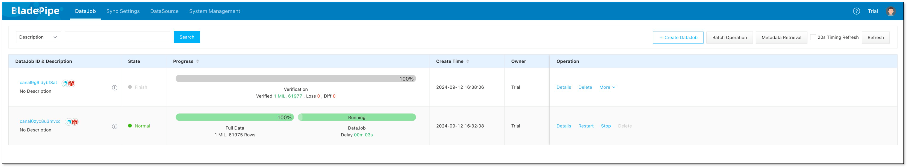

## Overview

This topic describes how to use BladePipe to move data from MySQL to Redis, including the following features:

- Support a single-node Redis instance, master/standby Redis instances, and a sharded cluster instance.
- Support setting a cache expiry time when writing data to a Redis instance.

## Highlights

### Automatical Adaptation to Redis Various Deployments

There are differences in the way of writing data between Redis sharded and non-sharded clusters.

BladePipe automatically identifies the deployment form of Redis by obtaining Redis parameters, and adjusts the writing method to run the Incremental DataJob normally.

### Support for Cache Expiration

It is allowed to set the cache expiry time when writing data to a Redis instance. 

When creating a BladePipe DataJob, you can optionally set the expiry time (seconds).

When a DataJob is running, BladePipe sets the expiry time automatically to achieve the business goal.

## Procedure

### Step 1: Install BladePipe
Before you begin, you need to prepare the tool. Download and install BladePipe. 

### Step 2: Add DataSources
:::info
In this example, a ApsaraDB for Redis and a self-managed MySQL instance are used.
:::

1. Log on to the BladePipe console.
2. Click **DataSource** > **Add DataSource**, and add 2 DataSources.
:::tip
If Redis is a cluster, you can fill in all nodes or all master nodes and separate them with commas.
:::

### Step 3: Create a DataJob
1. Click **DataJob** > **Create DataJob**.
2. Set the cache expiry time (second) in Advanced configuration of the target DataSource. The number &lt;=0 means it is not set.
3. Click **Next Step**.

  

4. Select **Incremental**, together with the **Full Data** option.
5. Click **Next Step**.

  

6. Select the tables to be replicated and click **Next Step**.
:::tip
Because the keys in Redis are composed of the primary keys of the source tables, it is not recommended to select the tables without a primary key.
:::

  

7. Select the columns to be replicated and click **Next Step**.

  

8. Confirm the creation.

  

  

### Test and Verify Data
1. INSERT, UPDATE and DELETE data in the source instance.

  

2. Create a Data Verification DataJob, and the result shows that the data is consistent.

  

## FAQ

### What should I do after a Redis master/standby switchover?

BladePipe writes data with JedisCluster, which automatically senses a master/standby switchover.

### What should I do if the nodes in Redis are changed？

You can manually modify the node information of the DataJob configuration and restart the DataJob.

## Summary
This is a quick and easy guide to replicate data from MySQL to Redis with BladePipe, accelerating your business upgrade.
