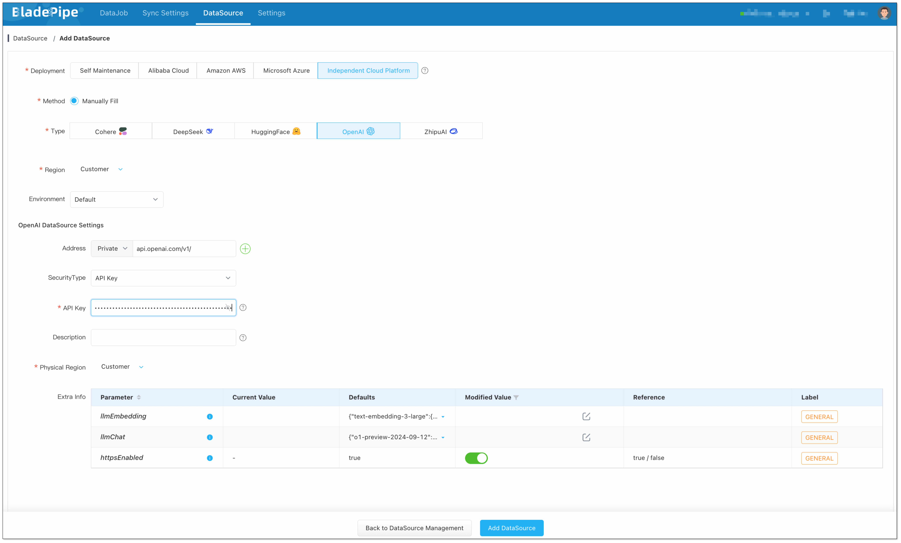
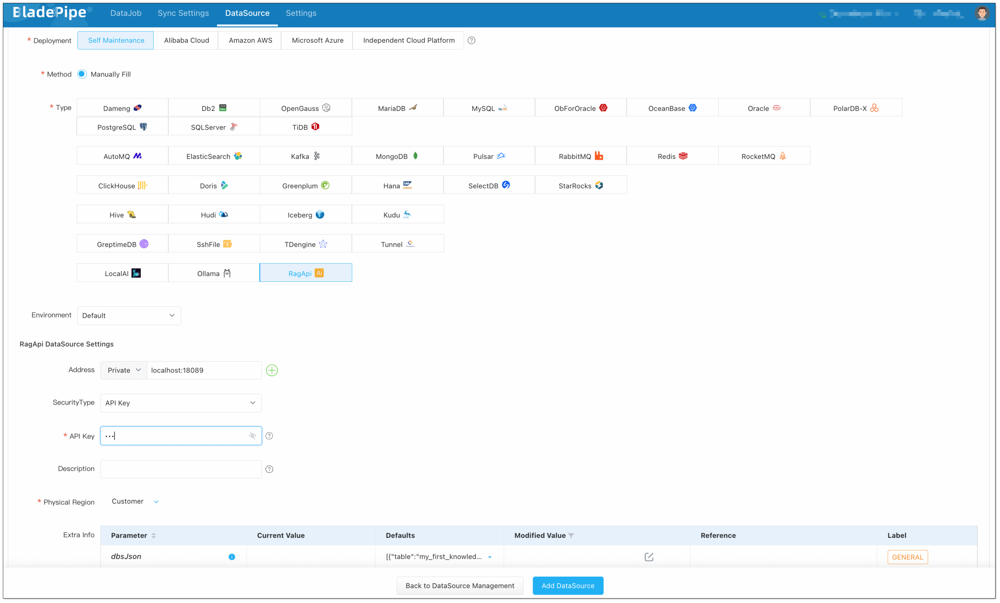
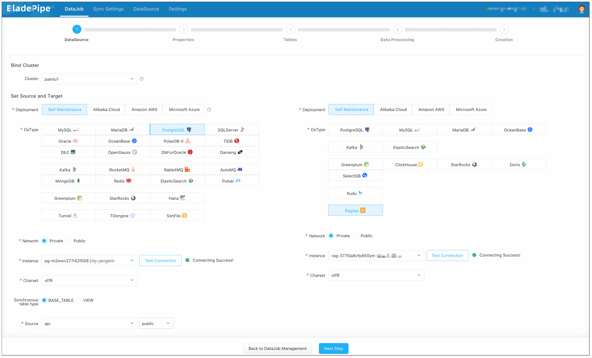
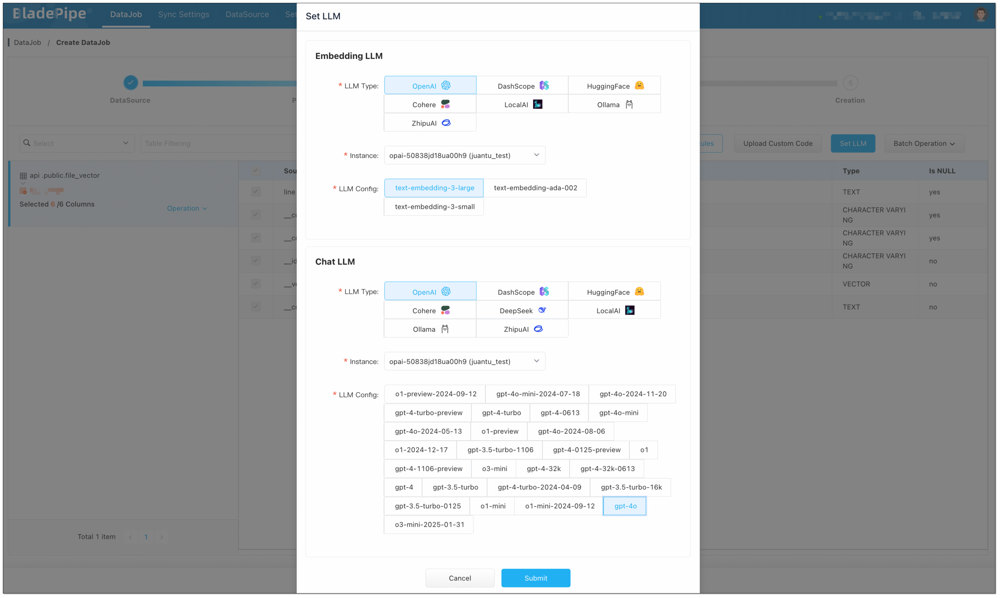
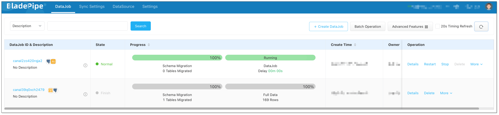

## Overview

This is part of a series of articles about building RAG applications. 

1. Create and Store Vectors in PGVector
2. [Create RAG API with PGVector](./pg_vector_to_rag_api)

BladePipe can automatically generate a chat service based on embeddings, named **RagApi**. It is compatible with the OpenAI interface, and the creation process doesn't use any code. This article dives into how to create a **RagApi**.

## Why BladePipe?

Compared with the traditional manual deployment of RAG architecture, the RagApi service provided by BladePipe has the following unique advantages:

- **RAG Built with Two DataJobs: text embedding + API building**
- **No Code**: The custom configuration can be done in a few clicks. Even non-developers can finish RAG service building. 
- **Modifiable Parameters**: It allows to set core parameters such as Top-K value, threshold for matching, prompt template, LLM temperature, etc.
- **Support for Diverse LLMs and Platforms**: It supports mainstream LLMs such as Alibaba Cloud DashScope, OpenAI and DeepSeek, and API platforms.
- **Compatibility with OpenAI Interface**: It can directly connect to existing Chat applications or toolchain without additional adaptation.
- **Local Deployment**: It supports local deployment of LLMs (such as DeepSeek) and APIs with Ollama to prevent internal data breach in organizations.

## Flow Chart of RagApi Building

To build a RAG API with BladePipe, two DataJobs needs to be created. This article mainly talks about **DataJob 2 (RAG API Building)**.


#### DataJob 1: File Embedding (File → PGVector) 
For more details, please refer to [Create and Store Embeddings in PGVector](./file_to_aliyun_pg_vector).

#### DataJob 2: RAG API Building (PGVector → RagApi) 
1. **Query Embedding and Retrieval**
   Users enter their queries at a Chat interface. BladePipe uses the same embedding model to get the query embedding, and retrieves the most relevant chunks stored in the vector database. 

2. **Create Prompt**  
   BladePipe constructs a complete context based on the configured Prompt template, combined with users' queries and search results.

3. **Chat Model Reasoning**  
   The created Prompt is fed into the configured Chat model (such as `qwq-plus`, `gpt-4o`, etc.) to generate the final answer. The interface is an OpenAI format interface, which can be directly connected to the applications.


## Supported LLMs
BladePipe uses the Chat model, together with the context obtained from the **vector queries**, to reason about the API request. Currently, the supported Chat models are as follows:

| Platform        | Model     | 
| ------------ | -------------------------------- |
| DashScope  |qwq-plus <br/> qwq-plus|
| DeepSeek  |deepseek-chat <br/> deepseek-chat | 
| OpenAI  |gpt-4o <br/>o1 <br/> o1-mini <br/> o3-mini <br/> ... |


## Procedure
Next, we will demonstrate how to complete the second task: creating a RagApi service based on embeddings stored in the vector database.

Before start, make sure that you have finished text embedding. For more information, please refer to [Create and Store Embeddings in PGVector](sshfile_to_aliyun_pg_vector.md).

The demonstration will be shown in an environment with:

- **Vector database**: **PostgreSQL** (with embeddings stored)
- **Target service**: **RagApi** deployed locally (to offer API for chatting)
- **Embedding model**: OpenAI **text-embedding-3-large**
- **Chat model**: OpenAI **GPT-4o**


### Step 1: Install BladePipe
Follow the instructions in [Install Worker (Docker)](../productOP/byoc/installation/install_worker_docker) or [Install Worker (Binary)](../productOP/byoc/installation/install_worker_binary.md) to download and install a BladePipe Worker.


### Step 2: Add DataSources

Log in to the [BladePipe Cloud](https://cloud.bladepipe.com). Click **DataSource** > **Add DataSource**.    

**Add the Vector Database:**   
Choose **Self Maintenance** > **PostgreSQL**, then connect.   


**Add a LLM:**   
Choose **Independent Cloud Platform** > **Manually Fill** > **OpenAI**, and fill in the API key.   



**Add RagApi Service:**    
Choose **Self Maintenance** > **RagApi**.   

+ **Address**: Set host to `localhost` and port to 18089.
+ **API Key**: Create your own API key for later use.




### Step 3: Create DataJob

1. Click **DataJob** > [**Create DataJob**](https://www.bladepipe.com/docs/operation/job_manage/create_job/create_full_incre_task/).
2. Select the source DataSource (**PostgreSQL** with embeddings stored) and target DataSource (**RagApi**), and click **Test Connection**.   



:::info
If the test connection does not response for a long time, try to refresh the page, check the network connectivity and parameter configuration.
:::  

3. In **Properties** page, select **Full Data** for DataJob Type, and 2 GB for **Specification**. 
4. In **Tables** page, select the vector table(s).


5. In **Data Processing** page, click **Set LLM**:
    1. **Embedding LLM**: Select OpenAI and the embedding model (e.g. `text-embedding-3-large`). **Note:** Make sure vector dimensions in PostgreSQL match the embedding model.

    2. **Chat LLM**: Select OpenAI and the chat model (e.g. `gpt-4o`). 



6. In **Creation** page, click **Create DataJob** to finish the setup. 




## Showcase

### Test with Command Line

The RagApi service runs in the local Worker by default, and the listen address is `http://localhost:18089`, which is compatible with the OpenAI Chat API protocol. You can quickly verify whether the service is deployed successfully through command line tools (such as `curl`).

#### Example (using curl)

```bash
curl http://localhost:18089/<knowledge-space>/v1/chat/completions \
  -H "Content-Type: application/json" \
  -H "Authorization: Bearer <RAG API Key>" \
  -d '{
        "messages": [
          {"role": "system", "content": "You are a helpful assistant."},
          {"role": "user", "content": "How to create an Incremental DataJob in BladePipe?"}
        ],
        "stream": false
      }'
```

**Note:**    
- `<knowledge-space>`: The name of the knowledge space, which is used to specify the vector database for query. If it is empty, all knowledge bases will be searched by default.
- `<RAG API Key>`: The API Key of the RagApi DataSource configured in BladePipe. 


### Test with Cherry Studio 

Besides the command line, RagApi also supports interactive testing through a desktop client [Cherry Studio](https://cherry-ai.com/). CherryStudio is compatible with the OpenAI interface, suitable for interface joint debugging, context debugging, and model performance verification.

1. Download [Cherry Studio](https://cherry-ai.com/).
2. Open Cherry Studio, and click the setting icon in the bottom left corner. 
3. In **Model Provider**, search `openai` and configure as follows:
    - **API Key**: Enter the RagApi API Key configured in BladePipe. 
    - **API Host**：http://localhost:18089
      
     
    - **Models**: BP_RAG (or any name as you like).


:::info
If no knowledge space is specified, the entire vector database will be searched by default.
:::

4. Back on the chat page:   
    - Click **Add Assistant** > **Default Assistant**.
    - Right click **Default Assistant** > **Edit Assistant** > **Model Settings**, and choose BP_RAG as the default model.


5. Now try asking: `How to create an incremental DataJob in BladePipe?`. RagApi will search your vector database and generate a response using the chat model.


## FAQ

**Q: What is retrieval-augmented generation (RAG)?**     
**A:** RAG is a technology that combines large language models (LLM) with external knowledge base to generate more accurate and contextually relevant answers. 

**Q: What are the advantages of RAG?**     
**A:** It solves the problems of hallucination in generated answers, lack of real-time information, and inability to access private data in traditional LLM solution, providing more credible and practical output. 

**Q: What are RAG’s core processes?**     
**A:** It includes steps such as data collection, chunking, embedding, retrieval in vector database, prompt generation and reasoning by LLM. 

**Q: Can I use non-OpenAI LLMs?**     
**A:** Yes. BladePipe RagApi supports multiple LLM platforms such as DashScope, DeepSeek, LocalAI, etc. 

**Q: How is it different from traditional search engine?**     
**A:** RAG not only retrieves documents, but also generates more semantically understandable answers based on the context. 
