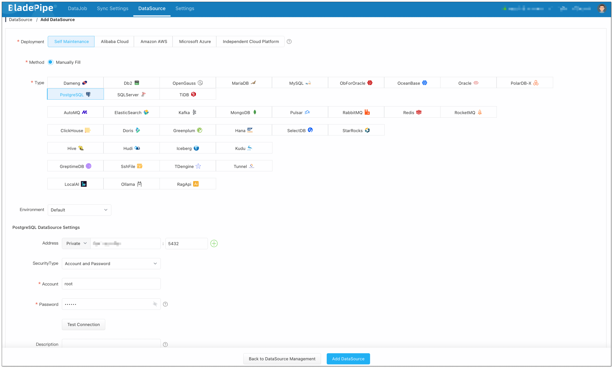
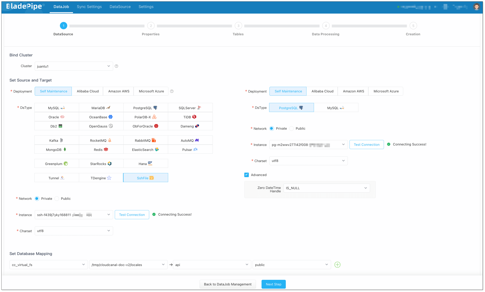
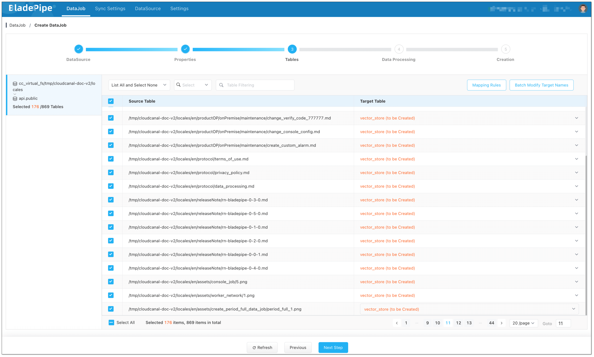
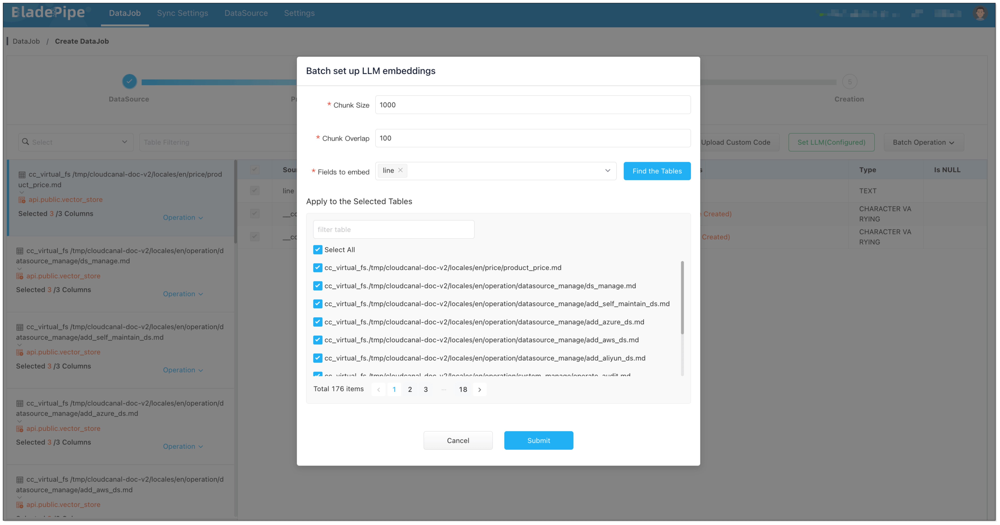

## Overview

This is part of a series of articles about building RAG applications. 

1. [Create and Store Vectors in PGVector](./file_to_aliyun_pg_vector)
2. Build a RAG API with PGVector

This article introduces how to create vectors and store them in PGVector using [BladePipe](https://www.bladepipe.com), preparing for retrieval-augmented generation (RAG).

## Why need RAG?

Although traditional large language models (LLM) (such as GPT-4) are powerful, they have the following limitations when used in organization-specific scenarios:

- **Knowledge Limitation**: Traditional LLMs have no access to private knowledge base, which is a repository of information that is limited to certain audience, such as an organization's internal documents, business rules, etc. That makes LLMs unable to answer organization-specific content.
- **Hallucination**: For the questions that is beyond the dataset used to train LLMs, the model may generate seemingly reasonable but untrue content, and users can hardly to tell right from wrong.
- **General Output**: Due to lack of personalized context, the answer produced by the LLM may be too general and not case-specific.
- **Outdated Data**: The answers generated by LLMs are based on certain volume of datasets, and it is difficult to keep the data up to date.

**RAG** makes up for these shortcomings by combining **information retrieval** and **LLM reasoning**. Users can import private knowledge bases into LLMs in real time to get more accurate, personalized and up-to-date results.

## Why need Text Embedding?

The core of RAG is "retrieval + generation", and high-quality "retrieval" is the basis for "generation". To make the machine understand a user's question and find the most related content from a large amount of text, **the text needs to be converted into a format that the machine can efficiently compare semantic similarity -- vector**. The process is called **embedding**.

Vector is a string of numbers converted from a text (e.g. paragraph, sentence) to represent its position in the "semantic space". **Only when the text is converted into vectors can the machine understand the similarity between the texts.** The more similar the two texts are, the closer the distance between the vectors is. 

Therefore, **text embedding is the first step of building RAG, and it decides the quality of information retrieval and generation.**

## Why BladePipe?
Compared with other embedding solutions, BladePipe offers the following features:

- **No Need of Code and Command**: Low threshold and easy to use.
- **Support Multiple Sources**: Support Markdown, TXT, local files, databases (e.g. PostgreSQL), object storage (e.g. OSS and S3), etc. 
- **Flexibility**: Call different LLM APIs quickly to assess the quality of embeddings.

## Flow Chart of RagApi Building

To build a RAG API with BladePipe, two DataJobs needs to be created. This article mainly talks about **DataJob 1 (File Embedding)**.


#### DataJob 1: File Embedding (File → PGVector) 
1. **Data Collection and Preparation**  
   Enterprise knowledge base includes markdown, txt, databases, internal documents, etc. Users create a DataJob through BladePipe to realize text embedding and configure information such as data sources, models, and target tables.

2. **Chunking and Embedding**  
   BladePipe automatically processes original documents and generates vectors, which are written into vector fields of PGVector (e.g., `__vector` columns).

#### DataJob 2: RAG API Building (PGVector → RagApi) 
For more details, please refer to [Create RAG API with PGVector](./pg_vector_to_rag_api).

## Supported LLMs

BladePipe uses the embedding model to realize data embedding. Currently, the supported embedding models are as follows:

| Platform        | Model     | 
| ------------ | -------------------------------- |
| DashScope  |text-embedding-v3 <br/> text-embedding-v2 <br/>  text-embedding-v1| 
| Cohere  |embed-english-v2.0 <br/> |
| HuggingFace  |sentence-transformers/all-MiniLM-L6-v2 |   
| OpenAI  |text-embedding-3-large <br/> text-embedding-3-large <br/>  text-embedding-3-small | 
| LocalAI  |text-embedding-ada-002 |

BladePipe uses the Chat model, together with the context obtained from the **vector queries**, to reason about the API request. Currently, the supported Chat models are as follows:

| Platform        | Model     | 
| ------------ | -------------------------------- |
| DashScope  |qwq-plus <br/> qwq-plus|
| DeepSeek  |deepseek-chat <br/> deepseek-chat | 
| OpenAI  |gpt-4o <br/>o1 <br/> o1-mini <br/> o3-mini <br/> ... |

## Procedure
Currently, BladePipe supports three file type data sources: **SshFile, OssFile, and S3File**. 

In this article, we show how to create and store vectors with the following sources:
- File: **SshFile**
- Vector database: **PostgreSQL**
- Embedding model: **OpenAI text-embedding-3-large**

### Step 1: Install BladePipe
Follow the instructions in [Install Worker (Docker)](../productOP/byoc/installation/install_worker_docker) or [Install Worker (Binary)](../productOP/byoc/installation/install_worker_binary.md) to download and install a BladePipe Worker.

### Step 2: Prepare DataSources
1. Log in [OpenAI API platform](https://openai.com/index/openai-api/) and create the API key. 
2. Install a local PostgreSQL instance:

```xml
#!/bin/bash

# create file docker-compose.yml
cat <<EOF > docker-compose.yml
version: "3"
services:
  db:
    container_name: pgvector-db
    hostname: 127.0.0.1
    image: pgvector/pgvector:pg16
    ports:
      - 5432:5432
    restart: always
    environment:
      - POSTGRES_DB=api
      - POSTGRES_USER=root
      - POSTGRES_PASSWORD=123456
    volumes:
      - ./init.sql:/docker-entrypoint-initdb.d/init.sql
EOF

# Start docker-compose automatically
docker-compose up --build

# Access PostgreSQL
docker exec -it pgvector-db psql -U root -d api
```

3. Create a privileged user and log in.
4. Switch to the target schema where you need to create tables (like `public`).
5. Run the following SQL to enable vector capability:

```shell
CREATE EXTENSION IF NOT EXISTS vector;
```

### Step 3: Add DataSources
Log in to the [BladePipe Cloud](https://cloud.bladepipe.com). Click **DataSource** > **Add DataSource**.     
   
**Add Files:**   
Select **Self Maintenance** > **SshFile**. You can set [extra parmeters](https://doc.bladepipe.com/reference/file_schema_format).

+ **Address**: Fill in the machine IP where the files are stored and SSH port (default 22).
+ **Account & Password**: Username and password of the machine.
+ Parameter **fileSuffixArray**: set to `.md` to include markdown files.
+ Parameter **dbsJson**: Copy the default value and modify the **schema** value (the root path where target files are located)

```json
[
   {
     "db":"cc_virtual_fs",
     "schemas":[
      {
         "schema":"/tmp/cloudcanal-doc-v2/locales",
         "tables":[]
      }
     ]
   }
]
```


**Add the Vector Database:**   
Choose **Self Maintenance** > **PostgreSQL**, then connect.



**Add a LLM:**   
Choose **Independent Cloud Platform** > **Manually Fill** > **OpenAI**, and fill in the API key.


### Step 4: Create a DataJob
1. Go to **DataJob** > [**Create DataJob**](https://doc.bladepipe.com/operation/job_manage/create_job/create_full_incre_task).
2. Choose source: **SshFile**, target: **PostgreSQL**, and test the connection.



3. Select **Full Data** for DataJob Type. Keep the specification as default (2 GB). 
4. In **Tables** page, 
    1. Select the markdown files you want to process.
    2. Click **Batch Modify Target Names** > **Unified table name**, and fill in the table name (e.g. `vector_store`). 



5. In **Data Processing** page,
    1. Click **Set LLM** > **OpenAI**, and select the instance and the embedding model (text-embedding-3-large).
    2. Click **Batch Operation** > **LLM embedding**. Select the fields for embedding, and check **Select All**.




6. In **Creation** page, click **Create DataJob**.


## Showcase
In this article, we show the results using code. **Later combined with BladePipe RAG API, query or reasoning can be done automatically**.

1. Use the embedding LLM to convert your question into vectors.    
   For example, you want to ask `What is the reason for latency of incremental DataJob in BladePipe? How to address it?`. Your question will be converted into vectors through the same embedding LLM.
```text
[-0.03169125, 0.02366958, ..., -6.437579E-4, 0.03856428]
```

2. Execute the following SQL statements to obtain the context and the corresponding original files.    
```sql
SELECT (2 - (__vector <=> '[-0.03169125, 0.02366958, ..., -6.437579E-4, 0.03856428]')) / 2 AS score, __content,__cc_src_file 
FROM public.file_vector WHERE round(cast(float8 (__vector <=> '[-0.03169125, 0.02366958, ..., -6.437579E-4, 0.03856428]') as numeric), 8) <= round(2 - 2 * 0.6, 8) 
ORDER BY __vector <=> '[-0.03169125, 0.02366958, ..., -6.437579E-4, 0.03856428]'  LIMIT 10
```
The result is output. Here we only show the result of field `__cc_src_file`, and the result lists the top 10 relevant records. 
```text
/tmp/cloudcanal-doc-v2/locales/faq/solve_incre_task_delay.md:0.95078015
/tmp/cloudcanal-doc-v2/locales/blog/tech_share/016_hana_change_data_capture_optimize.md:0.89463025
/tmp/cloudcanal-doc-v2/locales/bestPractice/time_schedule_full.md:0.8841969
/tmp/cloudcanal-doc-v2/locales/blog/data_sync_sample/031_biz_ob_sub.md:0.87750447
/tmp/cloudcanal-doc-v2/locales/faq/performance_optimization.md:0.87465495
/tmp/cloudcanal-doc-v2/locales/blog/data_sync_sample/043_redis_redis_sync.md:0.8742793
/tmp/cloudcanal-doc-v2/locales/operation/job_manage/create_job/create_full_incre_task.md:0.8737336
/tmp/cloudcanal-doc-v2/locales/blog/tech_share/012_hana_change_data_capture.md:0.87199974
/tmp/cloudcanal-doc-v2/locales/blog/tech_share/012_hana_change_data_capture.md:0.86868525
/tmp/cloudcanal-doc-v2/locales/blog/data_sync_sample/018_oceanbase_source_sync.md:0.86807317
```

3. Concatenate the result in the field `__content` to form the context, and complete reasoning with the Chat model (here we use the Alibaba Cloud qwq_plus model).

```text
The reasons for high latency in incremental DataJob include DataJob error, no changes or heartbeats on the source DataSource, poor write performance to the target DataSource, and slow data read on the source DataSource.

Solution:

1. Check exceptions in monitoring panel and logs to eliminate DataJob errors;
2. If there is no incremental data on the source DataSource, enable the heartbeat or confirm the data traffic;
3. Optimize parameter values when traffic is large (such as halving the parameter value of ringBuffer and batchSize, and doubling writeParallel);
4. For Hana DataJobs, you need to ensure that the incremental table schema evolves automatically and check version compatibility;
5. For network or source DataSource pressure issues, you need to improve infrastructure.
```

## FAQ

**Q: What is retrieval-augmented generation (RAG)?**     
**A:** RAG is a technology that combines large language models (LLM) with external knowledge base to generate more accurate and contextually relevant answers. 

**Q: What are the advantages of RAG?**     
**A:** It solves the problems of hallucination in generated answers, lack of real-time information, and inability to access private data in traditional LLM solution, providing more credible and practical output. 

**Q: What are RAG’s core processes?**     
**A:** It includes steps such as data collection, chunking, embedding, retrieval in vector database, prompt generation and reasoning by LLM. 

**Q: Can I use non-OpenAI LLMs?**     
**A:** Yes. BladePipe RagApi supports multiple LLM platforms such as DashScope, DeepSeek, LocalAI, etc. 

**Q: How is it different from traditional search engine?**     
**A:** RAG not only retrieves documents, but also generates more semantically understandable answers based on the context. 


## Summary
This article introduces how to create vectors and store them in PGVector using [BladePipe](https://www.bladepipe.com), preparing for retrieval-augmented generation (RAG).   