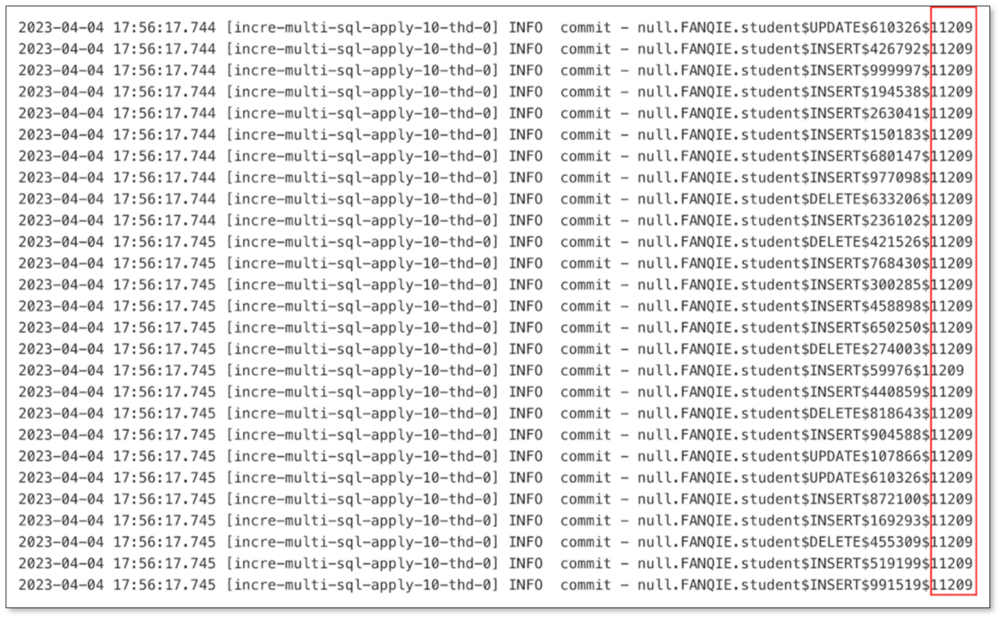

This page provides a general process for BladePipe DataJob performance tuning.

## Issue 
The latency of BladePipe DataJob is high. The performance needs to be optimized to improve the efficiency.

## Possible Causes and Solutions
1. Check the task exception:     
   Click **Sync Settings** > **Exception Log** to check whether there is a task exception recently. If so, click **View Exception Stack** and resolve the exception.

2. Check GC information:
   1. Go to the Details page of the DataJob. Click **More Metrics** next to **Performance** above the monitoring chart at the bottom of the page.
   2. Click **Resource** tab to view the monitoring charts of **JVM GC Count** and **JVM GC Time**. If the Full GC time is excessively long or the Full GC number is over two, it is deemed that there is a GC-related performance issue.
  
- **If there is a GC-related performance issue**, follow the steps:
  - Modify parameters for Full Data：
    1. Go to the Details page of the DataJob. Click **Functions** > [**Modify Parameters**](../operation/job_manage/job_op/job_params.md).
    2. Change the values of the parameters ***fullRingBufferSize*** and ***fullBatchSize*** to 50% of the original values.
    3. Change the value of the parameter ***writeParallel*** to 200% of the original value.
    4. Click **Save** in the upper-right corner of the page.

  - Modify parameters for Incremental:
    1. Go to the Details page of the DataJob. Click **Functions** > [**Modify Parameters**](../operation/job_manage/job_op/job_params.md).
    2. Change the values of the parameters ***increRingBufferSize*** and ***increBatchSize*** to 50% of the original values.
    3. Change the value of the parameter ***writeParallel*** to 200% of the original value.
    4. Click **Save** in the upper-right corner of the page.

- **If there isn't a GC-related performance issue**, try the following operations:
  1. Go to the Details page of the DataJob. Click **Functions** > [**Modify Parameters**](../operation/job_manage/job_op/job_params.md).  Change the values of the parameters ***increBatchSize*** and ***writeParallel*** to improve the efficiency of writing data to Target.

  2. If the writing efficiency isn't improved after the parameters are modified, there may be **a bottleneck in writing data to Target**. Follow the steps to see whether there's such a bottleneck.   
    Go to the Details page of the DataJob. Click **Log** under **Incremental** tab, then click **apply_commit.log** tab. The last column is the data write elapsed time (ms). If the elapsed time is near 10s, it is considered that there is a bottleneck in writing data to Target.
  
  

  3. Check whether there's a hardware limitation. View the **CPU usage**, **CPU load** and other information of the worker. If the resource utilization is high, consider upgrading the hardware of the worker.

   4. Try to upgrade the task specification. For more information, see [Adjust Specification](../dataMigrationAndSync/param_and_func/adjust_task_spec.md).
