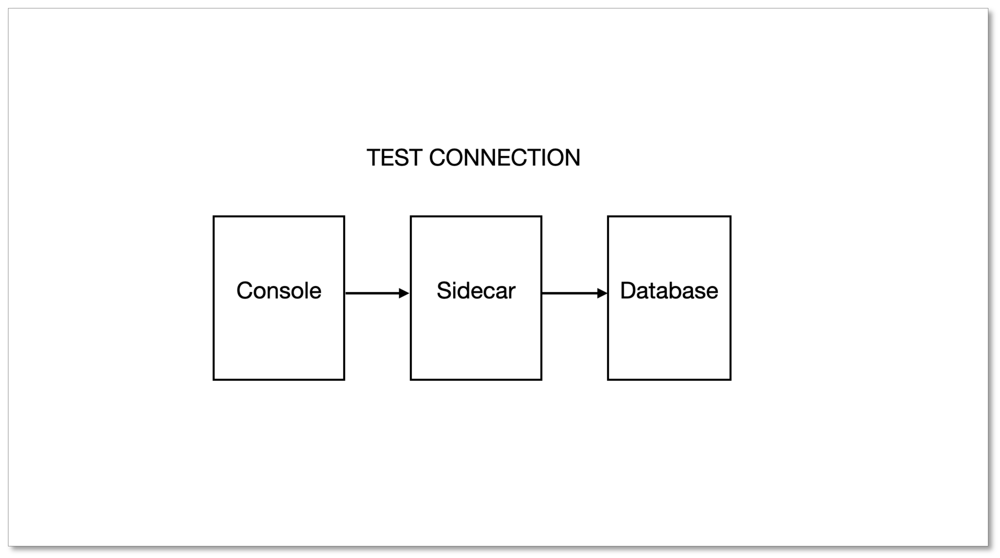

When adding a data source or creating a task in BladePipe, the **Test connection** may sometimes fail due to various reasons. This article outlines the steps for troubleshooting.

## Cause
The overall process for testing a connection in BladePipe is illustrated in the following diagram. As shown in the diagram, it is the sidecar that connects to the database. The exception of sidecar may lead to the failure of test connection.

## Solution
1. In the top navigation bar, click **Sync Settings** > **Exception Log**.
2. Click **SIDECAR** tab.
3. Check the exception stack trace in the Operation column to see the host-related information and confirm whether the connection failure is caused by **wrong host information, incorrect account or password or network issues (such as incorrect IP address or port, firewall blocking)**.
4. Login to the host of **Sidecar** container, and then directly connect to the database to see if it can be accessed.

