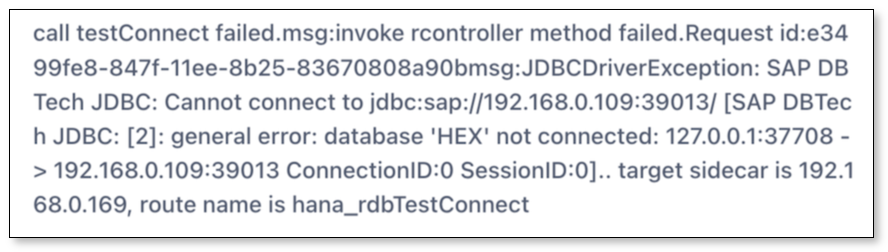

This page describes how to solve the issue of a Sap Hana connection test error.

## Issue
When testing connection to add a Sap Hana instance, the following error occurs:
  
  

## Cause
A wrong default database name is filled in.
  
## Solution
1. Execute the `SELECT DATABASE_NAME FROM M_DATABASE;` statement in Sap Hana to query the **database name**. 
  
2. Enter the **Default Database** in the **Add DataSource** setup form with the value found in **DATABASE_NAME**. Then click **Test Connection**.