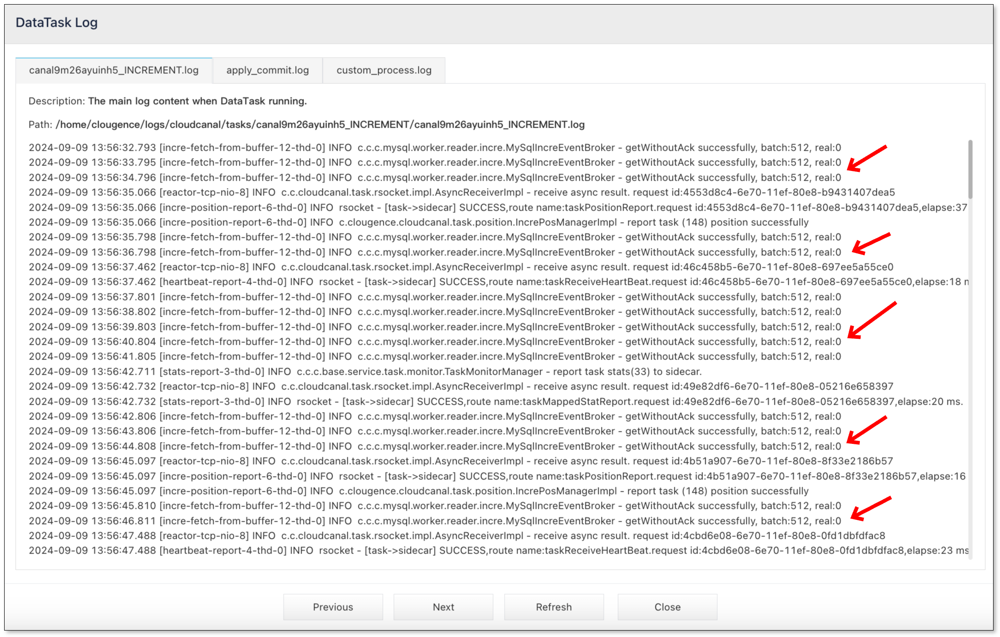

This article outlines the steps for troubleshooting Incremental DataTask latency in BladePipe.

## Cause
There are four common reasons for Incremental DataTask latency:
- High write pressure on the source end, poor tool or destination data source writing performance.
- The task has an error for various reasons, and data cannot be synchronized.
- There is no change on the source end, and there is no heartbeat event.
- The task specification is too small, or the amount of data migrated and synchronized from the source end is too large, leading to severe task process GC (such as encountering peak values of source end changes or synchronization content containing large fields).
You can use the following steps to troubleshoot these possible causes.

## Solution
1. In the top navigation bar, click **Sync Settings** > **Exception Log**. 
2. Select **DataJob** tab, and check if there is any DataJob exception recently based on the time of occurrence. If so, the increased latency may be caused by the exception. Common reasons for task errors include:
   - Exception in writing to the target database, such as primary key conflicts, target database writing timeouts, and poor write response in the target database.
   - Internal exceptions in BladePipe, such as unsupported scenes during synchronization.
   :::tip
   If you cannot locate the reason independently based on the exception logs, please join the support group and report the problem.
   :::
3. If there are no task exceptions in step 2, go to the DataJob Details page, and click **Incremental** tab. Observe whether the position information is normally updated forward. If it is normally updated forward, it means that the data is synchronizing normally. You need to check whether the data delay is caused by target database writing problems.
4. Click **Logs** under the **Incremental** tab to check the DataTask Log. Observe the "real" value in the logs. If it stays at 0 for a long time, it means that there are no incremental changes or heartbeat events on the source database. If it is several hundred or thousand, it means that the flow is large and performance tuning is required.

5. Go to the DataJob Details page. Click **More Metrics** above the monitoring chart, and then select **Resource** tab to view **JVM GC Count**. If the curve shows that the FGC count is not 0, it means that you need to increase the task specification or optimize parameters.
6. If there are too many FGCs, go to the DataJob Details page, and click **Functions** > **Modify DataJob Params** in the upper-right corner of the page. Search the parameter **specId**, and then choose a larger specification.
7. If there are too many FGCs, other parameter adjustments can also be made. The steps are as follows: go to the DataJob Details page, and click **Functions** > **Modify DataJob Params** in the upper-right corner of the page.
   - If the task is in the Incremental stage, search the **increRingBufferSize** and **increBatchSize** parameters, and adjust the original values to a smaller size to avoid too much data being synchronized at one time and causing FGC.
   - If the task is in the Full Data Stage, search the **fullRingBufferSize** and **fullBatchSize** parameters, and adjust the original values to a smaller size to avoid too much data being migrated at one time and causing FGC.
8. If the above steps don't work, please join the support group and provide a description of the problem, exception logs, or screenshots.
