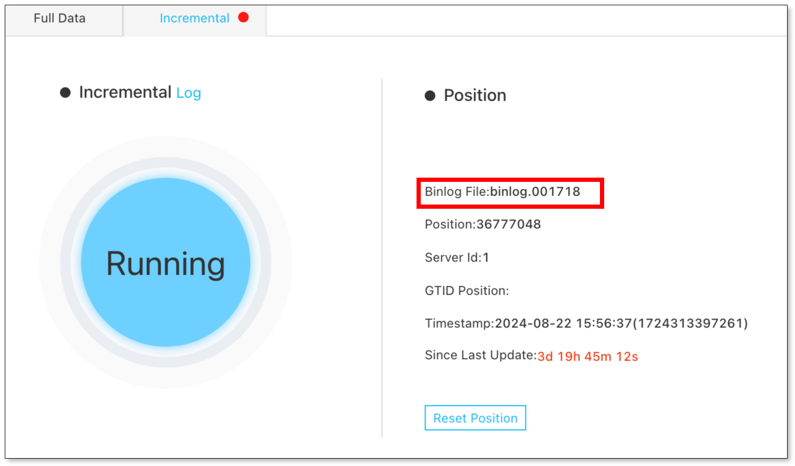

This page describes how to solve the issue of Incremental task interruption caused by binary logs that are not found in MySQL Source.

## Issue
In a DataJob with MySQL as the Source, the Incremental task is interrupted, and the following message appears in the log:

```
java.io.IOException: Received error packet: errno = 1236, sqlstate = HY000 errmsg = Could not find first log file name in binary log index file
```

## Cause
The MySQL binary logs are removed before being consumed in the DataTask. There are two possible causes:
  - A task exception occurs, leading to the failure of binary log consumption.
  - The binary logs consumption is so slow that the binary logs are cleaned up before being consumed. To solve the issue of slow consumption, see [Performance Tuning](./performance_optimization.md).

## Solution
1. Check the binary log file that is being consumed at the Details page of the DataJob.



2. Execute `show binary logs` statement to check whether the binary log file that is being consumed exits.
   
3. [Reset Position](../operation/job_manage/job_op/job_position.md).
4. [Verify and correct data](../operation/job_manage/create_job/create_period_verification_correction_job.md).
5. Modify the MySQL binary logs retention. It is recommended to retain binary logs for over 24 hours.
