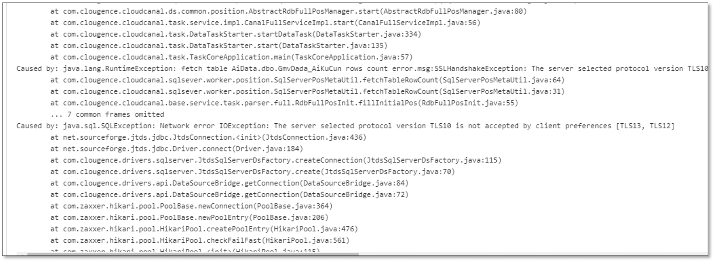

This page describes how to resolve TLS10 error when adding a SQL Server DataSource or starting a DataJob using a SQL Server instance.

## Issue
The following TLS error occurs when adding a SQL Server DataSource or starting a DataJob using a SQL Server instance.

## Cause
- By default, the driver for Microsoft SQL Server enables Secure Sockets Layer (SSL) encryption. 
- Earlier versions of Microsoft SQL Server doesn't support TLS 1.2.
- Several vulnerabilities have been reported against TLS 1.0/1.1, and thus TLS 1.0/1.1 are deemed insecure. By default, JDK disables them, leading to an error.

## Solutions

### Solution 1
1. Enter the Worker container.
2. Edit the file $JAVA_HOME/jre/lib/security/java.security (find / -name "java.security").
3. Modify the values behind `jdk.tls.disabledAlgorithms=`. Delete TLSv1, TLSv1.1 and 3DES_EDE_CBC.
4. Restart the Worker process.

### Solution 2

Use SQL Server 2017 or later versions.

### Solution 3

Upgrade to enable <a href="https://learn.microsoft.com/zh-CN/troubleshoot/sql/database-engine/connect/tls-1-2-support-microsoft-sql-server">TLS 1.2 support for Microsoft SQL Server</a>.
