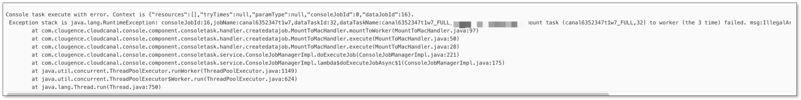

This article describes the steps to troubleshoot task deletion failure in BladePipe.

## Cause
There are two common reasons why a BladePipe DataJob cannot be deleted:
-  Subtasks (such as subscription editing tasks and periodic verification subtasks) have not been deleted.
-  Historical version issues.

## Solution
For the first reason, the solution is to **delete the subtasks first and then delete the main task**. 

For the second reason, follow the steps below.
1. In the top navigation bar, click **Sync Settings** > **ConsoleJob**. Check the exception logs to confirm the cause. If the exception log shows that there is a historical version issue and the task_restart_history table is missing from the metadata database, as shown in the picture below, proceed to step 2.

    

2. Log in to the metadata database (default `mysql -uclougence -h127.0.0.1 -P25000 -p123456`) and execute the following SQL statements. After executing the SQL statements, try to delete the task again on the page.
   ```sql
    CREATE TABLE IF NOT EXISTS `task_restart_history`
   (
    `id`                 bigint(20)   NOT NULL AUTO_INCREMENT,
    `gmt_create`         datetime     NOT NULL DEFAULT CURRENT_TIMESTAMP,
    `task_id`            bigint(20)   NOT NULL,
    `schedule_worker_ip` varchar(128) NOT NULL,
    PRIMARY KEY (`id`),
    KEY `idx_task_id` (`task_id`)
    ) ENGINE = InnoDB
      DEFAULT CHARSET = utf8mb4
      COLLATE = utf8mb4_general_ci;
   ```

3. If the above steps do not solve the problem, please join the support group and provide a description of the problem, exception logs, or screenshots.

