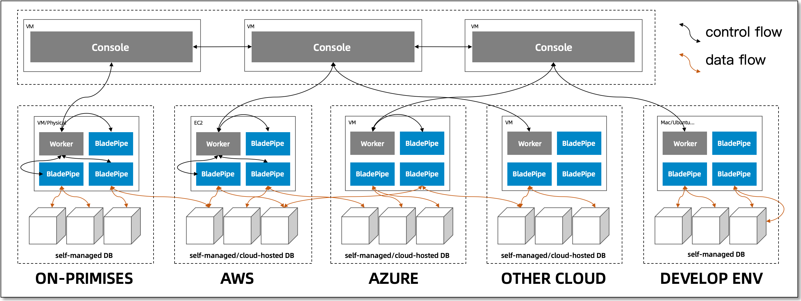
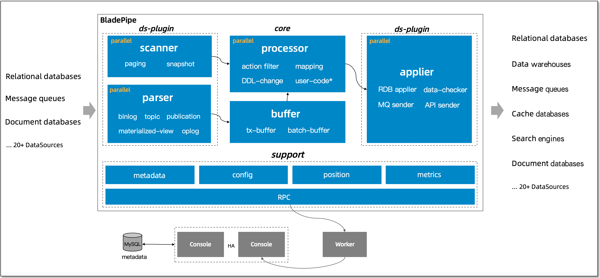
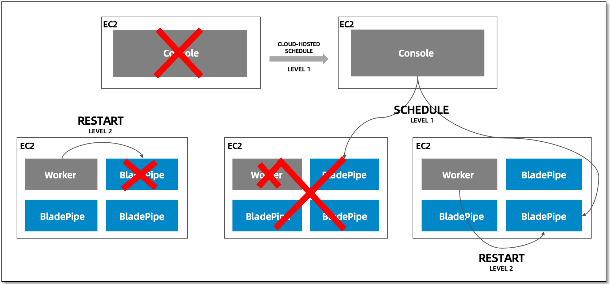
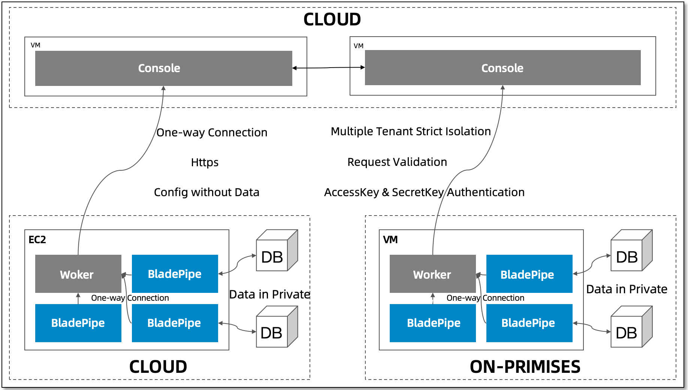

This topic mainly introduces the architecture of BladePipe.

## Product Architecture
The architecture is illustrated in the following figure:

The components and their functions are as follows:
- **Console**   
  It is a Web server cluster(s) to realize centralized management and control.    
   
  It performs product functions, including the lifecycle management over DataSources, Workers and DataJobs, scheduling for disaster recovery, monitoring and alerting, and metadata management.

- **Worker**    
  It is deployed on specific machines performing data migration and synchronization.  

  It performs the following functions: obtaining the configurations of DataJobs to be run, starting and stopping DataJobs, collecting and reporting DataJob status, and performing DataJob health checks, etc.

- **BladePipe Core**   
  It is deployed on specific machines performing data migration and synchronization.   

  It performs specific data migration, synchronization, verification, and correction DataTasks.

## Core Architecture
The architecture is illustrated in the following figure:

- **DataSource Plug-in**   
  They include data read/write, metadata acquisition logic, and corresponding drivers for each database, message, data warehouse, and other DataSource.   

  Each plug-in is isolated by the Java class loading mechanism, and only the corresponding DataSource plug-in is loaded when the DataJob runs.

- **Core**   
  It includes the skeleton core code, action filtering, metadata mapping, DDL conversion, custom data processing, etc.

- **Support**   
  It contains metadata, DataJob configuration, position management, monitoring metrics, and logic for interaction with Console.

## Disaster Recovery

- **Console Disaster Recovery**   
It can be achieved through cluster deployment. The stateful part is handled by the metadata database.

- **DataJob Level 1 Disaster Recovery**   
When a Worker exits the process, a Worker is abnormal, or the network is isolated, the Console will proactively schedule another healthy Worker for disaster recovery based on the lease period and the status of the Worker connection.

- **DataJob Level 2 Disaster Recovery**   
When a Worker process is normal while a DataJob process is not normal, the Worker enables the DataJob to run in accordance with the status specified by the Console through health checks, and the DataJob keeps running or is killed.

## Multiple/Hybrid Cloud Network

BladePipe takes a variety of network security measures to ensure the security of user data and information in order to accommodate the need of multi-tenant, distributed system deployments.

- **One-way Connection**    
Workers are connected to the Console, and Workers **do not actively expose the network information**.

- **HTTPS Protocol**   
Workers and the Console communicate using the HTTPS protocol to prevent information theft and tampering.

- **Data in Private Network**   
All data transfer occurs on the user's intranet, and no data leakage occurs. All BladePipe operations against DataSources occur in the user's network environment.

- **AccessKey & SecurityKey Authentication**   
With TCP persistent connections, each connection is authenticated by the user's unique AccessKey and SecurityKey.

- **Request Validation**   
Every request from the Worker is verified for resource attribution.

- **Operation Audit**   
The operations of a Worker requesting the Console are audited and can be traced.
