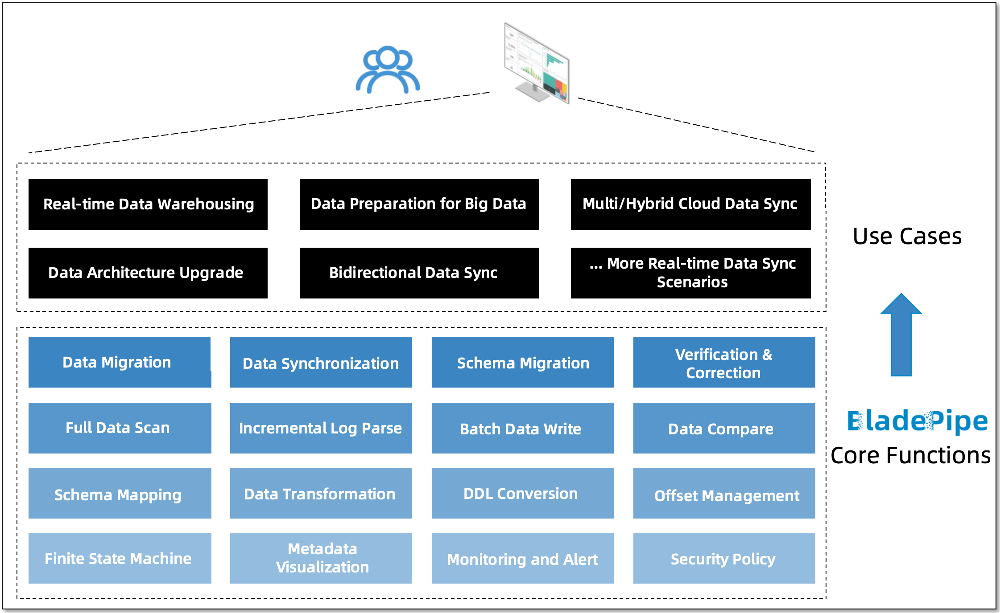

import DataSourceLinkForEn from "@site/src/components/DataSourceLinkForEn";

BladePipe is a real-time end-to-end data integration tool for building sub-second and stable data pipelines. It offers a one-stop data replication solution, ranging from schema evolution, data migration and data synchronization to monitoring and alerting. All is done in an automated and visualized way.  

## Data Migration (ETL)

BladePipe allows moving all the data of a specified DataSource to a target DataSource. It supports diverse DataSources, and enables resumable data migration, sequential paged data scanning, parallel scanning, metadata mapping and truncation, data processing with custom code, batch writing, parallel writing, and data filtering. It shows good performance and has little impact on the source DataSource. Besides, it meets certain needs of data processing.

Optionally, combine data migration with schema migration, verification and correction to prepare schema or ensure data integrity and accuracy.

## Data Sync (Change Data Capture)

By consuming incremental data logs of the source DataSource, BladePipe replays the operations in the target DataSource in near real time to synchronize the data. It allows resumable data migration, DDL synchronization, metadata mapping and truncation, data processing with custom code, action filtering, data filtering, and efficient data write.

Optionally, combine data synchronization with schema migration, data migration, verification and correction to meet the data quality requirements of data preparation and long-term data synchronization.

## Schema Evolution

BladePipe can quickly migrate the schemas of the source DataSource to the target DataSource. It enables data type conversion, database dialect conversion, and name mapping. This function can be used alone or as the preparation for data migration or synchronization.

## Data Verification and Correction

The source and target data are compared field by field, and the different data can be corrected. This function can be used alone or together with data migration or data synchronization to meet the needs of data quality verification and data revision.

## Supported Pipelines

The following table show the supported connections now. The vertical headings list the Source DataSources, and the horizontal headings show the Target DataSources. To learn more about the supported DataSource versions, see [Supported DataSources](../dataMigrationAndSync/datasource_version.md).

<DataSourceLinkForEn />
