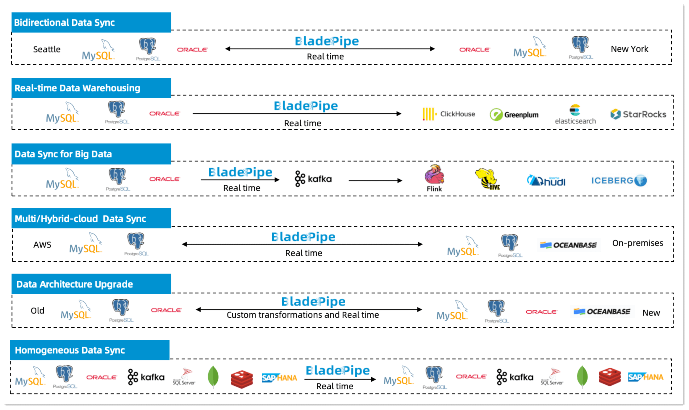

This topic describes some of the data integration use cases of BladePipe, helping you build robust data pipelines and leverage your business data effectively.

## Bidirectional Data Sync

BladePipe supports two-way CDC synchronization. It automatically resolves circular data replication issues, making this capability ideal for implementing geo-redundancy, data backup, and disaster recovery architectures. 

Example: [MySQL Bidirectional Synchronization](../bestPractice/mysql_loop_data_sync.md)

## Data Sync for Data Warehouses

Real-time data integration powers enterprise data warehouses. By utilizing continuous data pipelines, you can easily query and analyze your data to meet complex business requirements. This enables advanced use cases like complex data queries, fuzzy searches, and data mining.

Example: [MySQL to ClickHouse Synchronization](https://www.bladepipe.com/blog/tech_share/mysql_clickhouse_sync/)

## Big Data Analysis

Message queues can isolate online transactional databases from heavy analytical workloads. BladePipe feeds real-time data into message brokers, allowing downstream stream or batch processing to ingest the data safely. This serves as a scalable foundation for a big data platform.

Example: [MySQL to Kafka Synchronization](https://www.bladepipe.com/blog/tech_share/mysql_kafka_sync/)

## Multiple/Hybrid-Cloud Data Sync

BladePipe provides reliable data migrations across hybrid architectures, such as on-premises to public/private cloud, or across different cloud platforms. Continuous incremental sync saves significant network bandwidth. 

Example: [Intercontinental Data Sync](https://www.bladepipe.com/blog/data_insights/best_practice_in_intercontinental_data_sync/)

## Data Architecture Upgrades

Transitioning to new business data structures can be done with minimal downtime. BladePipe allows you to upload custom code via its SDK interface to perform complex ETL transformations during the sync process. You can process records, transform formats, or even call remote API services before the data reaches the target. 

Example: [Data Masking in Incremental Sync](../bestPractice/encrypt_data_when_sync.md)

## Homogeneous Data Sync

BladePipe supports dedicated data migration and sync between homogeneous environments, including relational and NoSQL databases like MySQL, PostgreSQL, Oracle, MongoDB, Redis, and TiDB. This accelerates routine operations like database version upgrades, cross-region replication, and automated disaster recovery.

Example: [Sync Data from PostgreSQL to PostgreSQL](https://www.bladepipe.com/blog/tech_share/pg_pg_sync/)

## More Scenarios

BladePipe empowers you to unlock the full potential of your data across endless use cases. You can combine automated schema evolution, data transformation, and continuous CDC to build a tailored data pipeline for your specific requirements. 

Example: [Data Verification and Correction](../bestPractice/verification_and_correction.md)