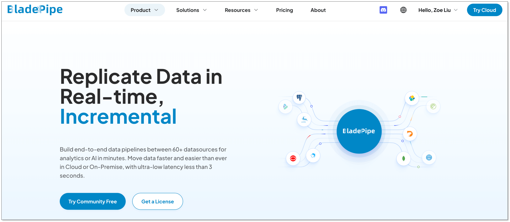
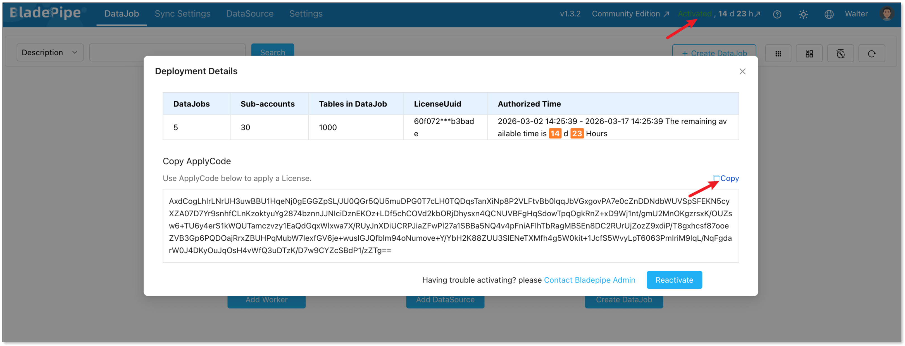
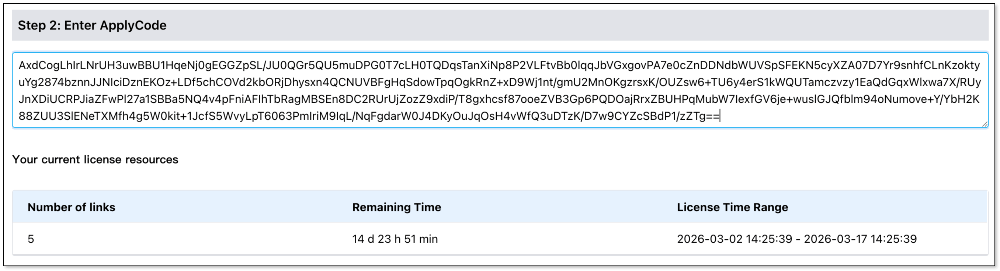
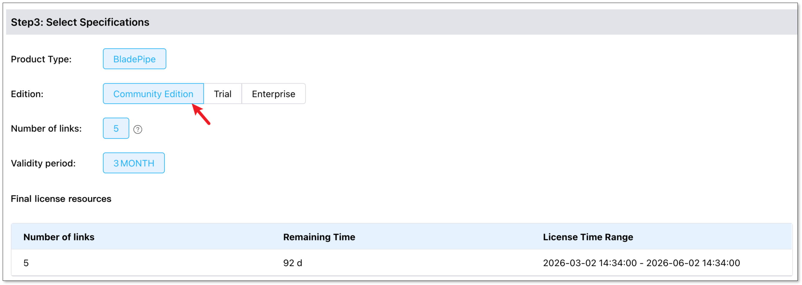
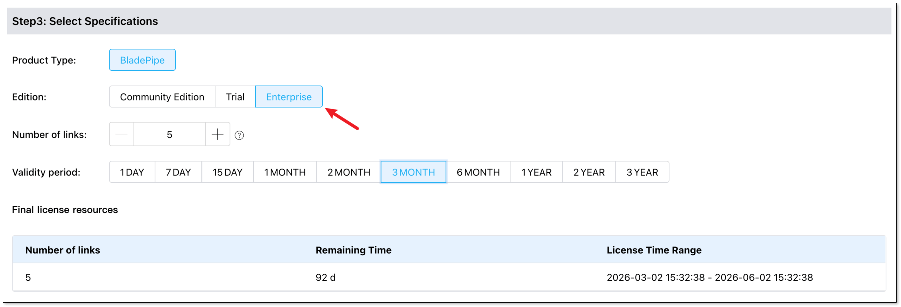
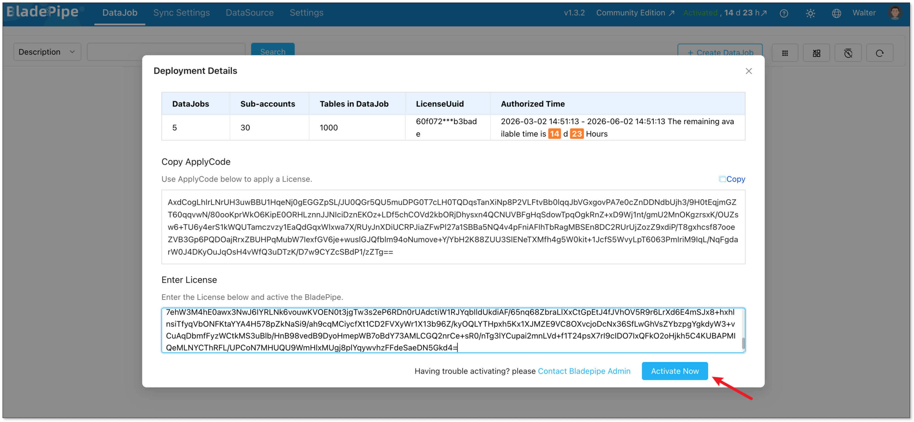

import Tabs from '@theme/Tabs';
import TabItem from '@theme/TabItem';

This topic describes how to activate your BladePipe On-Premise deployment using a valid license.

## Terminology

- **Apply Code**: A unique code required to generate and retrieve your BladePipe On-Premise license.
- **License**: The authorization credential used to activate your BladePipe On-Premise deployment. It specifies the validity period and the number of authorized [links](../reference/service_difference.md) for your data integration tasks.

## Install BladePipe On-Premise

1. Log in to [BladePipe](https://www.bladepipe.com?src=bp-doc).
2. Click **Try Community Free** and install BladePipe by following the instructions in [Install All-In-One (Docker)](../productOP/onPremise/installation/install_all_in_one_docker.mdx).
   
   

## Get Your Apply Code

1. Log in to your BladePipe Console and click the **Inactivated/Activated** status.
2. In the **Deployment Details** dialog, locate your Apply Code and click **Copy**.
   
   

## Get a License

Log in to [BladePipe](https://www.bladepipe.com?src=bp-doc) and click **Get a License**.    

For On-Premise deployments, BladePipe provides [Community, Enterprise Trial, and Enterprise plans](../price/plans_diff.md). Follow these steps to obtain the license for your deployment.

<Tabs groupId="license">
<TabItem value="community" label="Community/Trial License" default>

1. In **Step 2**, paste your Apply Code into the box.
   
   
2. In **Step 3**, select **Community Edition** / **Trial**.
   
   
3. Click **Proceed to Payment**.
4. In the License list, click **View** to check the license.
5. In the **View the License** dialog, click **Get Email Code** and enter the verification code.
6. Click **Copy** to copy your license.

</TabItem>
<TabItem value="enterprise" label="Enterprise License">

1. In **Step 2**, paste your Apply Code into the box.
   
   
2. In Step 3, select **Enterprise** Edition. Configure the desired number of links and the validity period. For details, see [Pricing](../price/product_price.md). 
   
   
3. Click **Proceed to Payment**.
4. In the License list, click **View** to check the license. 
5. In the **View the License** dialog, click **Get Email Code** and enter the verification code.
6. Click **Copy** to copy your license.

</TabItem>
</Tabs>

## Activate BladePipe

1. Return to your BladePipe Console.
2. In the **Deployment Details** dialog, paste your copied license into the **Enter License** box, and click **Activate Now**.    
If your BladePipe deployment is already activated, click **Reactivate** to open the **Enter License** dialog.
   
   

   :::info
   - You can click the **Activated** status anytime to view the authorization details of your license.   
   - Renew your **BladePipe Community Edition** license before it expires to prevent interruptions to your active DataJobs.    
   - For a **BladePipe Enterprise Edition** license, [contact support](https://www.bladepipe.com/about/) for renewal assistance or renew it directly through the BladePipe Console before the expiration date.
   :::

