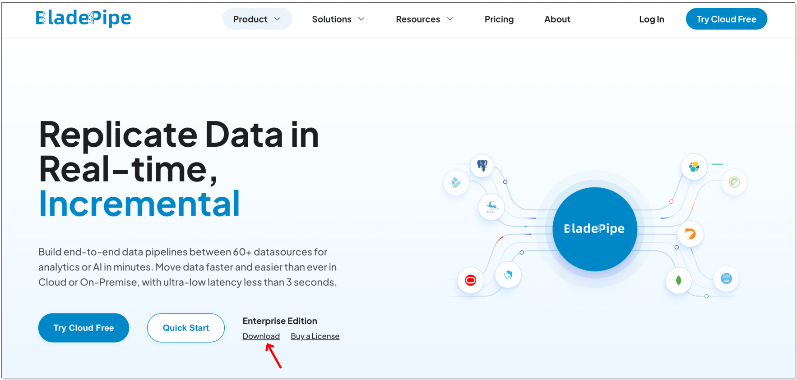
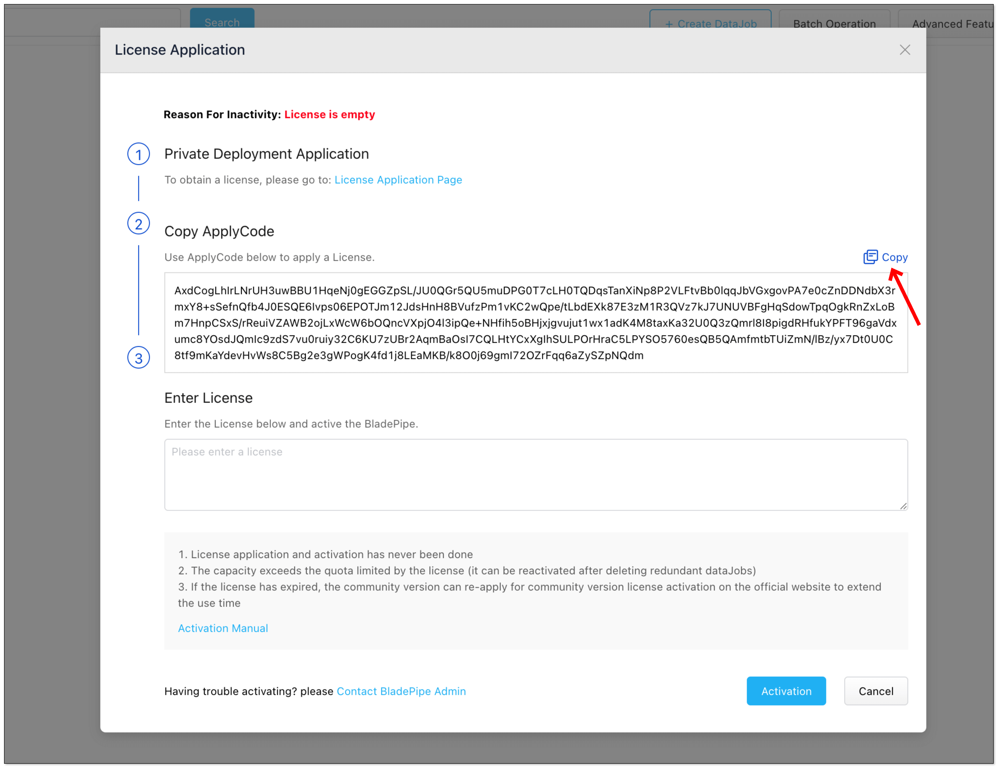
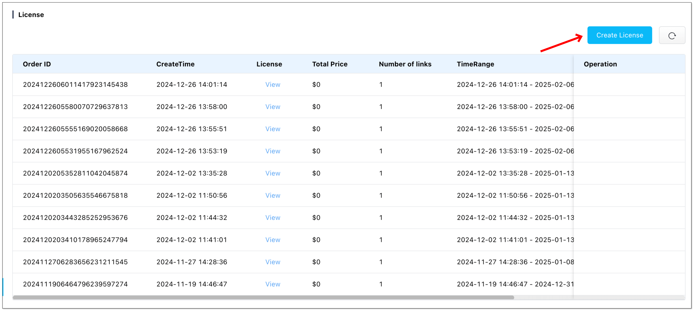
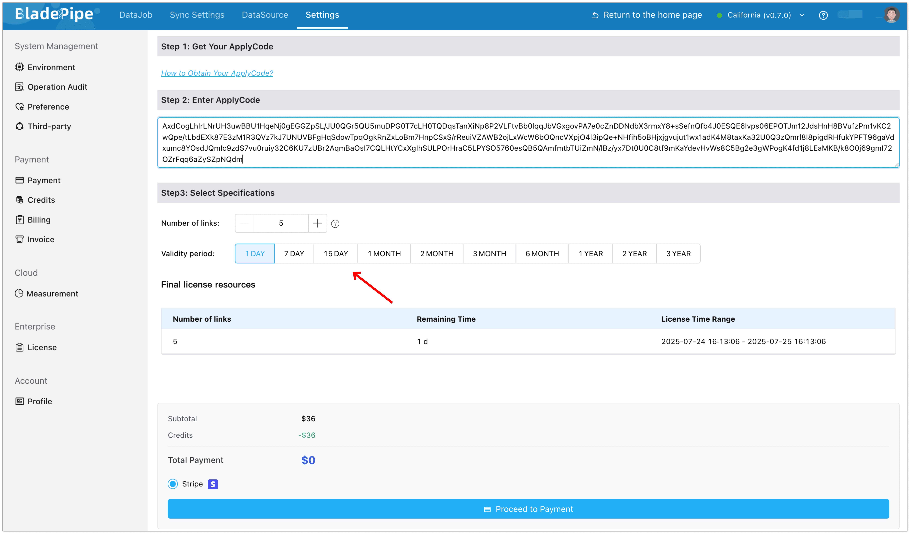
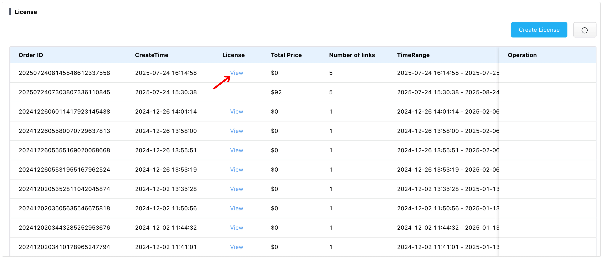
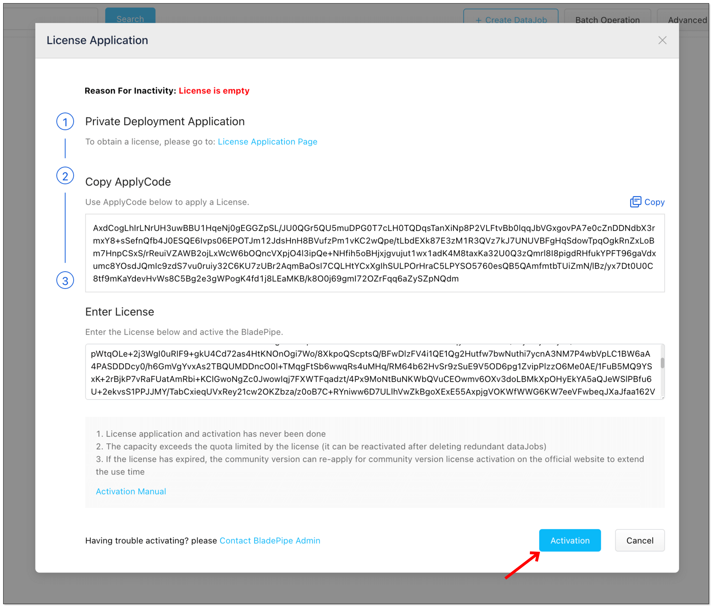
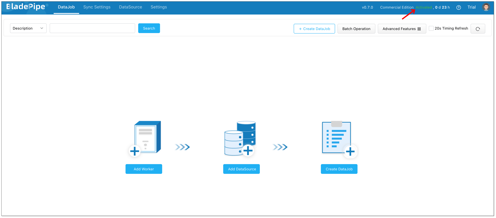

This page introduces how to activate BladePipe On-Premise.

## Terminology

- **Apply Code**: A unique code for purchasing a license.
- **License**: A license is used to activate BladePipe On-Premise, including the authorization duration and number of authorized [links](../reference/service_difference.md).

## Install BladePipe On-Premise

1. Log in to [BladePipe](https://www.bladepipe.com?src=bp-doc), and click **Download** under **Enterprise Edition**.

1. Install BladePipe On-Premise following the instructions in [Install All-In-One (Binary)](../productOP/onPremise/installation/install_all_in_one_binary.md).

## Get Apply Code

1. Log in to the Console of BladePipe On-Premise and click **Inactivated** in the upper-right corner.
2. An **Apply Code** is shown in the pop-up. Click **Copy** to copy the code. 

## Get a License

1. Log in to [BladePipe](https://www.bladepipe.com?src=bp-doc), and click **Buy a License** under **Enterprise Edition**.

1. Click **Create License** in the upper-right corner.

1. Fill in the **Apply Code**. 
2. Select the number of links and duration. For more details, please refer to [Pricing](../price/product_price.md). 
3. Click **Proceed to Payment**.

1. After successful payment, click **View** in the table. 

1. Enter the verification code, and then you will get the license.

## Activate BladePipe

1. Go back to BladePipe Console.
2. Fill the **License** in License Application window, and click **Activation**. 

3. If you activate BladePipe successfully, "**Activated**" will be shown in the upper-right corner.

    :::info
    Click **Activated** to check the **details** of the authorization.   
    If you need to extend the duration or use more links, please purchase a License following the above steps.
    :::

