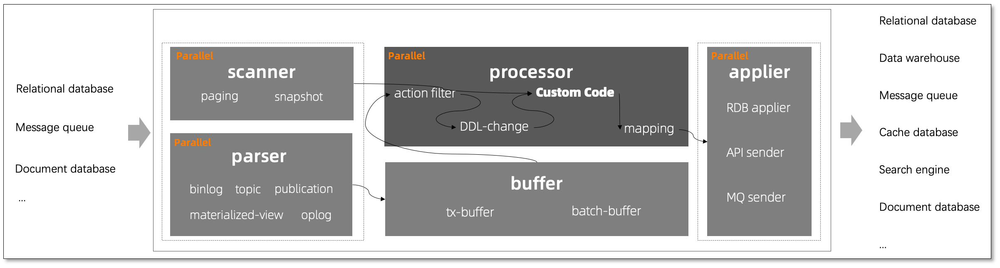
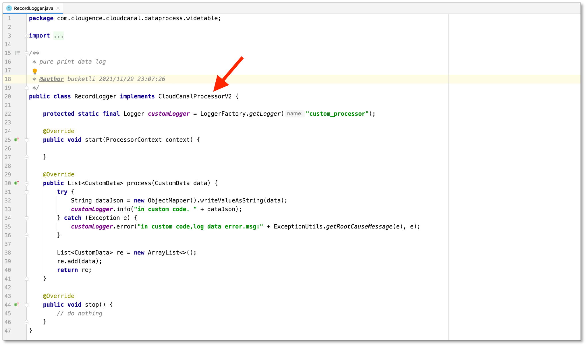
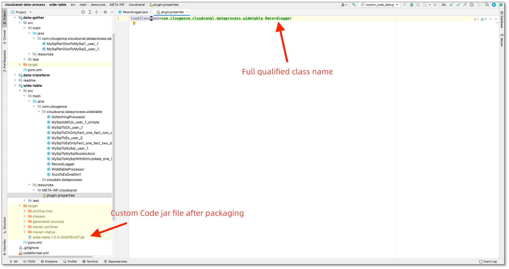
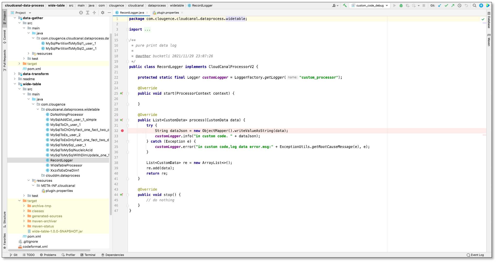
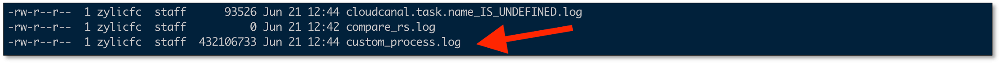
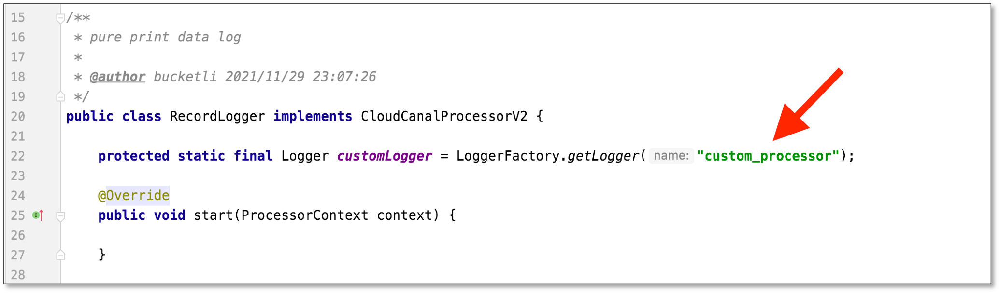

This page briefly introduces BladePipe **Custom Code**, covering coding, DataJob creation, code updating and troubleshooting.

## Overview

**Custom code** allows you to write Java code with data processing logic. By uploading Java jar files to BladePipe, BladePipe can automatically call these codes during Full Data and Incremental DataTasks to transform and process data in various ways.

The process of calling **custom codes** is in the middle of BladePipe's overall task processing chain, as shown in the following diagram:



## Scenarios
Custom code is mainly used for data migration or synchronization cases where BladePipe don't have a standardized process at present. It features great flexibility and certain complexity to satisfy business demands.

Some scenarios are listed below for reference:

- **Data transformation**
  - Data masking, together with encryption and decryption algorithms
  - Time zone conversion
- **Data cleansing**
  - Dealing with outlier and null values
  - Missing value completion
  - Data normalization
- **Real-time wide table creation**
  - The Fact tables join dimension tables
- **Data aggregation**
  - Aggregate data shards
  - Cross-region dataset centralization
- **Business logic processing**
  - Complex data transformation resulting from business architecture upgrades
  
## Procedure

### Write Code
1. BladePipe provides the basic project [bladepipe-data-process](https://github.com/bladepipe/data-process).
    :::info
    Custom codes are recommended to be written in a Java IDE such as [IntelliJ IDEA](https://www.jetbrains.com/idea/) or [Eclipse](https://www.eclipse.org/).   
    You can take the examples in the **bladepipe-data-process** project for reference and make changes accordingly.
    :::
2. For the classes in custom code, `com.bladepipe.sdk.api.BladePipeProcessorV2` should be allowed to be called by BladePipe.


### Package Codes

1. Modify the package metadata.

2. Go to the project directory and run the command to package codes.
    ```shell
    % pwd
    /Users/zylicfc/source/product/bladepipe/bladepipe-data-process
    % mvn -Dtest -DfailIfNoTests=false -Dmaven.javadoc.skip=true -Dmaven.compile.fork=true clean package
    ```
3. After executing the command, you can get the jar file in the corresponding directory.

### DataJob Creation
1. Click **DataJob** > **Create DataJob**.
2. In the upper-right corner of **Data Processing** page, click **Upload Custom Code**.
3. In the pop-up dialog box, click **Click here to upload file**.
4. DataJob runs automatically.

### Debugging

#### Remote Debugging
1. BladePipe supports debugging the custom code. For more information, see [Custom Code Debuging](../job_op/debug_customer_code.md).
2. After the DataJob starts, use the IDE breakpoint to debug the code.


#### Print Logs
1. BladePipe provides a fixed log file (**custom_processor.log**) to print logs in custom code. For more information, see [Print Log in Custom Code](../job_op/log_in_customer_code.md).
2. After it takes effect, go to the DataJob Details page, and click **Log > custom_process.log**, then you can view the log content. You can also check the whole file log in the terminal window according to the path provided.


### Update Code
1. Go to the DataJob Details page. Click **View** next to **Custom Code** on the left side of the page, or click **Functions** > **Custom Code** in the upper-right corner of the page.
2. Click **Upload New Package**. 
3. Select the code package and click **Activation**.
4. Restart the DataJob, otherwise the custom code don't come into effect.


## FAQ

### The code package doesn't take effect.
- You can restart DataJob on the BladePipe Cloud, because the jar file transmission is triggered by Start operation.
- If the above measure doesn't work, check whether the jar file exists in the Worker container or node directory **/home/bladepipe/bladepipe/datahandle**.
- If the jar file doesn't exist, you can upload the code package (the code package name can be modified according to the prompts in the error log).

### The log is not printed.
- Check whether the logger name is correct.
  
- If the name is correct, take measures metioned in **The code package doesn't take effect**.