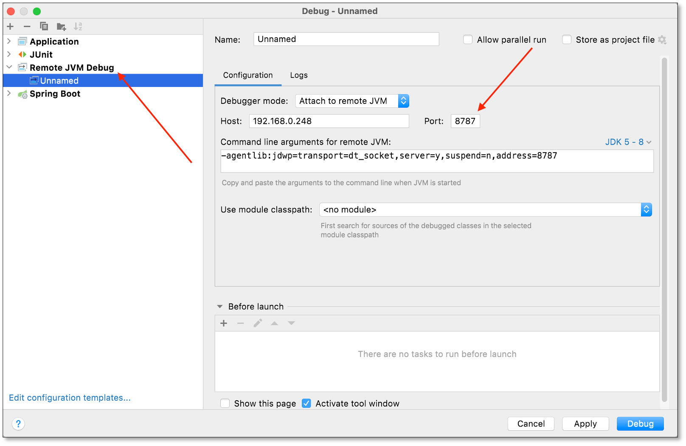

This article introduces how to enable debug mode and troubleshoot code problems when using BladePipe custom code.

## Procedure
1. Go to the DataJob Details page. Click **Functions** > **Modify DataJob Params** in the upper-right corner of the page.
2. Change the value of ***debugMode*** to true.
3. Change the ***debugPort***.
   - for Docker deployment: **18787**
   - for Binary deployment: **8787** 
4. Click **Save** in the upper-right corner of the page.
5. Restart the DataJob, which will stops and waits for the remote debug client to connect.
6. To remote debug, taking IDEA as an example, set the following task running address. 
  - Host is the Worker container or running node IP. 
  - Port is 18787/8787.
  
