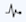

BladePipe allows you to view Worker monitoring metrics and configure alert rules for Workers. The Worker monitoring metrics help to troubleshoot the problem of DataJob sluggishness. This article describes how to view Worker monitoring metrics and how to configure Worker alerts.

## Monitor Worker
1. In the top navigation bar, click **Sync Settings** > **Sync Worker**.
2. Click **Workers** on the right side of the Sync Worker page to enter the Worker list page, where you can view the monitoring metrics of the Worker, including CPU, disk, memory, etc.
3. Click the  icon at the upper-right corner of the Worker list to view the monitoring charts.   

The following metrics are allowed to be viewed in the charts:

| Metric | Description |
| --- | --- |
| Memory Monitor | View total memory, free memory and used memory. <blockquote>Tips: Used memory is the memory already allocated to the DataJobs. When you create a DataJob, you need to select the specification, which refers to the memory allocated to the DataJob when it is run. The sum of the specifications of all DataJobs on a Worker is the used memory. </blockquote> |
| Memory Usage | View memory usage. Memory usage is the used memory/physical memory. |
| CPU Usage | View the CPU usage. | 
| Worker Load | If the load value exceeds the number of CPU cores too much, the Worker is overloaded. It is recommended to reschedule the DataJobs on this Worker to a new Worker. |
| Disk Monitor | View total disk capacity, free disk capacity and used disk capacity. |
| Disk Usage | View the disk usage. Disk usage is the used disk capacity/total disk capacity (physical disk capacity). |

## Configure Alerts
Currently, alert notifications are sent only when the Worker status is abnormal. The procedure is as follows:
1. Configure alerts in advance during system deployment. For more information, see [Configure Alarms](../../../productOP/byoc/maintenance/alarm_conf.md).
2. Select **Viability** in the lower right corner of the Worker list. When the Worker status is abnormal, an alert notification is sent according to the alert configuration in the BladePipe system.