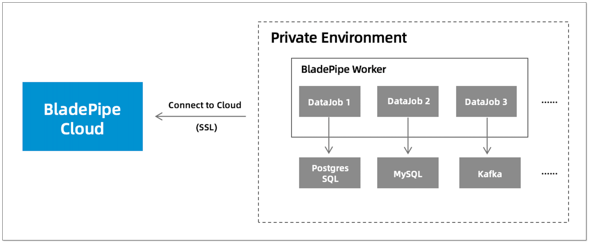

This page describes the principle of and the port for Worker's connectivity to BladePipe Cloud(BYOC).

## Principle

BladePipe uses a **BYOC** (Bring Your Own Cloud) deployment model, where the Worker establishes a connection to BladePipe Cloud. 

This allows BladePipe Cloud to manage the Worker while all DataJobs run securely in your local environment.



## Connect to BladePipe Cloud
The Worker connects to **BladePipe Cloud** via port **7007**.

The available BladePipe domains include:

| Region | Domain |
| -- | -- |
| California | west-us-1.bladepipe.com |
| Singapore | ap-southeast-1.bladepipe.com |

Select the right domain and test the connectivity to port 7007 by running: 
```shell
telnet ${domain} 7007
```

Make sure that the Worker can connect to this port to maintain proper communication.